# REST Endpoints — Flow Sequence Diagrams

All endpoints are defined in `stream-backend/app/main.py`. Shared participants across diagrams:

- **Client** — UI / SDK caller
- **API** — FastAPI route handler (`main.py`)
- **Service** — `ProtocolService` (`service.py`)
- **Repo** — `PublishingRepository` (`event_bus.py`) wrapping the inner store
- **Store** — `InMemoryRepository` / `PostgresRepository`
- **Broker** — `EventBroker` (in-memory / RabbitMQ Streams)
- **StreamMgr** — `StreamSubscriptionManager` (`streaming.py`)
- **Runner** — `AutoResearchRunner` → `ResearchDeepAgentRunner` / `DeepAgentDemoRunner`
- **Scheduler** — `CeleryRunScheduler` (when `runner_backend=celery`)

> `PublishingRepository.append_event` always does **persist (Store) + publish (Broker)**; diagrams show this as a single `Repo` call unless the split matters.

Endpoint inventory (26 REST routes + 1 WebSocket):

| # | Method | Path | Handler |
|---|---|---|---|
| 1 | GET | `/health` | `health` |
| 2 | POST | `/threads` | `create_thread` |
| 3 | POST | `/threads/search` | `search_threads` |
| 4 | DELETE | `/threads/{thread_id}` | `delete_thread` |
| 5 | PATCH | `/threads/{thread_id}` | `update_thread` |
| 6 | GET | `/threads/{thread_id}/state` | `get_thread_state` |
| 7 | POST | `/threads/{thread_id}/state` | `update_thread_state` |
| 8 | POST | `/threads/{thread_id}/history` | `get_thread_history` |
| 9 | GET | `/threads/{thread_id}/stream` | `join_thread_stream` (SSE) |
| 10 | POST | `/threads/{thread_id}/commands` | `protocol_command` |
| 11 | POST | `/threads/{thread_id}/stream/events` | `protocol_events` (SSE) |
| 12 | GET | `/threads/{thread_id}/runs` | `list_runs` |
| 13 | POST | `/threads/{thread_id}/runs` | `create_background_run` |
| 14 | POST | `/threads/{thread_id}/runs/stream` | `stream_stateful_run` (SSE) |
| 15 | POST | `/runs/stream` | `stream_stateless_run` |
| 16 | POST | `/threads/{thread_id}/runs/wait` | `wait_run` |
| 17 | POST | `/runs/wait` | `wait_stateless_run` |
| 18 | POST | `/runs` | `create_stateless_background_run` |
| 19 | GET | `/threads/{thread_id}/runs/{run_id}` | `get_run` |
| 20 | GET | `/threads/{thread_id}/runs/{run_id}/active` | `check_run_active` |
| 21 | GET | `/threads/{thread_id}/runs/{run_id}/checkpoints` | `get_run_checkpoints` |
| 22 | POST | `/threads/{thread_id}/runs/{run_id}/resume` | `resume_run` |
| 23 | GET | `/threads/{thread_id}/runs/{run_id}/join` | `join_run` |
| 24 | GET | `/threads/{thread_id}/runs/{run_id}/stream` | `stream_existing_run` (SSE) |
| 25 | POST | `/threads/{thread_id}/runs/{run_id}/cancel` | `cancel_run` |
| 26 | POST | `/runs/cancel` | `cancel_many` |
| — | WS | `/threads/{thread_id}/stream/events` | `protocol_events_websocket` |

---

## 1. `GET /health`

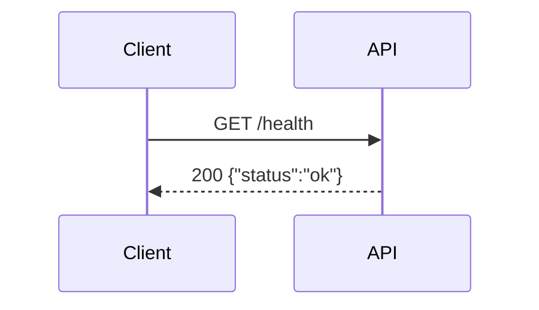
```mermaid
sequenceDiagram
    participant Client
    participant API
    Client->>API: GET /health
    API-->>Client: 200 {"status":"ok"}
```

---

## 2. `POST /threads`

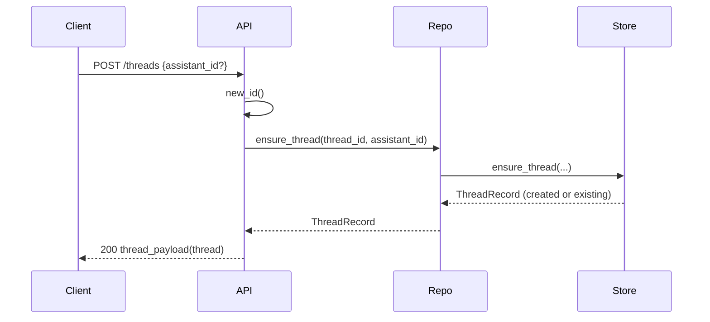
```mermaid
sequenceDiagram
    participant Client
    participant API
    participant Repo
    participant Store
    Client->>API: POST /threads {assistant_id?}
    API->>API: new_id()
    API->>Repo: ensure_thread(thread_id, assistant_id)
    Repo->>Store: ensure_thread(...)
    Store-->>Repo: ThreadRecord (created or existing)
    Repo-->>API: ThreadRecord
    API-->>Client: 200 thread_payload(thread)
```

---

## 3. `POST /threads/search`

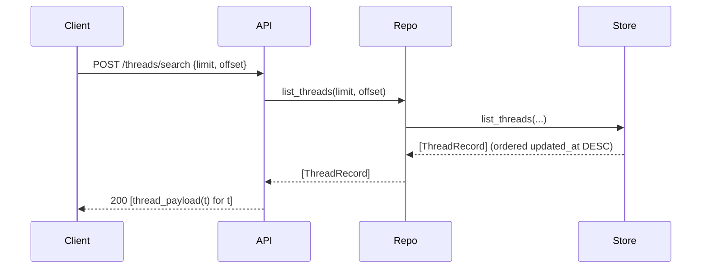
```mermaid
sequenceDiagram
    participant Client
    participant API
    participant Repo
    participant Store
    Client->>API: POST /threads/search {limit, offset}
    API->>Repo: list_threads(limit, offset)
    Repo->>Store: list_threads(...)
    Store-->>Repo: [ThreadRecord] (ordered updated_at DESC)
    Repo-->>API: [ThreadRecord]
    API-->>Client: 200 [thread_payload(t) for t]
```

---

## 4. `DELETE /threads/{thread_id}`

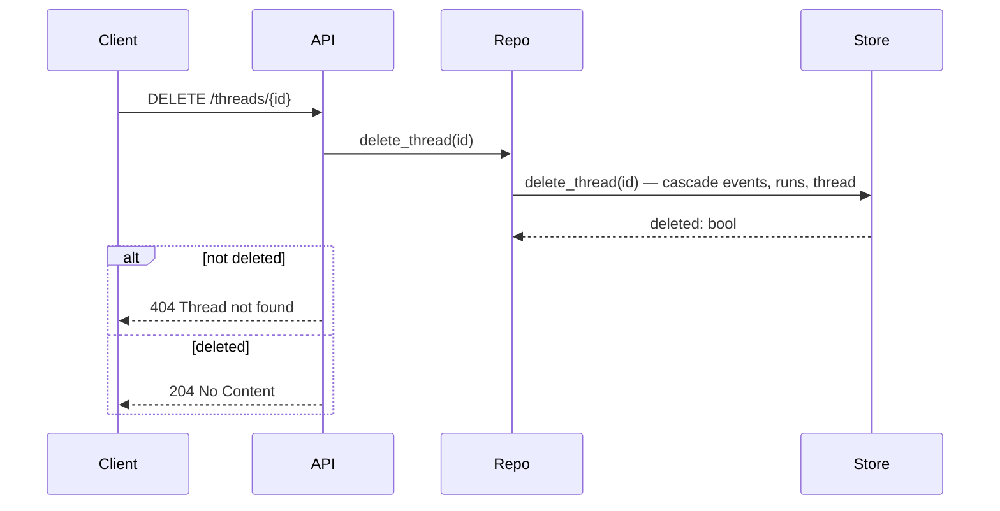
```mermaid
sequenceDiagram
    participant Client
    participant API
    participant Repo
    participant Store
    Client->>API: DELETE /threads/{id}
    API->>Repo: delete_thread(id)
    Repo->>Store: delete_thread(id) — cascade events, runs, thread
    Store-->>Repo: deleted: bool
    alt not deleted
        API-->>Client: 404 Thread not found
    else deleted
        API-->>Client: 204 No Content
    end
```

---

## 5. `PATCH /threads/{thread_id}`

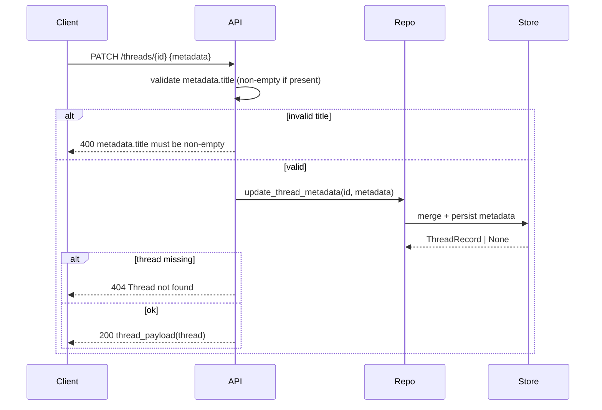
```mermaid
sequenceDiagram
    participant Client
    participant API
    participant Repo
    participant Store
    Client->>API: PATCH /threads/{id} {metadata}
    API->>API: validate metadata.title (non-empty if present)
    alt invalid title
        API-->>Client: 400 metadata.title must be non-empty
    else valid
        API->>Repo: update_thread_metadata(id, metadata)
        Repo->>Store: merge + persist metadata
        Store-->>Repo: ThreadRecord | None
        alt thread missing
            API-->>Client: 404 Thread not found
        else ok
            API-->>Client: 200 thread_payload(thread)
        end
    end
```

---

## 6. `GET /threads/{thread_id}/state`

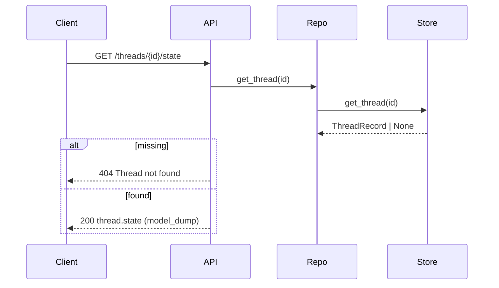
```mermaid
sequenceDiagram
    participant Client
    participant API
    participant Repo
    participant Store
    Client->>API: GET /threads/{id}/state
    API->>Repo: get_thread(id)
    Repo->>Store: get_thread(id)
    Store-->>Repo: ThreadRecord | None
    alt missing
        API-->>Client: 404 Thread not found
    else found
        API-->>Client: 200 thread.state (model_dump)
    end
```

---

## 7. `POST /threads/{thread_id}/state`

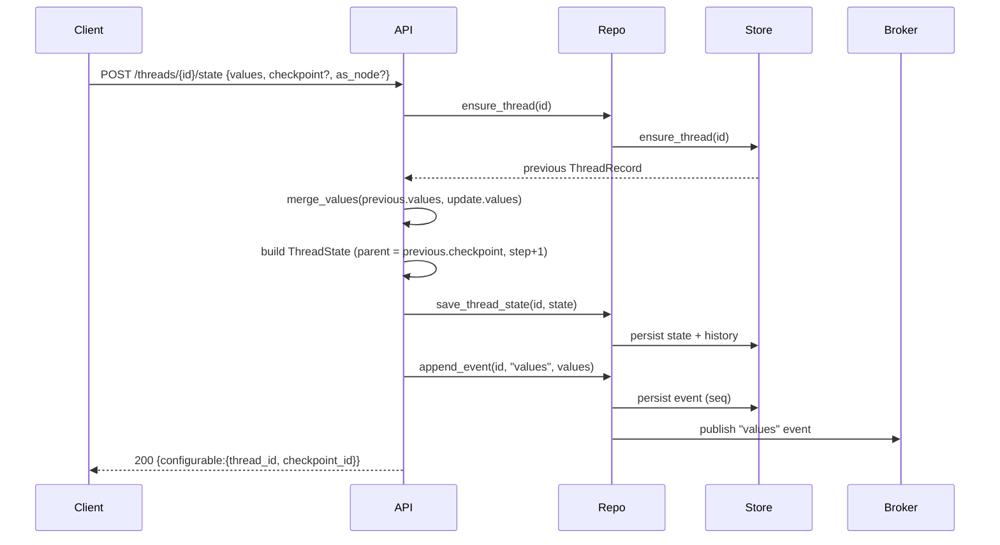
```mermaid
sequenceDiagram
    participant Client
    participant API
    participant Repo
    participant Store
    participant Broker
    Client->>API: POST /threads/{id}/state {values, checkpoint?, as_node?}
    API->>Repo: ensure_thread(id)
    Repo->>Store: ensure_thread(id)
    Store-->>API: previous ThreadRecord
    API->>API: merge_values(previous.values, update.values)
    API->>API: build ThreadState (parent = previous.checkpoint, step+1)
    API->>Repo: save_thread_state(id, state)
    Repo->>Store: persist state + history
    API->>Repo: append_event(id, "values", values)
    Repo->>Store: persist event (seq)
    Repo->>Broker: publish "values" event
    API-->>Client: 200 {configurable:{thread_id, checkpoint_id}}
```

---

## 8. `POST /threads/{thread_id}/history`

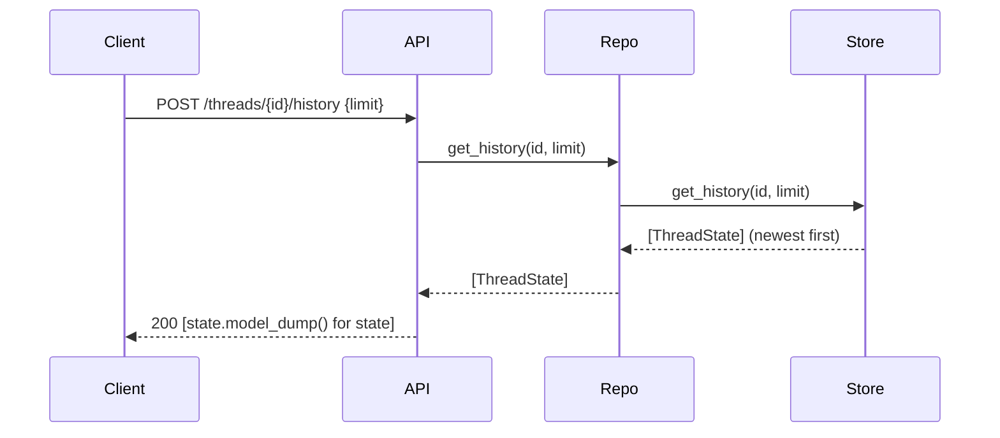
```mermaid
sequenceDiagram
    participant Client
    participant API
    participant Repo
    participant Store
    Client->>API: POST /threads/{id}/history {limit}
    API->>Repo: get_history(id, limit)
    Repo->>Store: get_history(id, limit)
    Store-->>Repo: [ThreadState] (newest first)
    Repo-->>API: [ThreadState]
    API-->>Client: 200 [state.model_dump() for state]
```

---

## 9. `GET /threads/{thread_id}/stream`  (SSE join)

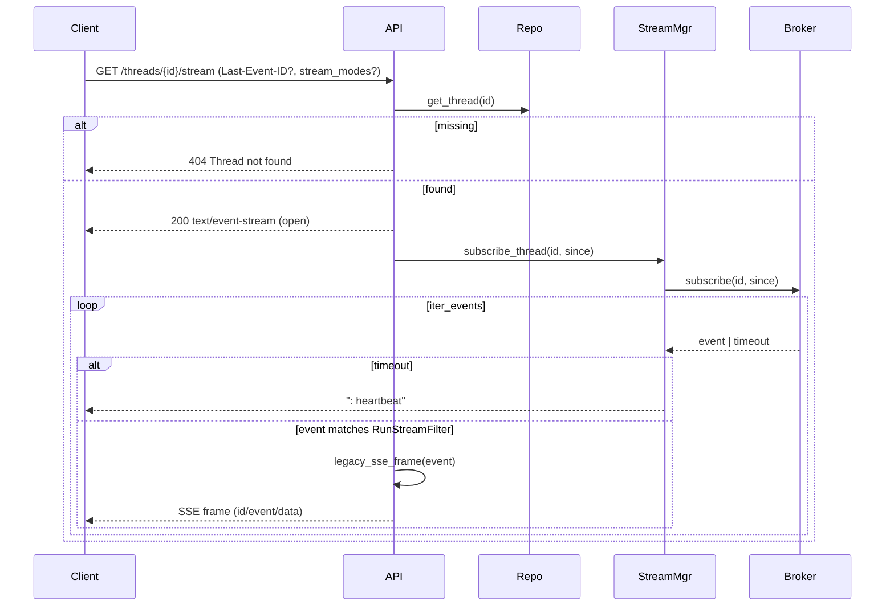
```mermaid
sequenceDiagram
    participant Client
    participant API
    participant Repo
    participant StreamMgr
    participant Broker
    Client->>API: GET /threads/{id}/stream (Last-Event-ID?, stream_modes?)
    API->>Repo: get_thread(id)
    alt missing
        API-->>Client: 404 Thread not found
    else found
        API-->>Client: 200 text/event-stream (open)
        API->>StreamMgr: subscribe_thread(id, since)
        StreamMgr->>Broker: subscribe(id, since)
        loop iter_events
            Broker-->>StreamMgr: event | timeout
            alt timeout
                StreamMgr-->>Client: ": heartbeat"
            else event matches RunStreamFilter
                API->>API: legacy_sse_frame(event)
                API-->>Client: SSE frame (id/event/data)
            end
        end
    end
```

---

## 10. `POST /threads/{thread_id}/commands`

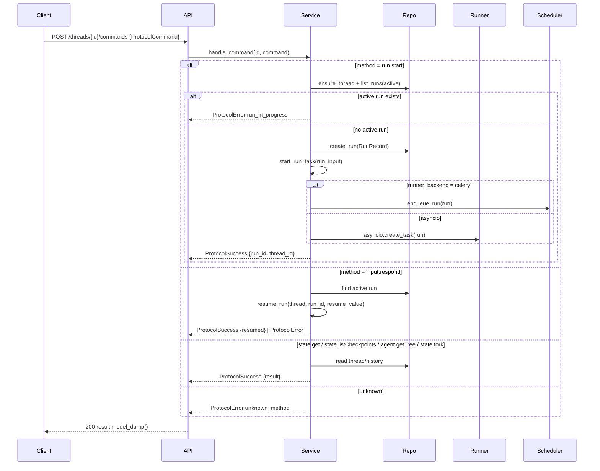
```mermaid
sequenceDiagram
    participant Client
    participant API
    participant Service
    participant Repo
    participant Runner
    participant Scheduler
    Client->>API: POST /threads/{id}/commands {ProtocolCommand}
    API->>Service: handle_command(id, command)
    alt method = run.start
        Service->>Repo: ensure_thread + list_runs(active)
        alt active run exists
            Service-->>API: ProtocolError run_in_progress
        else no active run
            Service->>Repo: create_run(RunRecord)
            Service->>Service: start_run_task(run, input)
            alt runner_backend = celery
                Service->>Scheduler: enqueue_run(run)
            else asyncio
                Service->>Runner: asyncio.create_task(run)
            end
            Service-->>API: ProtocolSuccess {run_id, thread_id}
        end
    else method = input.respond
        Service->>Repo: find active run
        Service->>Service: resume_run(thread, run_id, resume_value)
        Service-->>API: ProtocolSuccess {resumed} | ProtocolError
    else state.get / state.listCheckpoints / agent.getTree / state.fork
        Service->>Repo: read thread/history
        Service-->>API: ProtocolSuccess {result}
    else unknown
        Service-->>API: ProtocolError unknown_method
    end
    API-->>Client: 200 result.model_dump()
```

---

## 11. `POST /threads/{thread_id}/stream/events`  (SSE protocol-v2)

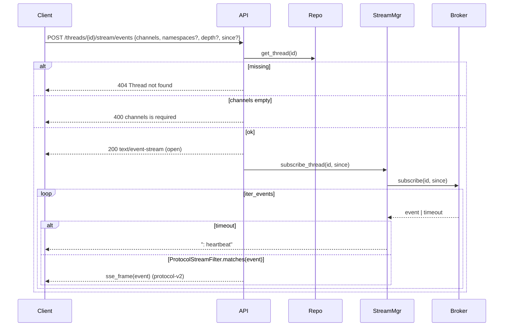
```mermaid
sequenceDiagram
    participant Client
    participant API
    participant Repo
    participant StreamMgr
    participant Broker
    Client->>API: POST /threads/{id}/stream/events {channels, namespaces?, depth?, since?}
    API->>Repo: get_thread(id)
    alt missing
        API-->>Client: 404 Thread not found
    else channels empty
        API-->>Client: 400 channels is required
    else ok
        API-->>Client: 200 text/event-stream (open)
        API->>StreamMgr: subscribe_thread(id, since)
        StreamMgr->>Broker: subscribe(id, since)
        loop iter_events
            Broker-->>StreamMgr: event | timeout
            alt timeout
                StreamMgr-->>Client: ": heartbeat"
            else ProtocolStreamFilter.matches(event)
                API-->>Client: sse_frame(event)  (protocol-v2)
            end
        end
    end
```

---

## 12. `GET /threads/{thread_id}/runs`

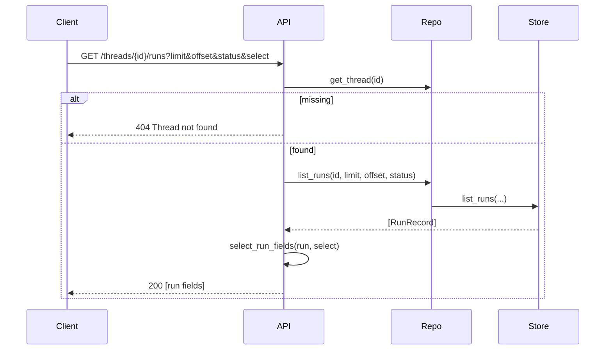
```mermaid
sequenceDiagram
    participant Client
    participant API
    participant Repo
    participant Store
    Client->>API: GET /threads/{id}/runs?limit&offset&status&select
    API->>Repo: get_thread(id)
    alt missing
        API-->>Client: 404 Thread not found
    else found
        API->>Repo: list_runs(id, limit, offset, status)
        Repo->>Store: list_runs(...)
        Store-->>API: [RunRecord]
        API->>API: select_run_fields(run, select)
        API-->>Client: 200 [run fields]
    end
```

---

## 13. `POST /threads/{thread_id}/runs`  (background run)

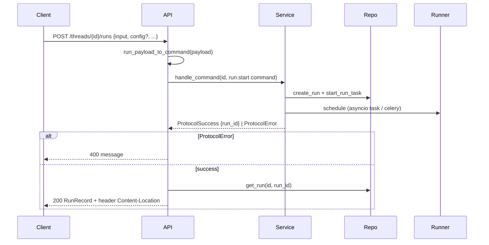
```mermaid
sequenceDiagram
    participant Client
    participant API
    participant Service
    participant Repo
    participant Runner
    Client->>API: POST /threads/{id}/runs {input, config?, ...}
    API->>API: run_payload_to_command(payload)
    API->>Service: handle_command(id, run.start command)
    Service->>Repo: create_run + start_run_task
    Service->>Runner: schedule (asyncio task / celery)
    Service-->>API: ProtocolSuccess {run_id} | ProtocolError
    alt ProtocolError
        API-->>Client: 400 message
    else success
        API->>Repo: get_run(id, run_id)
        API-->>Client: 200 RunRecord + header Content-Location
    end
```

---

## 14. `POST /threads/{thread_id}/runs/stream`  (create + SSE)

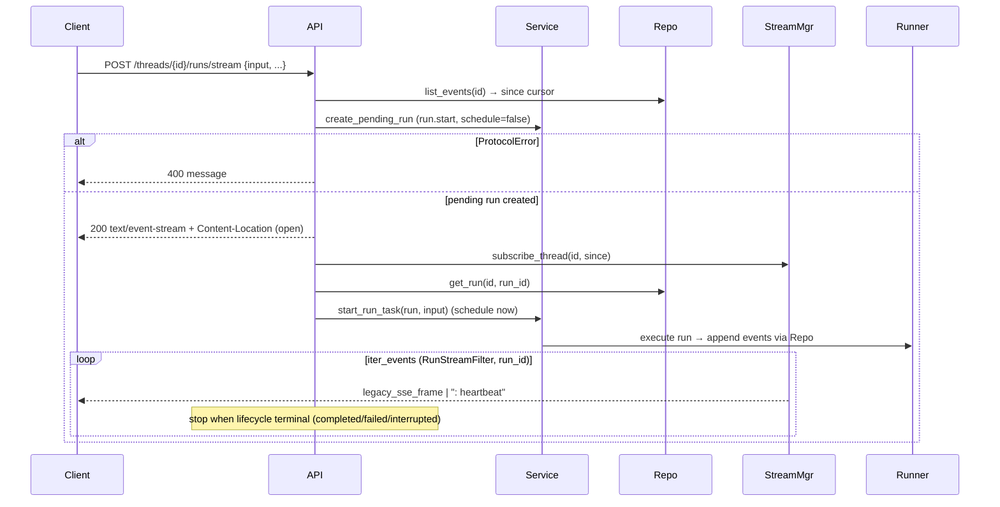
```mermaid
sequenceDiagram
    participant Client
    participant API
    participant Service
    participant Repo
    participant StreamMgr
    participant Runner
    Client->>API: POST /threads/{id}/runs/stream {input, ...}
    API->>Repo: list_events(id) → since cursor
    API->>Service: create_pending_run (run.start, schedule=false)
    alt ProtocolError
        API-->>Client: 400 message
    else pending run created
        API-->>Client: 200 text/event-stream + Content-Location (open)
        API->>StreamMgr: subscribe_thread(id, since)
        API->>Repo: get_run(id, run_id)
        API->>Service: start_run_task(run, input)  (schedule now)
        Service->>Runner: execute run → append events via Repo
        loop iter_events (RunStreamFilter, run_id)
            StreamMgr-->>Client: legacy_sse_frame | ": heartbeat"
            Note over API: stop when lifecycle terminal (completed/failed/interrupted)
        end
    end
```

---

## 15. `POST /runs/stream`  (stateless)

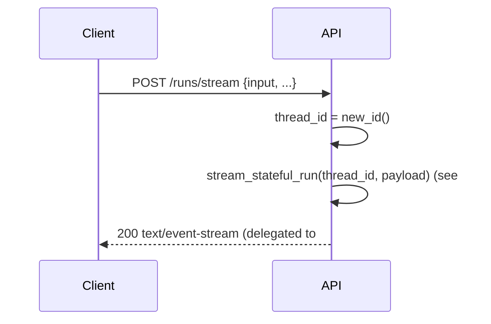
```mermaid
sequenceDiagram
    participant Client
    participant API
    Client->>API: POST /runs/stream {input, ...}
    API->>API: thread_id = new_id()
    API->>API: stream_stateful_run(thread_id, payload)  (see #14)
    API-->>Client: 200 text/event-stream (delegated to #14)
```

---

## 16. `POST /threads/{thread_id}/runs/wait`

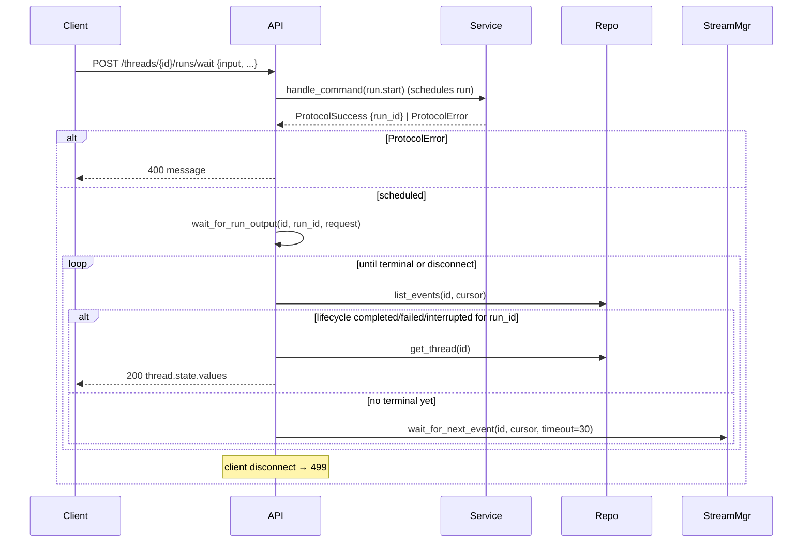
```mermaid
sequenceDiagram
    participant Client
    participant API
    participant Service
    participant Repo
    participant StreamMgr
    Client->>API: POST /threads/{id}/runs/wait {input, ...}
    API->>Service: handle_command(run.start)  (schedules run)
    Service-->>API: ProtocolSuccess {run_id} | ProtocolError
    alt ProtocolError
        API-->>Client: 400 message
    else scheduled
        API->>API: wait_for_run_output(id, run_id, request)
        loop until terminal or disconnect
            API->>Repo: list_events(id, cursor)
            alt lifecycle completed/failed/interrupted for run_id
                API->>Repo: get_thread(id)
                API-->>Client: 200 thread.state.values
            else no terminal yet
                API->>StreamMgr: wait_for_next_event(id, cursor, timeout=30)
            end
        end
        Note over API: client disconnect → 499
    end
```

---

## 17. `POST /runs/wait`  (stateless)

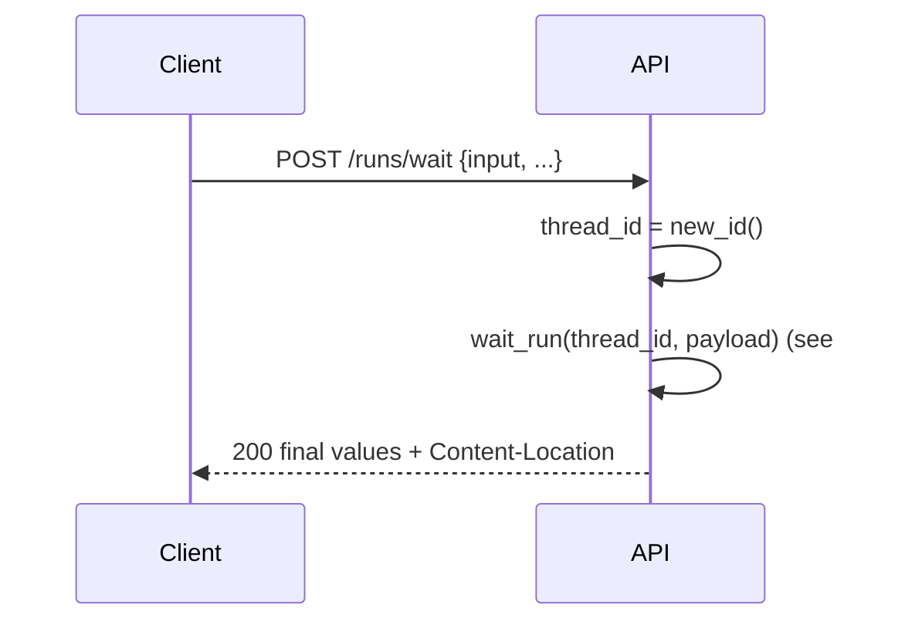
```mermaid
sequenceDiagram
    participant Client
    participant API
    Client->>API: POST /runs/wait {input, ...}
    API->>API: thread_id = new_id()
    API->>API: wait_run(thread_id, payload)  (see #16)
    API-->>Client: 200 final values + Content-Location
```

---

## 18. `POST /runs`  (stateless background)

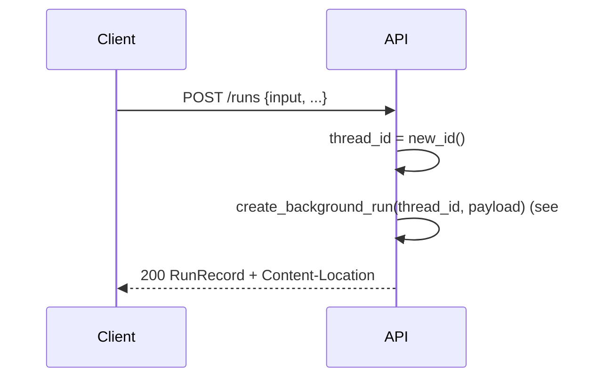
```mermaid
sequenceDiagram
    participant Client
    participant API
    Client->>API: POST /runs {input, ...}
    API->>API: thread_id = new_id()
    API->>API: create_background_run(thread_id, payload)  (see #13)
    API-->>Client: 200 RunRecord + Content-Location
```

---

## 19. `GET /threads/{thread_id}/runs/{run_id}`

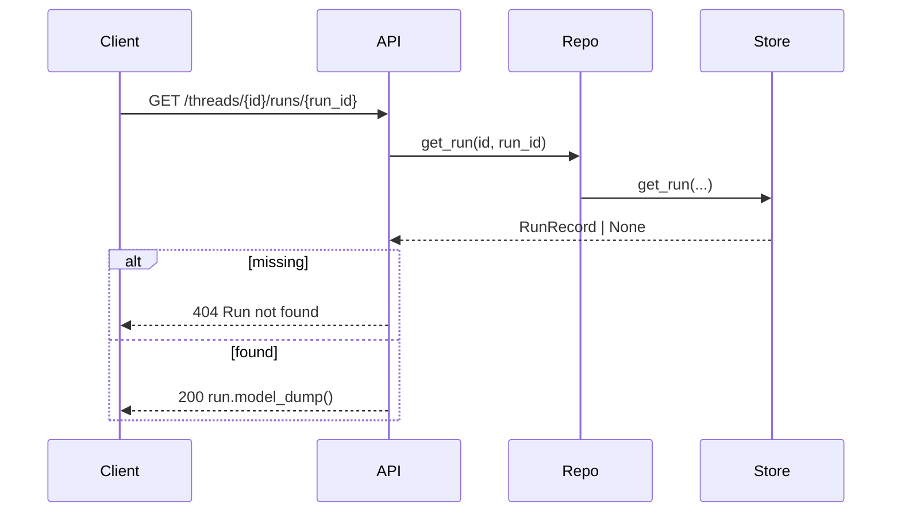
```mermaid
sequenceDiagram
    participant Client
    participant API
    participant Repo
    participant Store
    Client->>API: GET /threads/{id}/runs/{run_id}
    API->>Repo: get_run(id, run_id)
    Repo->>Store: get_run(...)
    Store-->>API: RunRecord | None
    alt missing
        API-->>Client: 404 Run not found
    else found
        API-->>Client: 200 run.model_dump()
    end
```

---

## 20. `GET /threads/{thread_id}/runs/{run_id}/active`

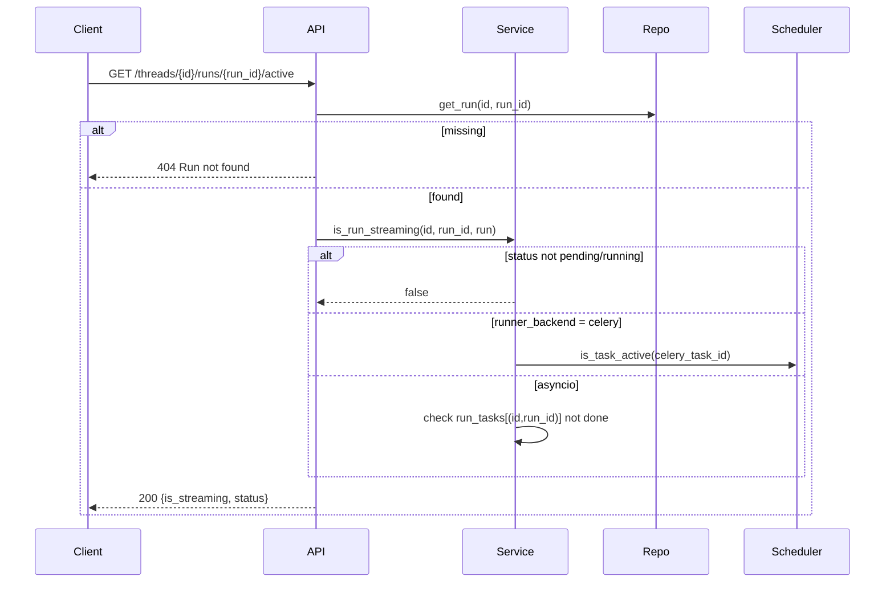
```mermaid
sequenceDiagram
    participant Client
    participant API
    participant Service
    participant Repo
    participant Scheduler
    Client->>API: GET /threads/{id}/runs/{run_id}/active
    API->>Repo: get_run(id, run_id)
    alt missing
        API-->>Client: 404 Run not found
    else found
        API->>Service: is_run_streaming(id, run_id, run)
        alt status not pending/running
            Service-->>API: false
        else runner_backend = celery
            Service->>Scheduler: is_task_active(celery_task_id)
        else asyncio
            Service->>Service: check run_tasks[(id,run_id)] not done
        end
        API-->>Client: 200 {is_streaming, status}
    end
```

---

## 21. `GET /threads/{thread_id}/runs/{run_id}/checkpoints`

```mermaid
sequenceDiagram
    participant Client
    participant API
    participant Repo
    participant Store
    Client->>API: GET /threads/{id}/runs/{run_id}/checkpoints?limit
    API->>Repo: get_run(id, run_id)
    alt missing
        API-->>Client: 404 Run not found
    else found
        API->>Repo: get_history(id, limit)
        Repo->>Store: get_history(...)
        Store-->>API: [ThreadState]
        API->>API: project_run_checkpoints(run, history)
        Note over API: derives run messages, todos,<br/>subagents, checkpoints
        API-->>Client: 200 {run, values, messages, todos, subagents, checkpoints}
    end
```

---

## 22. `POST /threads/{thread_id}/runs/{run_id}/resume`

```mermaid
sequenceDiagram
    participant Client
    participant API
    participant Service
    participant Repo
    participant Runner
    participant Scheduler
    Client->>API: POST /threads/{id}/runs/{run_id}/resume
    API->>Service: resume_run(id, run_id)
    Service->>Repo: get_run(id, run_id)
    alt run missing
        Service-->>API: false
        API-->>Client: 404 Run not found
    else not active
        Service-->>API: true (no-op)
    else dead celery task
        Service->>Scheduler: is_task_active? → reschedule (<= max) or fail
    else detached/recover
        Service->>Repo: check latest checkpoint (next empty → mark success)
        alt needs re-run
            Service->>Runner: enqueue_resume / create_task(resume)
        end
    end
    API->>Repo: get_run(id, run_id)
    API-->>Client: 200 RunRecord | {ok:true}
```

---

## 23. `GET /threads/{thread_id}/runs/{run_id}/join`

```mermaid
sequenceDiagram
    participant Client
    participant API
    participant Repo
    participant StreamMgr
    participant Service
    Client->>API: GET /threads/{id}/runs/{run_id}/join?cancel_on_disconnect
    loop until terminal or disconnect
        API->>Repo: get_run(id, run_id)
        alt run missing
            API-->>Client: 404 Run not found
        else status in success/error/interrupted/timeout
            API->>Repo: get_thread(id)
            API-->>Client: 200 thread.state.values
        else still active
            API->>StreamMgr: wait_for_next_event(id, cursor, timeout=30)
        end
    end
    alt disconnected & cancel_on_disconnect
        API->>Service: cancel_run(id, run_id)
    end
    Note over API: disconnect → 499
```

---

## 24. `GET /threads/{thread_id}/runs/{run_id}/stream`  (join existing, SSE)

```mermaid
sequenceDiagram
    participant Client
    participant API
    participant Repo
    participant Service
    participant StreamMgr
    participant Broker
    Client->>API: GET /threads/{id}/runs/{run_id}/stream (stream_mode?, cancel_on_disconnect?)
    API->>Repo: get_run(id, run_id)
    alt missing
        API-->>Client: 404 Run not found
    else found
        alt status pending/running
            API->>Service: resume_run(id, run_id)  (reattach)
        end
        API-->>Client: 200 text/event-stream (open)
        API->>StreamMgr: subscribe_thread(id, since)
        loop stream_thread_events (RunStreamFilter, run_id, stop_on_terminal)
            StreamMgr->>Broker: next_event
            StreamMgr-->>Client: legacy_sse_frame | ": heartbeat"
            Note over API: return on lifecycle terminal
        end
        opt disconnect & cancel_on_disconnect
            API->>Service: cancel_run(id, run_id)
        end
    end
```

---

## 25. `POST /threads/{thread_id}/runs/{run_id}/cancel`

```mermaid
sequenceDiagram
    participant Client
    participant API
    participant Service
    participant Repo
    participant Runner
    participant Scheduler
    Client->>API: POST /threads/{id}/runs/{run_id}/cancel
    API->>Service: cancel_run(id, run_id)
    Service->>Repo: get_run(id, run_id)
    alt missing
        Service-->>API: false
        API-->>Client: 404 Run not found
    else found
        opt asyncio task tracked
            Service->>Runner: task.cancel()
        end
        opt celery task
            Service->>Scheduler: revoke(task_id, terminate?)
        end
        Service->>Repo: save_run(status=interrupted, cancel_requested=true)
        Service->>Repo: append_event(lifecycle interrupted)
        Service-->>API: true
        API-->>Client: 200 {ok:true}
    end
```

---

## 26. `POST /runs/cancel`  (bulk)

```mermaid
sequenceDiagram
    participant Client
    participant API
    participant Service
    Client->>API: POST /runs/cancel {thread_id, run_ids[]}
    loop each run_id
        API->>Service: cancel_run(thread_id, run_id)  (see #25)
        Service-->>API: bool
    end
    API-->>Client: 200 {cancelled: count}
```

---

## (WS) `/threads/{thread_id}/stream/events`  — WebSocket (not REST, included for completeness)

```mermaid
sequenceDiagram
    participant Client
    participant API
    participant Service
    participant Repo
    participant StreamMgr
    Client->>API: WS connect /threads/{id}/stream/events
    API-->>Client: accept
    par receive_loop
        Client->>API: {subscription.subscribe | unsubscribe | command}
        alt subscribe
            API->>Repo: get_thread + list_events (replay matching)
            API-->>Client: replayed events + ProtocolSuccess {subscription_id}
        else command
            API->>Service: handle_command(...)
            API-->>Client: response
        end
    and send_loop
        API->>StreamMgr: subscribe_thread(id, cursor)
        loop iter_events
            StreamMgr-->>API: event
            API->>API: matches_subscription?
            API-->>Client: event.model_dump()
        end
    end
    Client->>API: disconnect → cancel loops
```
