# State Enums & State Machines

This document inventories every enumerated **state** representation in the codebase and models each as a Mermaid state diagram. The system uses Python `Literal` types, TypeScript union types, and string constant sets rather than formal `enum` classes — all are included.

## Inventory

| # | State enum | Values | Location |
|---|---|---|---|
| 1 | `RunRecord.status` | `pending, running, success, error, interrupted, timeout` | `app/models.py:73` |
| 2 | Run lifecycle event | `running, completed, failed, interrupted` | `research_runtime.py`, `deep_agent.py`, `service.py`, `tasks.py` |
| 3 | `RunRecord.multitask_strategy` | `reject, rollback, interrupt, enqueue` | `app/models.py:76` |
| 4 | `RunHandle.status` | `active, completed, failed, cancelled` | `app/streaming.py:32` |
| 5 | `TaskStatus` (Celery) | `PENDING, STARTED, RETRY, SUCCESS, FAILURE, REVOKED` | `worker/client.py:10` |
| 6 | Streaming message event | `message-start → content-block-* → message-finish` | `research_runtime.py`, `deep_agent.py` |
| 7 | Tool activity event | `tool-started, tool-finished` | `research_runtime.py`, `deep_agent.py` |
| 8 | `ProtocolResponse.type` | `success, error` (+ `event`) | `app/models.py:87,94,109` |
| 9 | UI `RunStatus` | `idle, running, success, error, interrupted` | `ui/src/types.ts:85` |
| 10 | UI `ChatMessage.status` | `streaming, done` | `ui/src/types.ts:45` |
| 11 | UI `ToolActivity.status` | `running, done` | `ui/src/types.ts:55` |
| 12 | UI `SubagentCard.status` | `pending, running, done, error` | `ui/src/types.ts:78` |
| 13 | `TodoItem.status` | `pending, in_progress, completed` | `ui/src/types.ts:62`, `api.ts:184` |

---

## 1. `RunRecord.status` — server-side run lifecycle

The authoritative run state persisted in `stream_runs`. `ACTIVE_RUN_STATUSES = {pending, running}` (`service.py:25`); terminal set is `{success, error, interrupted, timeout}`.

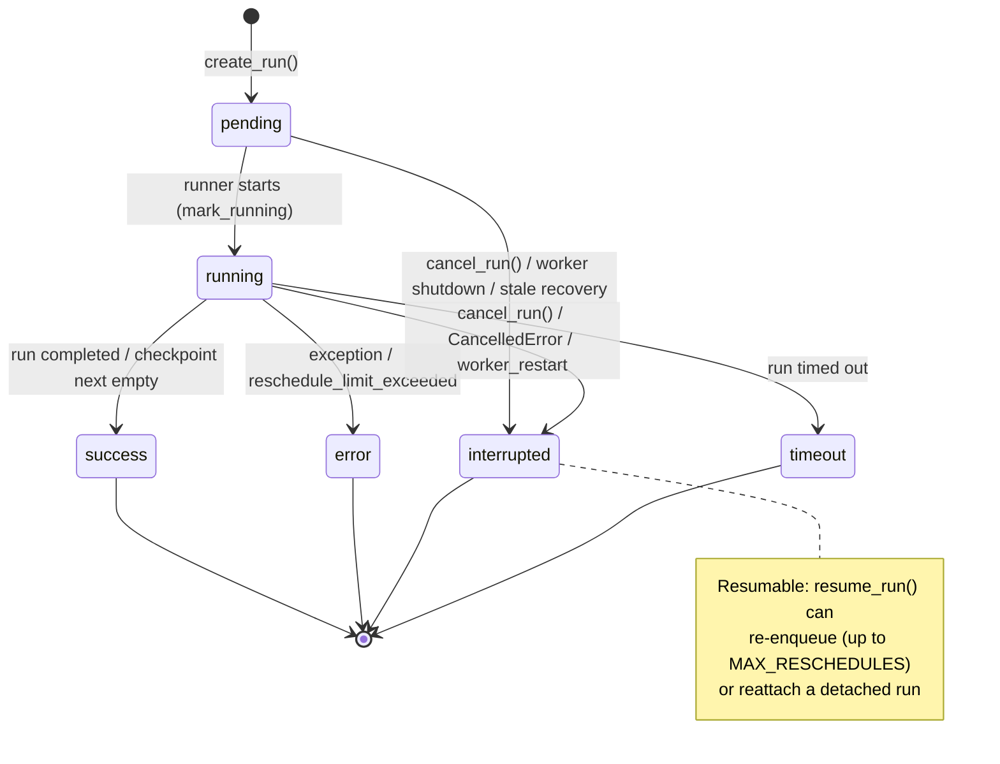

---

## 2. Run lifecycle event stream (`lifecycle` channel)

Emitted via `append_event(thread_id, "lifecycle", {"event": ...})`. These drive SSE terminal detection (`RunStreamFilter.is_terminal` → `completed|failed|interrupted`). Note the event vocabulary differs from the persisted `status` (`completed` vs `success`).

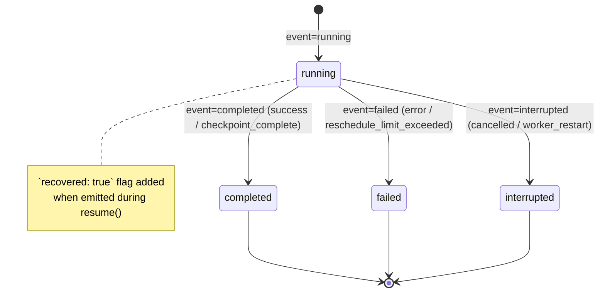

---

## 3. `RunRecord.multitask_strategy`

Not a lifecycle — a per-run policy selected at creation (default `rollback`; UI sends `reject`). Governs what happens when a run is requested while another is active. In the current implementation `_run_start` always rejects a second active run regardless of strategy.

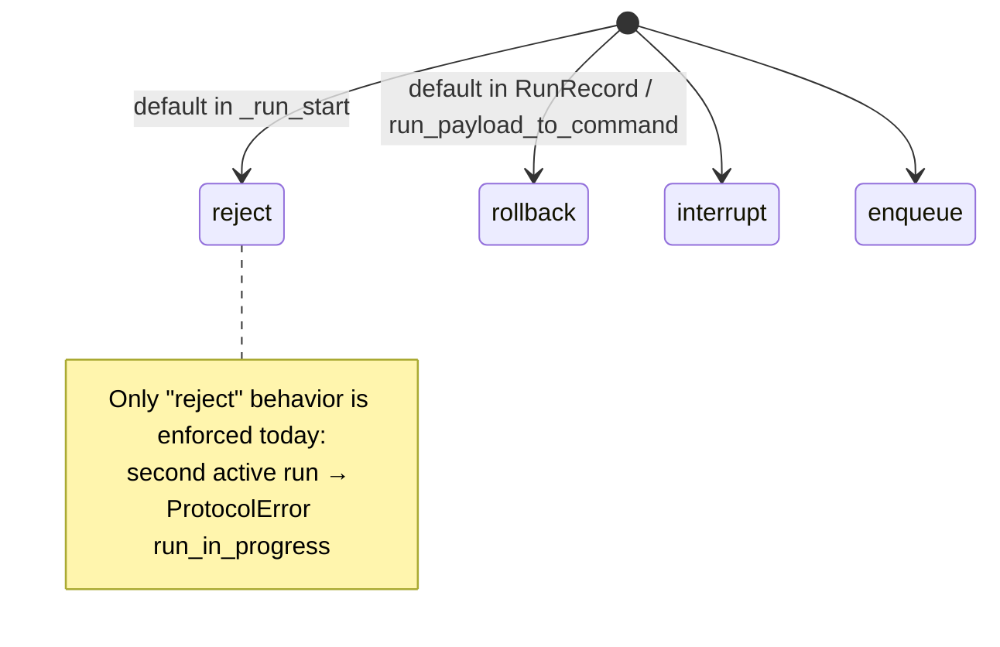

---

## 4. `RunHandle.status` — streaming subscription handle

Tracks a run's streaming/retry handle inside `StreamSubscriptionManager` (`streaming.py`).

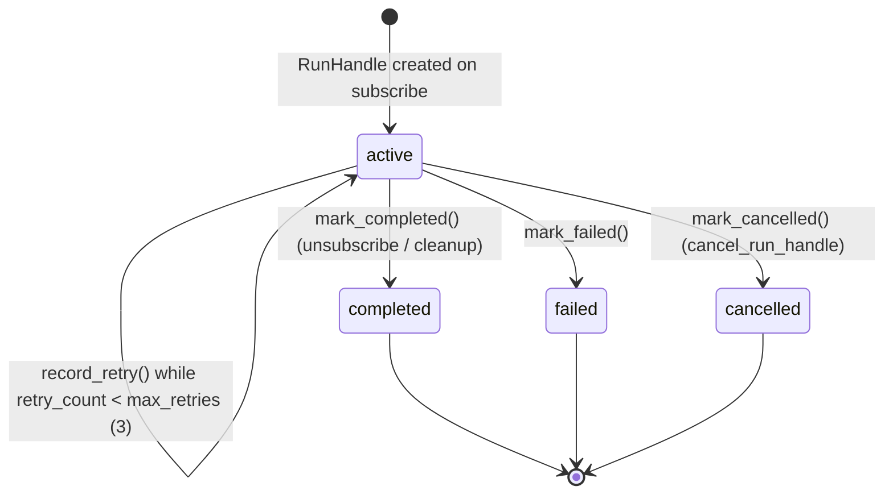

---

## 5. `TaskStatus` — Celery task states

Read by `CeleryRunScheduler` (`worker/client.py`). `is_task_active()` treats `{PENDING, STARTED, RETRY}` as active; used to detect dead tasks for rescheduling.

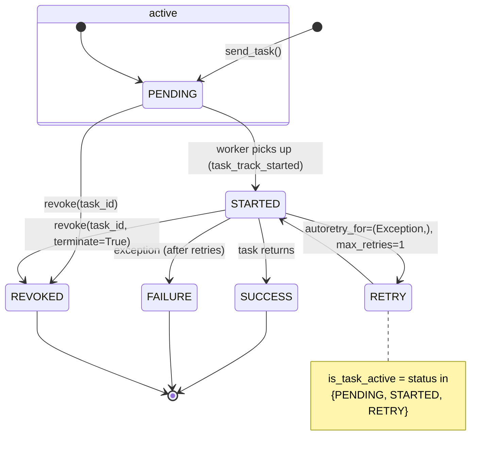

---

## 6. Streaming message state (`messages` channel)

The per-message event sequence emitted by `_mirror_agent_event` (real agent) and `_stream_text_message` (fixture). Mirrors LangChain `on_chat_model_start/stream/end`.

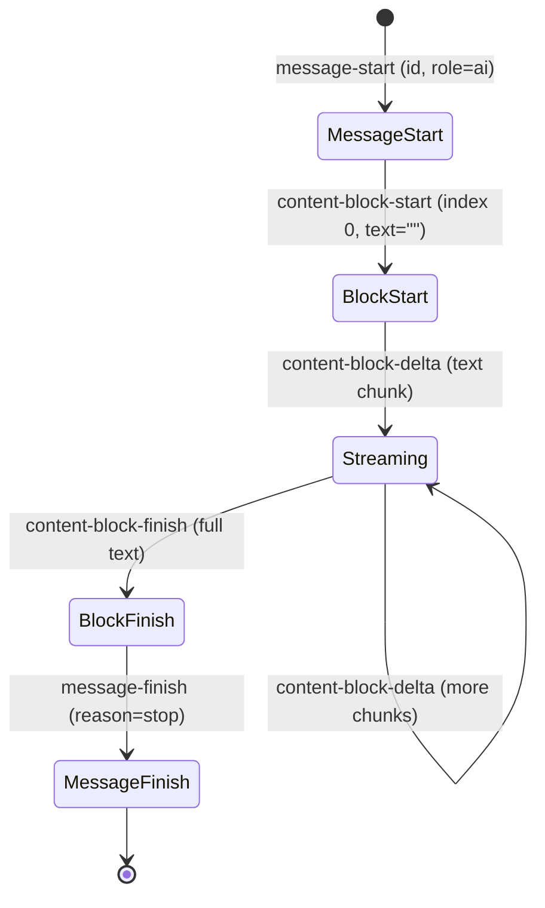

---

## 7. Tool activity state (`tools` channel)

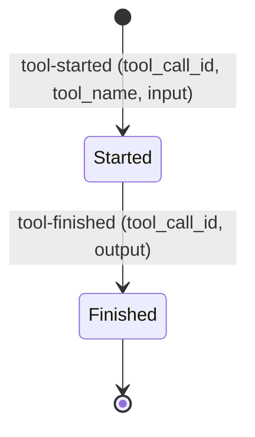

---

## 8. `ProtocolResponse.type` — command response discriminator

Discriminated union for command results and events (`models.py`).

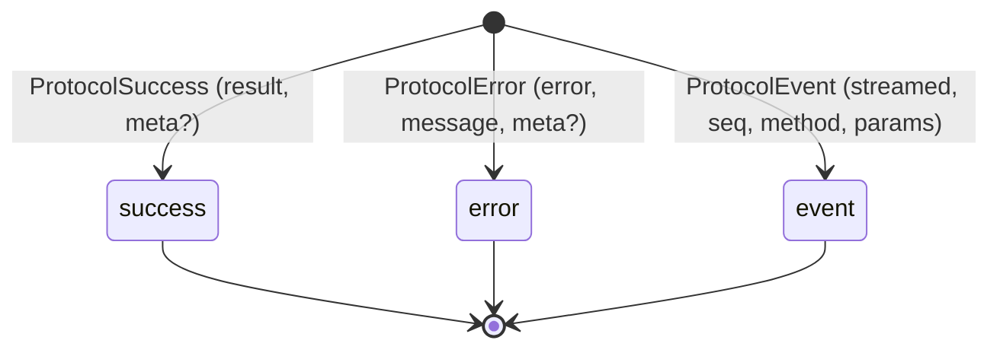

---

## 9. UI `RunStatus` — frontend run view

Derived client-side in `App.tsx` from run records + lifecycle events. `ACTIVE_RUN_STATUSES = {pending→running}`, `TERMINAL_RUN_EVENTS = {completed, failed, interrupted, timeout}`.

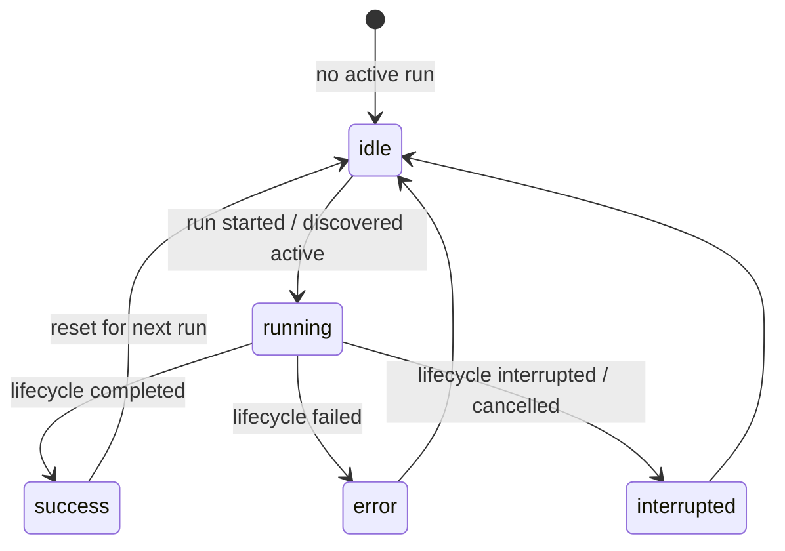

---

## 10. UI `ChatMessage.status`

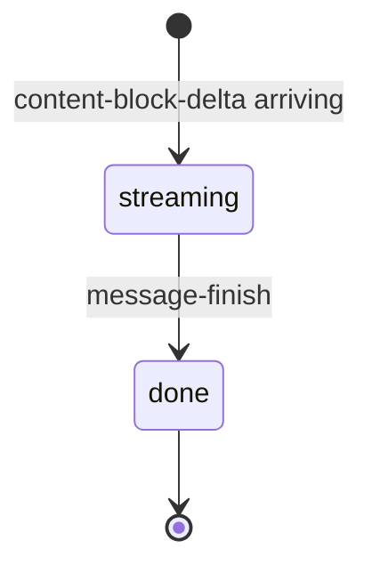

---

## 11. UI `ToolActivity.status`

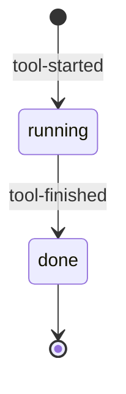

---

## 12. UI `SubagentCard.status`

Aggregated per subagent (`tools:task-*` namespace). Becomes `done` when its status is `running` and all its messages are `done` (`App.tsx:469`).

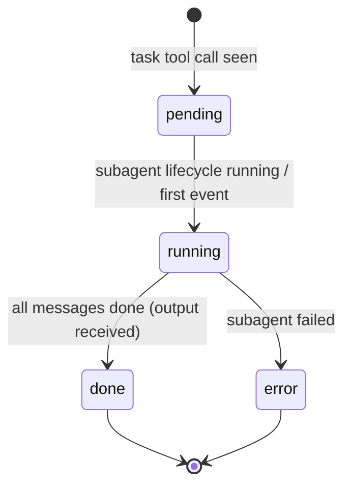

---

## 13. `TodoItem.status` — plan item state

Produced by the agent's todo/plan tool, projected in `updates` events and normalized in `api.ts` (unknown → `pending`).

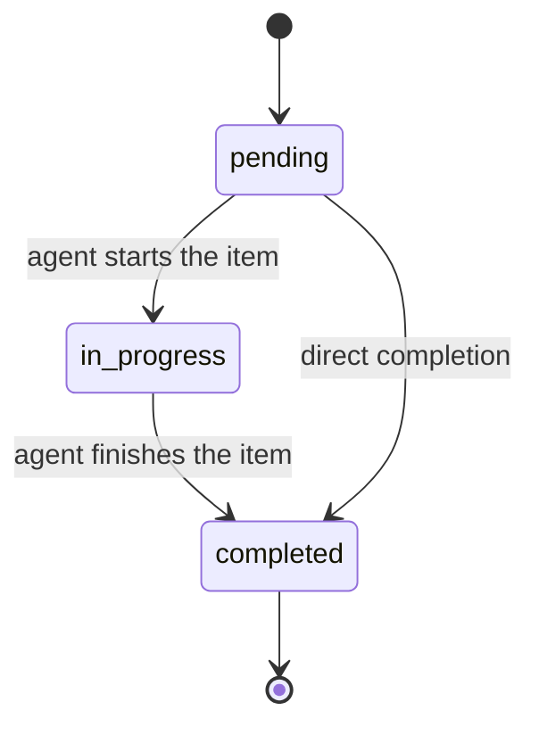

---

## Cross-cutting note: status vs. lifecycle-event vocabulary

Two vocabularies describe the *same* run and must be read together:

| Persisted `RunRecord.status` | `lifecycle` event | UI `RunStatus` |
|---|---|---|
| `pending` | — | `running` (once discovered) |
| `running` | `running` | `running` |
| `success` | `completed` | `success` |
| `error` | `failed` | `error` |
| `interrupted` | `interrupted` | `interrupted` |
| `timeout` | *(no distinct event; terminal set)* | `interrupted`/terminal |

The mismatch (`success`↔`completed`, `error`↔`failed`) is a known translation seam between the persisted store and the streamed protocol/UI layers.
