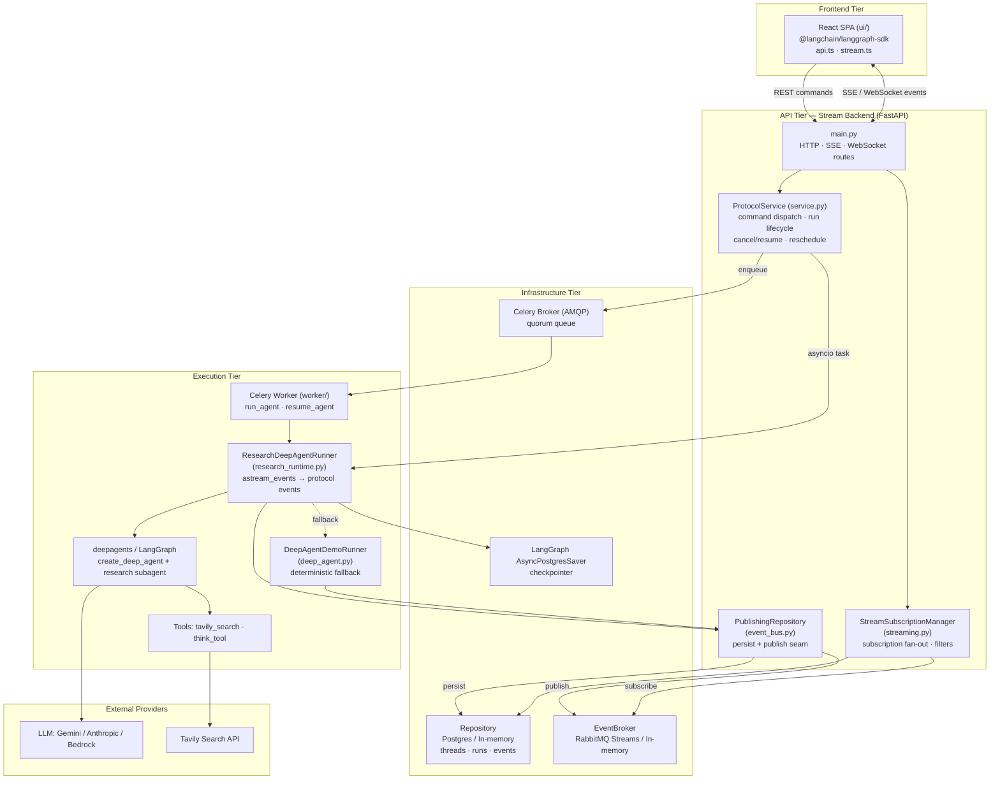

# System Overview — Deep Research Agent

## Purpose of the System

The Deep Research Agent is an AI system that conducts autonomous, multi-step web research and streams its reasoning, tool activity, and results back to a user in real time. A user submits a research question; an orchestrator agent plans the work, delegates focused sub-topics to a research subagent, searches the web (Tavily), reflects on findings, and produces a synthesized answer.

The distinguishing engineering goal is **durable, resumable, real-time streaming of agent execution**. Rather than a fire-and-forget request, every run is:

- **Streamed** — tokens, tool calls, todos, and lifecycle events are pushed to the browser as they happen (SSE / WebSocket).
- **Persisted** — thread state, run records, and an append-only event log are stored so a run survives disconnects and process restarts.
- **Resumable** — runs can be joined, resumed, cancelled, and rescheduled, optionally across a distributed worker fleet.

The repository re-implements the LangGraph Platform HTTP/streaming protocol in a custom FastAPI backend so it can add Postgres persistence, a RabbitMQ Streams event bus, and Celery-based distributed execution, while remaining compatible with the `@langchain/langgraph-sdk` frontend.

---

## High-Level Architecture

The system is organized in four tiers:

1. **Frontend (UI tier)** — a React/Vite SPA using `@langchain/langgraph-sdk`. It creates threads, starts runs, and subscribes to event streams to render messages, tool calls, todos, and subagent cards.

2. **API tier (Stream Backend)** — a FastAPI service that exposes the LangGraph-style HTTP/SSE/WebSocket surface. It owns run lifecycle, command dispatch, subscription fan-out, and the persistence/eventing wiring.

3. **Execution tier** — the deepagents/LangGraph research agent, run either **in-process** as asyncio tasks or **out-of-process** on Celery workers. Execution mirrors LangChain `astream_events` into protocol events.

4. **Infrastructure tier** — PostgreSQL (application store + LangGraph checkpointer), RabbitMQ (Streams protocol for the event bus, AMQP for the Celery task queue), and external LLM/search providers.

The pivotal design element is the **`PublishingRepository`**: a decorator that, for every event, both *persists* it (Repository) and *publishes* it (EventBroker). This single seam is what lets a run executing on a Celery worker deliver live events to an SSE client connected to a different API process — persistence provides replay/resume, the broker provides real-time fan-out.

Nearly every component is **pluggable via environment variables**, defaulting to a single-process in-memory stack and scaling up to the full distributed stack (Postgres + RabbitMQ + Celery).

---

## Mermaid Component Diagram

---

## Main Modules & Responsibilities

### API Tier — `stream-backend/app/`

| Module | Responsibility |
|---|---|
| `main.py` | FastAPI app; all HTTP/SSE/WebSocket routes; dual SSE frame formatting (legacy SDK + protocol-v2); run-checkpoint projection; app startup/shutdown hooks; logging config. |
| `service.py` | `ProtocolService` — command dispatch, run scheduling (asyncio vs Celery), start/cancel/resume, one-active-run-per-thread guard, dead-task reschedule/recovery. `AutoResearchRunner` (research → fixture fallback). |
| `streaming.py` | `StreamSubscriptionManager` — subscribes clients to a thread's event stream, tracks `RunHandle`s, filters events (`RunStreamFilter`, `ProtocolStreamFilter`), cleans up on terminal events/disconnect. |
| `event_bus.py` | `PublishingRepository` (persist+publish decorator); `InMemoryEventBroker` and `RabbitMQStreamBroker`; broker factory. |
| `store.py` | `Repository` Protocol + `InMemoryRepository` (threads, runs, events, condition-based waits). |
| `store_postgres.py` | `PostgresRepository` — durable `stream_threads`, `stream_runs`, `stream_events`; schema bootstrap; sequence generation. |
| `protocol.py` | Channel/namespace subscription matching and SSE frame serialization. |
| `models.py` | Pydantic models: `ThreadRecord`, `RunRecord`, `ThreadState`, `Checkpoint`, `ProtocolCommand/Event/Success/Error`. |
| `runtime.py` | Repo/broker factory (`create_publishing_repository`) used by workers. |

### Execution Tier

| Module | Responsibility |
|---|---|
| `app/research_runtime.py` | `ResearchDeepAgentRunner` — builds the deepagents agent, runs `astream_events` (v2), mirrors LangChain events into protocol events, manages the Postgres checkpointer, resolves Bedrock model IDs, hot-reloads prompts on file mtime change, saves final state snapshots. |
| `app/deep_agent.py` | `DeepAgentDemoRunner` — deterministic scripted event stream used as a fallback and for tests. |
| `worker/celery_app.py` | Celery app configuration (broker, quorum queues, serialization, acks). |
| `worker/tasks.py` | `run_agent` / `resume_agent` tasks; `WorkerShutdownManager` for graceful drain; `recover_stale_runs`. |
| `worker/client.py` | `CeleryRunScheduler` — API-side enqueue/resume/revoke and task-status checks. |
| `worker/asyncio_policy.py` | Windows selector event-loop policy fix. |

### Research Agent — `research_agent/` (duplicated under `stream-backend/`)

| Module | Responsibility |
|---|---|
| `prompts.py` | Orchestrator, subagent-delegation, and researcher instruction prompts. |
| `tools.py` | `tavily_search` (Tavily URL discovery + full-page markdown fetch) and `think_tool` (strategic reflection). |

### Frontend — `ui/src/`

| Module | Responsibility |
|---|---|
| `api.ts` | REST client — threads, runs, commands, checkpoints. |
| `stream.ts` | `useStream` SDK wrapper exposing `DeepResearchStream` (messages, tool calls, todos, debug events). |
| `App.tsx`, `selectors.ts`, `types.ts`, `logger.ts` | UI composition, state selection, shared types, structured logging. |

### Root LangGraph deployment

| File | Responsibility |
|---|---|
| `agent.py` | Standalone `create_deep_agent` graph (`agent`) for LangGraph-CLI deployment. |
| `langgraph.json`, `Dockerfile` | Graph registration and container build on `langchain/langgraph-api:3.11`. |

---

## External Dependencies

### Runtime services / infrastructure
- **PostgreSQL** — application store (`stream_threads`, `stream_runs`, `stream_events`) and the LangGraph `AsyncPostgresSaver` checkpointer.
- **RabbitMQ** — two roles: the **Streams protocol** (port 5552, via `rstream`) as the streaming event bus, and **AMQP** (port 5672) as the Celery task-queue broker.
- **Celery** — distributed task execution for agent runs (optional; asyncio in-process is the default).

### AI / search providers
- **LLM provider** (configurable via `RESEARCH_AGENT_PROVIDER`): Google Gemini (`langchain-google-genai`), Anthropic (`langchain-anthropic`), or AWS Bedrock (`langchain-aws` / `boto3`).
- **Tavily** — web search API (`tavily-python`).

### Core Python libraries
- `deepagents` — agent framework (`create_deep_agent`, subagents, `task` tool).
- `langgraph` / `langchain-core` — graph execution, `astream_events`, checkpointing.
- `fastapi` + `uvicorn` — API server.
- `pydantic` v2 — data models.
- `psycopg[binary,pool]` — async Postgres access.
- `rstream` — RabbitMQ Streams client.
- `httpx`, `markdownify` — webpage fetch + HTML→markdown.

### Frontend libraries
- `@langchain/langgraph-sdk` (incl. `/react` `useStream`).
- `react` 19, `react-dom`, `vite`, `typescript`, `lucide-react`.

### Configuration surface (selected env vars)
- `STREAM_BACKEND_STORE` (`memory` | `postgres`)
- `STREAM_BACKEND_EVENT_BROKER` (`memory` | `rabbitmq`)
- `STREAM_BACKEND_RUNNER_BACKEND` / `STREAM_BACKEND_EXECUTION_BACKEND` (`asyncio` | `celery`)
- `STREAM_BACKEND_AGENT_MODE` (`auto` | `fixture` | `research`)
- `RESEARCH_AGENT_PROVIDER` / `RESEARCH_AGENT_MODEL`, plus provider credentials (`GOOGLE_API_KEY`, AWS profile/region, `TAVILY_API_KEY`).
- `STREAM_BACKEND_POSTGRES_URI`, `RABBITMQ_STREAM_URL`, `STREAM_BACKEND_CELERY_BROKER_URL`, `STREAM_BACKEND_CELERY_QUEUE`, `STREAM_BACKEND_MAX_RESCHEDULES`.
