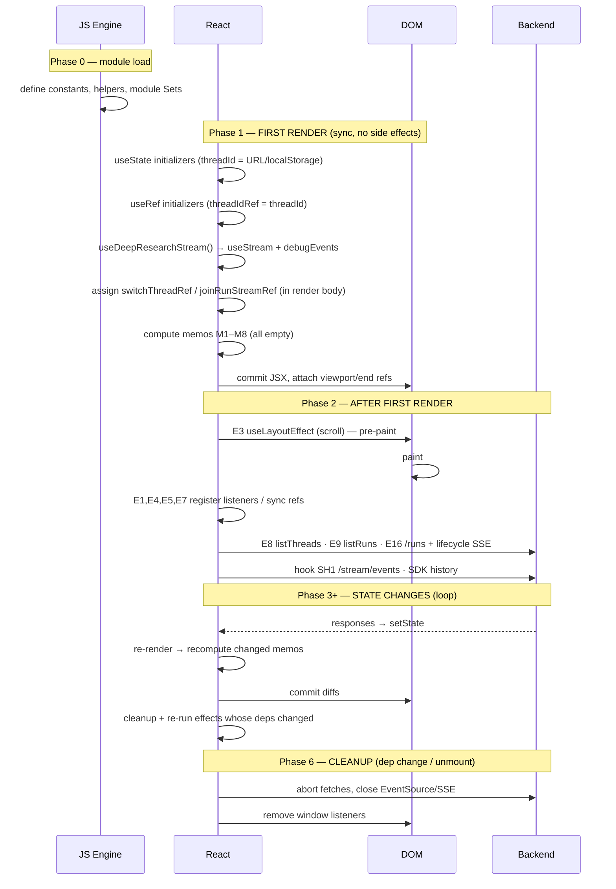
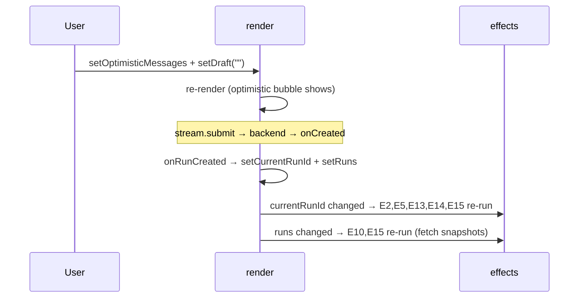

# Lifecycle Timeline — `ui/src/App.tsx`

A chronological account of the `App` component, anchored to React's actual phase ordering: **render → commit → layout effects → paint → passive effects → cleanup**. Effects are referenced by their numbers (E1–E16) from [ui-effects-table.md](ui-effects-table.md); `SH1` is the raw-SSE effect inside `useDeepResearchStream` (`stream.ts`).

## Master timeline

---

## 1. First render (synchronous, side-effect-free)

`App()` runs top to bottom. Nothing touches the network or DOM yet.

- **State is seeded.** The important one is `threadId = initialThreadId()`, which reads the `?thread_id=` URL param and falls back to `localStorage`. A returning user is already "on a thread" before anything loads. Everything else starts empty/idle (`runs=[]`, `currentRunId=null`, `runCheckpointSnapshots={}`, `visibleMessages=[]`).
- **Refs are seeded.** `threadIdRef` is initialized to `threadId` (not null), while the DOM refs (`messagesViewportRef`, `messagesEndRef`) are still `null` — they only get real nodes at commit.
- **The stream hook is instantiated.** `useDeepResearchStream` sets up its own `debugEvents` state and the SDK's `useStream`. Its effects are *registered* but do not run yet.
- **Two refs are assigned during the render body** (not in an effect): `switchThreadRef.current = stream.switchThread` and `joinRunStreamRef.current = async (…)`. This is deliberate — they're refreshed on *every* render so effects always call the latest closure.
- **Memos M1–M8 compute once** against empty inputs, yielding `displayedMessageEntries = []`.
- **JSX returns** the sidebar + empty-state ("What should we research?") + composer. React commits this to the DOM and, during commit, populates the DOM refs.

Key React fact: **no `useEffect` has run yet**, and DOM refs were `null` throughout the render body.

## 2. After first render (commit → effects)

Order is strict:

1. **`E3` (`useLayoutEffect`) runs first, before paint** — scroll-to-bottom (a no-op here since the transcript is empty).
2. **Browser paints.**
3. **Passive effects run in declaration order** E1→E16. On mount, *all* run:
   - Listener/ref setup: `E1` (menu close), `E4` (scroll tracking), `E5` (mirror refs), `E7` (URL normalize), `E11` (popstate).
   - **Network burst if a `threadId` exists**: `E8` `listThreads`, `E9` `listRuns`, `E16` opens the lifecycle `EventSource` + initial `/runs` check, the hook's `SH1` opens the raw `/stream/events` SSE, and the SDK fetches state history. A returning user fires ~5 concurrent requests here.
   - Early-returners: `E2` (no messages), `E10` (no runs → nothing missing), `E13`/`E14`/`E15` (no `currentRunId`/active run), `E12` (dead).

## 3. When state changes

Every `setState` (e.g. `E8`'s `setThreads` resolving) schedules a re-render, and the cycle repeats: **render body re-runs → changed memos recompute → `joinRunStreamRef`/`switchThreadRef` reassigned → commit → cleanup+re-run only the effects whose dependency arrays changed.**

The instructive cascade is a submit:

A single logical action (submit) ripples through 5–6 effects because `currentRunId` and `runs` are the two hub dependencies.

## 4. When refs change

Mutating `ref.current` **does not** re-render and **does not** re-run effects. Refs change three ways here:

- **During render** — `switchThreadRef`, `joinRunStreamRef` reassigned each pass.
- **In `E5` after commit** — the mirror refs (`threadIdRef`, `activeRunRef`, `currentRunIdRef`, `isLoadingRef`) are synced from state. Because this runs *after* commit, **refs lag state by up to one render** — an accepted tradeoff.
- **Imperatively in handlers** — `threadRequestSeqRef++`, `joinedRunIds.add()`, `handledTerminalRunIdsRef.add()`.

Consumers (async closures, the `EventSource` callback, `refreshRuns`) read `ref.current` *lazily at call time*, so they see the freshest value without being wired into the effect graph. That decoupling is the whole reason the refs exist — it's how the component survives thread-switch races.

## 5. When effects execute (ordering rules)

The invariant to remember: **previous cleanup runs before the new body.** On a thread switch (`openThread → resetVisibleThread` bumps `threadRequestSeqRef`, clears state, calls `stream.switchThread`, sets `threadId`):

- `E9` cleanup **aborts** the old `listRuns`, then re-runs with the new thread.
- `E16` cleanup **closes** the old lifecycle `EventSource` and aborts, then opens a fresh one.
- `SH1` (hook) aborts and re-subscribes `/stream/events`.
- `E5` re-syncs refs; `E13`/`E15` re-evaluate; `E10` re-runs once new `runs` land.

## 6. During cleanup

Cleanups fire on dependency change (that one effect) and on unmount (all of them):

| Effect | Cleanup |
|---|---|
| E1 | remove `click`/`keydown` listeners |
| E4 | remove `scroll` listener |
| E8 | `cancelled = true` (ignore late `listThreads`) |
| E9 | `controller.abort()` (cancel `listRuns`) |
| E10 | `cancelled = true` + `controller.abort()` |
| E11 | remove `popstate` listener |
| E16 | `cancelled = true`, `controller.abort()`, `source.close()` |
| SH1 (hook) | `controller.abort()` → close the SSE reader |
| E2, E3, E5, E6, E7, E12, E13, E14, **E15** | **no cleanup** |

On unmount, React runs these (roughly reverse order), tearing down every listener, aborting every fetch, and closing both SSE connections.

**The one gap:** `E15` has no cleanup and no `AbortController`, so its in-flight `fetchRunActive` can resolve *after* the effect (or component) is gone and call `setActiveRun` for a stale thread. It is the single spot in this otherwise carefully-torn-down lifecycle that leaks — softened only by downstream `threadId` filtering, not by cancellation.

---

## Related documents

- [ui-app-mental-model.md](ui-app-mental-model.md) — responsibilities, state/refs/memos/effects grouped by purpose.
- [ui-state-graph.md](ui-state-graph.md) — per-state relationship graph.
- [ui-effects-table.md](ui-effects-table.md) — full effect reference with loop/race analysis.
