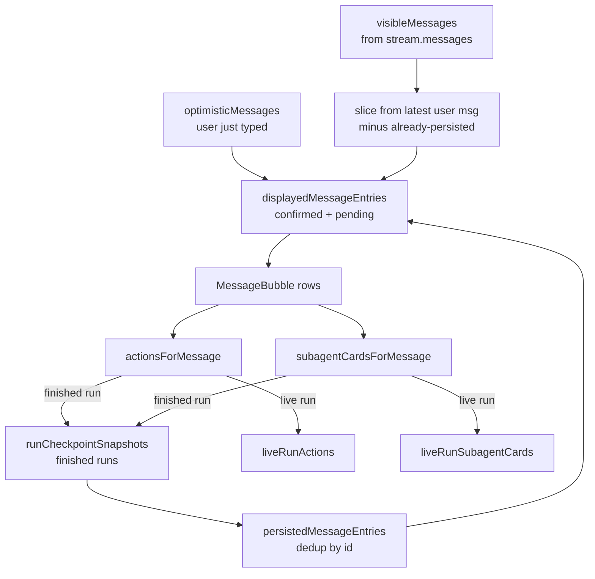
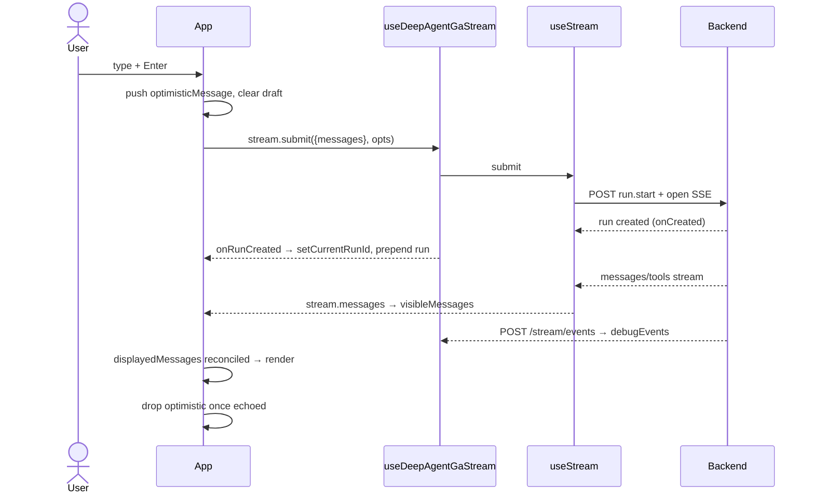

# Mental Model — `ui/src/App.tsx`

A mental model of the React front end, not a line-by-line reading. The goal is to understand **what the component owns, why each piece of state/ref/memo/effect exists, and how they cooperate** to render a durable, resumable, streaming research session.

---

## 1. What the component is responsible for

`App` is the single top-level container for the entire UI. It has no router and no global store — everything is local component state. Its responsibilities:

- **Thread management** — list, open, create, rename, delete threads (sidebar); persist the current thread in `localStorage` + the URL query param.
- **Run submission** — send a research question, optimistically show the user message, and start a streaming run.
- **Live streaming** — surface streaming assistant tokens, tool actions, and subagent cards as the run executes.
- **Durability / reconnection** — on load or reconnect, discover an already-active run and either auto-rejoin its stream or offer a resume/cancel banner.
- **History reconstruction** — for finished runs, merge persisted checkpoint snapshots with any live tail so each user turn shows the right messages, actions, and subagent cards.
- **Human-in-the-loop** — render interrupt/permission requests and resume the run with the user's answer.

It delegates the actual transport to a custom hook (`useDeepAgentGaStream`) and pure projection logic to `selectors.ts`; `App` is the **orchestrator and reconciliation layer**.

### Module context

```mermaid
flowchart LR
    subgraph App[App.tsx — orchestrator]
        ST[useState x15]
        RF[useRef x14]
        MM[useMemo x8]
        EF[useEffect x14]
        CB[callbacks]
        UIcomp[MessageBubble / InputRequests / SubagentCardView]
    end
    HOOK[useDeepAgentGaStream\nstream.ts]
    SDK[@langchain/langgraph-sdk\nuseStream]
    SEL[selectors.ts\npure projections]
    API[api.ts\nREST client]
    BE[(Stream Backend\nFastAPI + SSE)]

    App --> HOOK
    HOOK --> SDK
    SDK <-->|SSE / commands| BE
    HOOK -->|POST /stream/events\nraw SSE reader| BE
    App --> SEL
    App --> API
    API --> BE
    App -->|EventSource lifecycle| BE
```

Note there are **three parallel connections to the backend**: the SDK's `useStream` (messages/values/tools), the hook's own raw `POST /stream/events` reader (feeding `debugEvents`), and `App`'s own `EventSource` on the `lifecycle` channel (for active-run discovery). This redundancy is the source of much of the reconciliation complexity below.

---

## 2. Major pieces of state (`useState`)

Grouped by purpose:

### A. Connection & navigation
- **`apiUrl`** — backend base URL (editable in the sidebar). Re-keys most data-loading effects.
- **`threadId`** — the active thread; the central identity everything else is scoped to.

### B. Thread list (sidebar)
- **`threads`** — thread summaries shown in the sidebar.
- **`threadsLoading`** — spinner state for the list.
- **`openThreadMenu`** — which thread's ⋯ menu is open (pure UI).

### C. Composer & feedback
- **`draft`** — the textarea content.
- **`error`** — the error banner message.
- **`logMode`** — dev logging verbosity (mirrors the logger module).

### D. Run tracking (the durability core)
- **`runs`** — run summaries for the current thread.
- **`currentRunId`** — the run currently being *viewed/streamed* (live focus).
- **`activeRun`** — a discovered run that is active but **not** streaming → drives the "Inactive run found" banner.
- **`cancellingRunId`** — which run is mid-cancellation (banner button state).

### E. Message-rendering sources (three overlapping sources of truth)
- **`visibleMessages`** — the live message list mirrored from `stream.messages`.
- **`optimisticMessages`** — the user's just-typed message, shown before the backend confirms it.
- **`runCheckpointSnapshots`** — persisted, per-run reconstructed data (messages, subagents, actions) for finished runs.

> The single hardest idea in this component: **a message can come from three places** — persisted snapshots, the live stream, or the optimistic buffer — and they must be deduped into one ordered list (see §5 and §7).

---

## 3. Refs

Grouped by why they exist:

### A. Stale-closure mirrors
Effects, async callbacks, and the long-lived `EventSource`/`AbortController` closures need the *latest* value without re-subscribing. These refs shadow state:
- **`threadIdRef`**, **`activeRunRef`**, **`currentRunIdRef`**, **`isLoadingRef`** — mirror the corresponding state, synced in a dedicated effect.
- **`switchThreadRef`** — latest `stream.switchThread` (used in `popstate` + monitor).
- **`joinRunStreamRef`** — reassigned **every render** so effects can call the freshest join logic without depending on it.

### B. Request sequencing & idempotency
Guard against races between thread switches and in-flight async work:
- **`threadRequestSeqRef`** — a monotonically increasing token; incremented on every thread change so stale responses (runs, snapshots) can be discarded.
- **`joinedRunIds`** — set of run ids already joined/handled, so a run is never double-joined.
- **`handledTerminalRunIdsRef`** — set of runs whose terminal lifecycle event was already processed (fire-once).

### C. Transient / pending values
- **`pendingThreadTitleRef`** — the title to apply to a not-yet-created thread (set from the draft at submit time).
- **`loggedMessageTextRef`** — per-message last-logged text, to emit only *new* token deltas.

### D. Scroll management
- **`messagesViewportRef`** — the scroll container.
- **`messagesEndRef`** — the bottom sentinel for `scrollIntoView`.
- **`shouldStickToBottomRef`** — whether to auto-scroll (true only when the user is near the bottom).

---

## 4. Memos

Grouped by purpose. All are derivations that feed rendering; they exist to avoid recomputing projections on every render.

### A. Live-run derivations (from `stream.debugEvents` / SDK subagents)
- **`liveRunSubagentCards`** — subagent cards reconstructed from the live event stream, merged with the SDK's `subagents` map.
- **`liveRunActions`** — root-level tool "action rows" (e.g. "Searching example.com") for the current run.
- **`inputRequests`** — interrupt/permission requests, but only when a run is current *and* no reconnection banner is showing.

### B. Ordering & persisted projection
- **`runsInMessageOrder`** — current-thread runs sorted by `createdAt` (chronological transcript order).
- **`persistedMessageEntries`** / **`persistedMessages`** — deduped messages from all finished runs' checkpoint snapshots, attributed to the earliest run that produced each.

### C. Final display reconciliation
- **`displayedMessageEntries`** — the merge: persisted entries + the live tail (from the latest user message onward, minus anything already persisted) + still-pending optimistic messages. This is the array the transcript renders.
- **`displayedMessages`** — the plain message list derived from the entries.

---

## 5. Callbacks

Grouped by responsibility (these are plain functions closed over render scope, not memoized):

### A. Thread lifecycle
- **`refreshThreads`** / startup loader — reload the sidebar list.
- **`resetVisibleThread`** — the master "switch context" routine: clears runs/messages/snapshots/debug events, bumps the sequence token, calls `stream.switchThread`, and updates `localStorage`.
- **`newThread`**, **`openThread`**, **`renameThreadTitle`**, **`removeThread`** — sidebar actions.

### B. Run submission & control
- **`submit`** — trim draft → push optimistic message → `stream.submit(...)` → refresh threads/runs.
- **`resume`** — answer an interrupt via `stream.submit(null, { command: { resume } })`.
- **`continueActiveRun`** — resume a discovered inactive run (`POST /resume` then `stream.joinStream`).
- **`stopActiveRun`** — cancel a discovered inactive run (`POST /cancel`); marks it joined so the monitor won't re-show the banner.
- **`stopCurrentRun`** — cancel the actively-streaming run (topbar Stop): `stream.stop()` for instant client-side feedback, **and** `POST /cancel` for the backend — `stream.stop()` alone cannot reach the backend cancel route here (`reconnectOnMount: false` disables the SDK's internal cancel call), which previously left the worker running after the client disconnected.

### C. Run data & per-message projection
- **`refreshRuns`** — reload runs for a thread, with stale-response guards via `threadRequestSeqRef`.
- **`runIdForUserMessage`**, **`subagentCardsForMessage`**, **`actionsForMessage`** — map a transcript row to its run's live-or-persisted cards/actions.
- **`logStreamingTokens`** — dev-only token delta logging.

---

## 6. Effects

Grouped by purpose (14 total). This is where the component's real behavior lives.

### A. Global UI listeners (mount-only)
- Close the thread menu on outside click / Escape.
- Attach a scroll listener that maintains `shouldStickToBottomRef`.
- **`popstate`** handler — browser back/forward re-derives the thread from the URL and resets context.
- One-time URL normalization (localStorage fallback → address bar).

### B. Ref syncing
- Mirror `activeRun`, `currentRunId`, `stream.isLoading`, `threadId` into their refs each time they change.

### C. Stream → view
- When `stream.messages` changes: log token deltas, copy into `visibleMessages`, and drop optimistic messages the backend has now echoed.
- **`useLayoutEffect`** — auto-scroll to bottom when `displayedMessages` changes (respecting the stick-to-bottom ref).
- Propagate `stream.error` into the `error` banner.

### D. Data loading (keyed by `apiUrl` / `threadId`)
- Startup: `listThreads`.
- On thread change: `refreshRuns` (with an `AbortController`).
- Load missing checkpoint snapshots for finished runs (batched, abortable, sequence-guarded).

### E. Run lifecycle & reconnection (the hard part)
- **Clear `currentRunId`** when its run reaches a non-active status (and its persisted snapshot is loaded).
- **Terminal handler** — when a `lifecycle` terminal event for the current run appears in `debugEvents`, mark it handled once, flip the run's status, clear live buffers, drop the stale snapshot, and `refreshRuns` to reload persisted data.
- **Active-run monitor (runs-driven)** — when the runs list contains an active run not yet joined, ask the backend `.../active`: if streaming → auto-join; else → show the banner.
- **Active-run monitor (lifecycle EventSource)** — subscribes to the thread's `lifecycle` SSE and does an initial `/runs` check; `showActiveRun` (auto-join vs banner) on `running`, `clearActiveRun` on terminal events. Also self-heals a deleted thread (404 → reset).
- One empty/no-op effect on `activeRun` (dead code).

---

## 7. How they work together

### 7.1 The three message sources → one transcript



The rule that ties it together: for a given user-message row, if its run is the **current** (non-persisted) run, show **live** cards/actions; once the run is persisted, switch to the **snapshot**. `sameMessage`/id-dedup prevents the live tail and the optimistic buffer from duplicating persisted rows.

### 7.2 Run lifecycle as the UI sees it

```mermaid
stateDiagram-v2
    [*] --> Idle
    Idle --> Streaming: submit() / joinStream()
    note right of Streaming
        currentRunId set,
        stream.isLoading true,
        live cards from debugEvents
    end note
    Streaming --> Streaming: stopCurrentRun (cancel)\nstream.stop() + POST /cancel
    Streaming --> TerminalSeen: lifecycle terminal event\n(in debugEvents; cancel included)
    TerminalSeen --> Persisted: drop stale snapshot,\nrefreshRuns → load snapshot\n(runLiveMessages/runSubagentCards RETAINED, not cleared)
    Persisted --> Idle: currentRunId cleared

    Idle --> BannerShown: activeRunMonitor finds\nactive but NOT streaming run
    BannerShown --> Streaming: continueActiveRun (resume + join)
    BannerShown --> Idle: stopActiveRun (cancel)
    Idle --> Streaming: activeRunMonitor autoJoin\n(active AND streaming)
```



### 7.3 Submit flow (happy path)



### 7.4 Why so many refs and sequence tokens

Thread switching is the recurring hazard: an async request (runs, snapshots, join) may resolve *after* the user has moved to another thread. Every such path checks `threadIdRef.current === requestThreadId && requestSeq === threadRequestSeqRef.current` before committing state. `joinedRunIds` and `handledTerminalRunIdsRef` make join/terminal handling idempotent across the three overlapping event sources. Together they keep the multi-source, multi-connection design from racing itself into duplicate joins, stale banners, or cross-thread bleed.

---

## 8. Child components

`App` renders three presentational components (pure props, minimal state):

- **`MessageBubble`** — one transcript row; hides empty/internal-todo AI messages; renders action rows + inline subagent cards for human rows.
- **`InputRequests`** — the HITL panel; local `responses` state per request; calls `onResume`.
- **`SubagentCardView`** — a subagent's progress bar, input, tool actions, and streamed messages.

---

## Summary

`App.tsx` is a reconciliation engine over a streaming, resumable backend. The essential tension it manages is **three sources of message truth** (persisted / live / optimistic) arriving over **three backend connections** (SDK stream / raw event reader / lifecycle EventSource), reconciled per-run into a single ordered transcript. State holds the sources, memos project them, refs + sequence tokens defend against thread-switch races, and effects wire streaming and reconnection together. The durability features (auto-join, resume banner, terminal→persisted handoff) account for most of the code's complexity.
