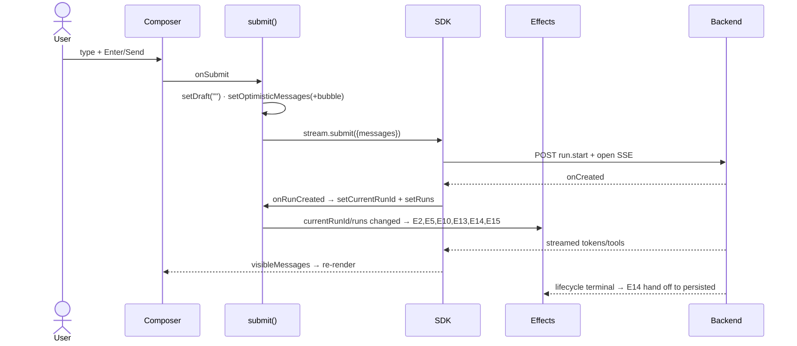

# User Interactions — `ui/src/App.tsx`

Every user interaction in the UI, traced through the pipeline:

**Event → Handler → State updates → Effects triggered → Re-render → Network requests → DOM updates**

Effect numbers (E1–E16) and `SH1` refer to [ui-effects-table.md](ui-effects-table.md). "SDK" = the `@langchain/langgraph-sdk` `useStream` instance wrapped by `useDeepResearchStream`.

## Interaction inventory

| # | Element | Handler |
|---|---|---|
| 1 | Composer submit (form / Enter / Send button) | `submit` |
| 2 | Topbar Stop button | `stream.stop` |
| 3 | New research button | `newThread` |
| 4 | Thread row | `openThread` |
| 5 | Thread ⋯ menu toggle | inline `setOpenThreadMenu` |
| 6 | Menu → Rename | `renameThreadTitle` |
| 7 | Menu → Delete | `removeThread` |
| 8 | Banner → Resume run | `continueActiveRun` |
| 9 | Banner → Cancel run | `stopActiveRun` |
| 10 | HITL → Continue / Deny | `resume` |
| 11 | API URL input | inline `setApiUrl` |
| 12 | Logging select | inline `setSelectedLogMode` |
| 13 | Messages scroll | inline (ref only) |
| 14 | Composer textarea typing | inline `setDraft` |
| 15 | Browser back/forward | E11 `popstate` |
| 16 | Outside click / Escape | E1 listeners |

---

## 1. Submit a research question

Fired by the composer `<form onSubmit>`, `Enter` (no Shift) in the textarea, or the Send button (`type=submit`).

```
Event:    form submit / Enter keydown / Send click
  ↓
Handler:  submit()   (guards: non-empty draft && !stream.isLoading)
  ↓
State:    setError(null) · setDraft("") · setOptimisticMessages(+human bubble)
          · stream.clearDebugEvents()→setDebugEvents([])
          refs: pendingThreadTitleRef=content, shouldStickToBottomRef=true
          then stream.submit(...) drives: isLoading=true →
            onThreadId → setThreadId (only if new thread) + setThreads(upsert)
            onRunCreated → setCurrentRunId + setRuns(prepend running)
          on success: refreshThreads→setThreads/setThreadsLoading; refreshRuns→setRuns
          on error:   setOptimisticMessages(remove) + setError
  ↓
Effects:  E2 (stream.messages/currentRunId) · E5 (currentRunId) · E13/E14/E15 (currentRunId/runs)
          · E10 (runs) · E3 layout-scroll (displayedMessages)
          if new thread: E9/E16 re-run + SH1 re-subscribe
  ↓
Re-render: optimistic human bubble → Send button shows spinner → topbar Stop appears →
           AI tokens stream into visibleMessages → subagent cards + action rows fill in
  ↓
Network:  POST run.start + open run SSE (SDK) · POST /threads (SDK, if new) ·
          POST /stream/events (SH1) · SDK state history · listThreads · listRuns
  ↓
DOM:      composer clears; spinner; Stop button; streaming transcript; auto-scroll to bottom
```

## 2. Stop the running stream (topbar CircleStop)

Only rendered while `stream.isLoading`.

```
Event:    click
  ↓
Handler:  stream.stop()   (SDK-level abort of the active stream)
  ↓
State:    SDK sets isLoading=false; no direct App setState.
          Later: lifecycle SSE (E16) may deliver a terminal event → E14 reset path.
  ↓
Effects:  E2 (isLoading) · E5 (isLoading) · E14 if a terminal lifecycle event arrives
  ↓
Re-render: spinner/Stop button removed; status → "Ready"
  ↓
Network:  client-side stream abort (no dedicated cancel POST — contrast #9)
  ↓
DOM:      Stop button hidden; topbar status text changes
```

## 3. New research (sidebar New button)

```
Event:    click
  ↓
Handler:  newThread() → setOpenThreadMenu(null) · pendingThreadTitleRef="New research"
          · resetVisibleThread(null) · writeThreadUrl(null)
  ↓
State:    (via resetVisibleThread) setActiveRun(null) · setVisibleMessages([]) ·
          setOptimisticMessages([]) · setRuns([]) · setCurrentRunId(null) ·
          setRunCheckpointSnapshots({}) · setThreadId(null)
          refs: threadIdRef=null, threadRequestSeqRef++, joinedRunIds.clear(),
          loggedMessageTextRef.clear(); stream.switchThread(null); localStorage.removeItem
  ↓
Effects:  threadId→null: E5 · E9 (cleanup aborts old listRuns; new run empty→setRuns([])) ·
          E13 · E15 · E16 (cleanup closes old EventSource; no thread→return) · SH1 (no subscribe)
  ↓
Re-render: transcript → empty-state; sidebar shows no active thread
  ↓
Network:  aborts in-flight listRuns + closes lifecycle SSE; no new requests (no thread)
  ↓
DOM:      "What should we research?" panel; URL `thread_id` param removed
```

## 4. Open an existing thread (sidebar row)

```
Event:    click thread button
  ↓
Handler:  openThread(id) → setOpenThreadMenu(null); no-op if already active;
          else resetVisibleThread(id) + writeThreadUrl(id)
  ↓
State:    bulk clear (as #3) but setThreadId(id) · stream.switchThread(id) · localStorage.set
  ↓
Effects:  threadId change: E5 · E9 (fetch new runs) · E13 · E15 · E16 (open new lifecycle
          SSE + /runs check) · SH1 (re-subscribe /stream/events) · then E10 (load snapshots)
  ↓
Re-render: transcript blanks then rebuilds from persisted snapshots + history
  ↓
Network:  listRuns · GET /runs (E16) · lifecycle EventSource (E16) · POST /stream/events (SH1)
          · SDK history · getRunCheckpointSnapshot ×N (E10)
  ↓
DOM:      active sidebar row switches; transcript populated from snapshots; URL updated
```

## 5. Toggle thread ⋯ menu

```
Event:    click (wrapper stops propagation so E1 doesn't immediately close it)
  ↓
Handler:  setOpenThreadMenu(current => current===id ? null : id)
  ↓
State:    openThreadMenu
  ↓
Effects:  none depend on openThreadMenu
  ↓
Re-render: dropdown for that row opens/closes
  ↓
Network:  none
  ↓
DOM:      Rename/Delete menu appears
```

## 6. Rename thread (menu → Rename)

```
Event:    click
  ↓
Handler:  renameThreadTitle(id) → setOpenThreadMenu(null) → window.prompt(...)
  ↓
State:    prompt cancelled → return; empty title → setError; else setError(null) +
          await renameThread(API) → setThreads(map new title/updatedAt)
  ↓
Effects:  none (threads is in no effect's deps)
  ↓
Re-render: sidebar title updates
  ↓
Network:  PATCH /threads/{id} {metadata.title}
  ↓
DOM:      native prompt dialog; then thread label text changes
```

## 7. Delete thread (menu → Delete)

```
Event:    click
  ↓
Handler:  removeThread(id) → setOpenThreadMenu(null) → window.confirm(...)
  ↓
State:    confirm=false → return; else setError(null) + await deleteThread →
          setThreads(filter out id); if id===threadId → resetVisibleThread(null) + writeThreadUrl(null)
  ↓
Effects:  if deleting current thread: threadId→null cascade (E5/E9/E13/E15/E16, SH1)
  ↓
Re-render: row removed; if it was current, transcript → empty-state
  ↓
Network:  DELETE /threads/{id}
  ↓
DOM:      native confirm dialog; row removed; empty-state if current
```

## 8. Resume an inactive run (banner → Resume run)

Banner shows only when `visibleActiveRun` is set (a run active on the server but not streaming).

```
Event:    click
  ↓
Handler:  continueActiveRun(run)
  ↓
State:    setError(null) · clearDebugEvents;
          if fetched status not active → setActiveRun(null) + return;
          else joinedRunIds.add · setActiveRun(null) · setCurrentRunId(run.runId)
          · setRunCheckpointSnapshots(drop stale) · setRuns(upsert running); then stream.joinStream
  ↓
Effects:  currentRunId change: E2/E5/E13/E14/E15 · runs change: E10/E15 · banner clears (activeRun null)
  ↓
Re-render: banner disappears; streaming resumes into transcript
  ↓
Network:  GET /threads/{t}/runs/{r} (status) · POST /threads/{t}/runs/{r}/resume · joinStream SSE
  ↓
DOM:      "Inactive run found" banner removed; live messages/subagents resume
```

## 9. Cancel an inactive run (banner → Cancel run)

```
Event:    click
  ↓
Handler:  stopActiveRun(run)
  ↓
State:    setError(null) · setCancellingRunId(run.runId); then POST cancel →
          joinedRunIds.add · setCurrentRunId(null if match) · clearDebugEvents
          on error: setCancellingRunId(null) + setError
          later (E16 lifecycle terminal): clearActiveRun → setCancellingRunId(null) + setActiveRun(null)
  ↓
Effects:  currentRunId change: E5/E2/E13/E14/E15 · E16 lifecycle SSE delivers "interrupted"
  ↓
Re-render: banner text → "Cancelling…", buttons disabled; then banner removed on terminal event
  ↓
Network:  POST /threads/{t}/runs/{r}/cancel  (terminal arrives over the already-open lifecycle SSE)
  ↓
DOM:      banner shows cancelling state, then disappears
```

## 10. Answer a human-in-the-loop request (HITL → Continue / Deny)

Rendered by `InputRequests` when `inputRequests.length > 0`.

```
Event:    input onChange (local) · Continue click (value|true) · Deny click (false)
  ↓
Handler:  child setResponses (local state) · onResume(value) → App.resume(value)
  ↓
State:    resume(): setError(null) · clearDebugEvents · stream.submit(null,{command:{resume}})
          → SDK sets isLoading, streams; on error setError
  ↓
Effects:  E2 (messages) · E5 · E13/E14/E15 as the resumed run streams and finishes
  ↓
Re-render: HITL panel clears once interrupts resolve; streaming continues
  ↓
Network:  input.respond/resume command + SSE (SDK); SH1 keeps feeding debugEvents
  ↓
DOM:      HITL card removed; AI output continues
```

## 11. Change the API URL (sidebar input)

```
Event:    input change
  ↓
Handler:  setApiUrl(e.target.value)
  ↓
State:    apiUrl
  ↓
Effects:  E8 (reload threads) · E9 (reload runs) · E10 · E16 (reconnect) · E12 (dead) ·
          hook re-instantiates useStream · SH1 re-subscribe
  ↓
Re-render: whole workspace reloads against the new backend
  ↓
Network:  listThreads · listRuns · /runs · lifecycle SSE · /stream/events (all re-issued)
  ↓
DOM:      thread list + transcript reload
```

## 12. Change logging verbosity (sidebar select)

```
Event:    select change
  ↓
Handler:  setSelectedLogMode(mode) + setLogMode(mode)  (logger module)
  ↓
State:    logMode
  ↓
Effects:  none
  ↓
Re-render: select reflects new value
  ↓
Network:  none
  ↓
DOM:      select updates; console log verbosity changes
```

## 13. Scroll the transcript

```
Event:    scroll (onScroll on .messages + a window scroll listener from E4)
  ↓
Handler:  inline → shouldStickToBottomRef.current = isNearBottom(viewport)
  ↓
State:    none (ref only — no re-render)
  ↓
Effects:  none now; influences E3 (auto-scroll) on the next transcript change
  ↓
Re-render: none
  ↓
Network:  none
  ↓
DOM:      none directly (decides whether future streamed messages auto-scroll)
```

## 14. Type in the composer

```
Event:    textarea input
  ↓
Handler:  setDraft(e.target.value)
  ↓
State:    draft
  ↓
Effects:  none
  ↓
Re-render: textarea value; Send button enabled/disabled (draft.trim() && !isLoading && !banner)
  ↓
Network:  none
  ↓
DOM:      textarea reflects typed text
```

## 15. Browser back / forward (popstate)

A user navigation gesture, handled by E11.

```
Event:    window popstate
  ↓
Handler:  E11 handler → derive threadId from URL
  ↓
State:    setActiveRun(null) · setVisibleMessages([]) · setOptimisticMessages([]) · setRuns([])
          · setCurrentRunId(null) · setRunCheckpointSnapshots({}) · setThreadId(fromUrl)
          refs: threadIdRef, threadRequestSeqRef++, joinedRunIds.clear; switchThreadRef(fromUrl)
  ↓
Effects:  threadId change: E5/E9/E13/E15/E16 + SH1 (same as opening a thread)
  ↓
Re-render: transcript + sidebar switch to the URL's thread
  ↓
Network:  listRuns · /runs · lifecycle SSE · /stream/events · snapshots
  ↓
DOM:      workspace reflects the navigated thread
```

## 16. Dismiss the thread menu (outside click / Escape)

```
Event:    window click OR keydown Escape (E1 listeners)
  ↓
Handler:  setOpenThreadMenu(null)
  ↓
State:    openThreadMenu → null
  ↓
Effects:  none
  ↓
Re-render: open dropdown closes
  ↓
Network:  none
  ↓
DOM:      menu removed
```

---

## Cross-cutting notes

- **Two "stop" paths differ.** Topbar Stop (#2) is a client-side `stream.stop()` (SDK abort); the banner Cancel (#9) is a server `POST /cancel`. They are not interchangeable — #2 halts local streaming, #9 terminates the run on the backend.
- **`currentRunId` and `runs` are the trigger hubs.** Any interaction that touches them (#1, #8, #9, #15) fans out to E2/E5/E10/E13/E14/E15 — most of the effect graph.
- **Thread-context switches (#3, #4, #7-current, #15)** all funnel through `resetVisibleThread`/E11's bulk reset and bump `threadRequestSeqRef`, invalidating in-flight requests from the previous thread.
- **Ref-only interactions (#13)** intentionally cause no re-render — scroll position must not thrash React.
- **Native dialogs (#6 prompt, #7 confirm)** block the handler synchronously before any state update.

## Main flow (submit) as a diagram


