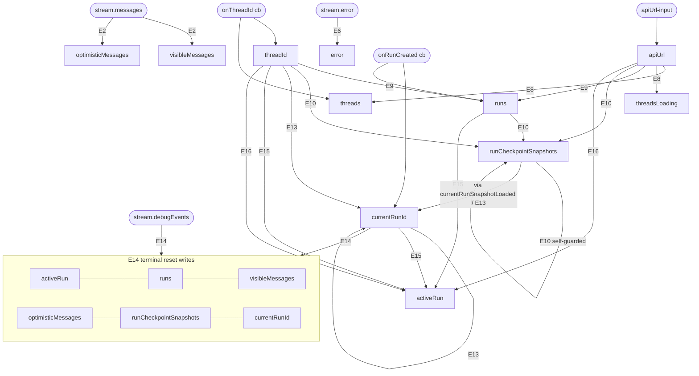
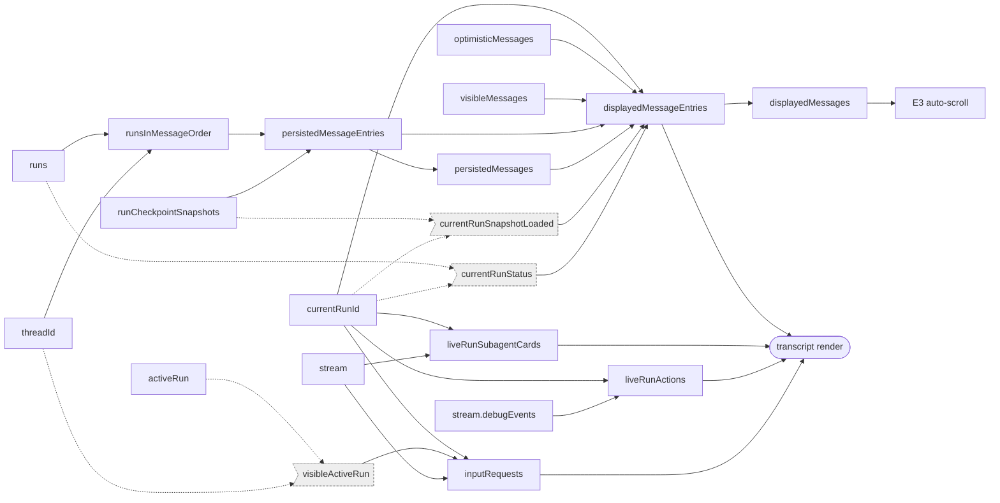

# React State Relationship Graph — `ui/src/App.tsx`

Every `useState` in `App`, and how it connects to the setters, readers, effects, memos, and callbacks around it. The component holds **15 state atoms**. Because there is no store, all coupling is expressed through effect dependency arrays and setter call sites — this document makes that graph explicit.

## Legend

- **Effects** are numbered E1–E16 in source order (E3 is the `useLayoutEffect`).
- **Memos** are M1–M8.
- `[En]` on a graph edge means "a change to the source re-runs effect En, which writes the target."
- External inputs (not state): `apiUrl-input` (sidebar field), and the stream hook outputs `stream.messages`, `stream.debugEvents`, `stream.error`, plus its `onThreadId` / `onRunCreated` callbacks.

### Effect index (dependency arrays)

| Effect | Deps | Writes |
|---|---|---|
| E1 menu listeners | `[]` | `openThreadMenu` |
| E2 stream→view | `currentRunId, stream.isLoading, stream.messages` | `visibleMessages, optimisticMessages` |
| E3 scroll (layout) | `displayedMessages` | — (refs) |
| E4 scroll listener | `[]` | — (refs) |
| E5 ref sync | `activeRun, currentRunId, stream.isLoading, threadId` | — (refs) |
| E6 stream error | `stream.error` | `error` |
| E7 url normalize | `[]` | — |
| E8 startup threads | `apiUrl` | `threads, threadsLoading, error` |
| E9 refresh runs | `apiUrl, threadId` | `runs` |
| E10 load snapshots | `apiUrl, runCheckpointSnapshots, runs, threadId` | `runCheckpointSnapshots, error` |
| E11 popstate | `[]` | `activeRun, visibleMessages, optimisticMessages, runs, currentRunId, runCheckpointSnapshots, threadId` |
| E12 (dead) | `activeRun, apiUrl` | — |
| E13 clear current run | `currentRunId, currentRunSnapshotLoaded, currentRunStatus, stream.isLoading, threadId` | `currentRunId` |
| E14 terminal reset | `currentRunId, stream.debugEvents, threadId` | `activeRun, runs, visibleMessages, optimisticMessages, runCheckpointSnapshots, currentRunId` |
| E15 monitor (runs) | `activeRun, currentRunId, runs, stream.isLoading, threadId` | `activeRun` |
| E16 monitor (SSE) | `apiUrl, threadId` | `activeRun, cancellingRunId, threadId` |

---

## Graph A — Reactive cascade (effects + stream callbacks)

How a change to one state/input propagates to writes of other state. This is the "what triggers what" graph.

**Reading it:** the two self-referential loops (`runCheckpointSnapshots→E10→runCheckpointSnapshots` and `currentRunId→E13→currentRunId`) are intentional convergence loops guarded by conditions (only load *missing* snapshots; only clear a run that is *finished*). The `E14` node fans out to six states — it is the "run finished, hand off live→persisted" reset and the single most connected effect.

---

## Graph B — Read / derivation graph (states → memos → render)

How state is consumed to produce what the user sees. Derived (non-memo) values are shown dashed.

---

## Per-state reference

For each state: **updaters** (setter call sites), **readers**, **effects that depend on it** (in a dep array), **memos that depend on it**, **callbacks that modify it**.

### 1. `apiUrl`
- **Updated by:** `setApiUrl` — sidebar API `<input>` `onChange` only.
- **Read by:** `useDeepResearchStream`, all `fetch` calls, `fetchRunActive`/`fetchRunStatus`, E8/E9/E10/E12/E16, render.
- **Effects depending:** E8, E9, E10, E12, E16.
- **Memos depending:** none directly (reaches memos only via the `stream` object).
- **Callbacks modifying:** none (inline setter).

### 2. `threadId`
- **Updated by:** `setThreadId` — `onThreadId` cb, `resetVisibleThread`, E11 (popstate), E16 (404 self-heal).
- **Read by:** `useDeepResearchStream`, `visibleActiveRun`, `currentRun`, `refreshRuns`, `submit`, E5/E7/E9/E13/E15/E16, render.
- **Effects depending:** E5, E9, E13, E15, E16.
- **Memos depending:** M4 (and M3 via `visibleActiveRun`).
- **Callbacks modifying:** `resetVisibleThread` (via `newThread`/`openThread`/`removeThread`).

### 3. `threads`
- **Updated by:** `setThreads` — `onThreadId` cb (`upsertThread`), `refreshThreads`, E8 (startup), `renameThreadTitle`, `removeThread`.
- **Read by:** sidebar render, `renameThreadTitle`, `removeThread`.
- **Effects depending:** none (E8 writes it).
- **Memos depending:** none.
- **Callbacks modifying:** `refreshThreads`, `renameThreadTitle`, `removeThread`, `submit` (via `refreshThreads`).

### 4. `threadsLoading`
- **Updated by:** `setThreadsLoading` — `refreshThreads`, E8.
- **Read by:** sidebar render.
- **Effects depending:** none.
- **Memos depending:** none.
- **Callbacks modifying:** `refreshThreads`.

### 5. `draft`
- **Updated by:** `setDraft` — composer `<textarea>` `onChange`, `submit` (clear).
- **Read by:** `submit`, composer render (value + disabled).
- **Effects depending:** none.
- **Memos depending:** none.
- **Callbacks modifying:** `submit`.

### 6. `logMode`
- **Updated by:** `setSelectedLogMode` — logging `<select>` `onChange`.
- **Read by:** select render.
- **Effects depending:** none.
- **Memos depending:** none.
- **Callbacks modifying:** none (inline).

### 7. `error`
- **Updated by:** `setError` — `submit`, `resume`, `continueActiveRun`, `stopActiveRun`, `renameThreadTitle`, `removeThread`, `refreshThreads`, E6, E8, E10.
- **Read by:** error-banner render.
- **Effects depending:** none depend; E6/E8/E10 write it.
- **Memos depending:** none.
- **Callbacks modifying:** `submit`, `resume`, `continueActiveRun`, `stopActiveRun`, `renameThreadTitle`, `removeThread`, `refreshThreads`.

### 8. `activeRun`
- **Updated by:** `setActiveRun` — `joinRunStreamRef` (clear), `resetVisibleThread`, `continueActiveRun` (clear), E11, E14, E15 (discover), E16 (`showActiveRun`/`clearActiveRun`).
- **Read by:** `visibleActiveRun` (→ banner render, M3), E5, E12, E15.
- **Effects depending:** E5, E12, E15.
- **Memos depending:** M3 (via `visibleActiveRun`).
- **Callbacks modifying:** `continueActiveRun`, `resetVisibleThread` (`stopActiveRun` clears it indirectly through E16's `clearActiveRun`).

### 9. `cancellingRunId`
- **Updated by:** `setCancellingRunId` — `stopActiveRun` (set + catch-clear), E16 (`clearActiveRun`).
- **Read by:** active-run banner render.
- **Effects depending:** none (E16 writes it).
- **Memos depending:** none.
- **Callbacks modifying:** `stopActiveRun`.

### 10. `visibleMessages`
- **Updated by:** `setVisibleMessages` — E2 (from `stream.messages`), `resetVisibleThread`, E11, E14.
- **Read by:** `displayedMessageEntries` (M7), `latestUserIndex`.
- **Effects depending:** none (E2 writes it).
- **Memos depending:** M7.
- **Callbacks modifying:** `resetVisibleThread`.

### 11. `optimisticMessages`
- **Updated by:** `setOptimisticMessages` — `submit` (add + catch-remove), E2 (drop echoed), `resetVisibleThread`, E11, E14.
- **Read by:** M7.
- **Effects depending:** none (E2 writes it).
- **Memos depending:** M7.
- **Callbacks modifying:** `submit`, `resetVisibleThread`.

### 12. `openThreadMenu`
- **Updated by:** `setOpenThreadMenu` — E1 (outside click/Escape), menu trigger `onClick`, `newThread`, `openThread`, `renameThreadTitle`, `removeThread`.
- **Read by:** sidebar menu render.
- **Effects depending:** none (E1 writes it).
- **Memos depending:** none.
- **Callbacks modifying:** `newThread`, `openThread`, `renameThreadTitle`, `removeThread`.

### 13. `runs`
- **Updated by:** `setRuns` — `onRunCreated` cb, `refreshRuns`, `resetVisibleThread`, `continueActiveRun`, E11, E14.
- **Read by:** M4, `currentRun`, `subagentCardsForMessage`, `actionsForMessage`, E10, E15.
- **Effects depending:** E10, E15.
- **Memos depending:** M4 (→ M5 → M7 downstream).
- **Callbacks modifying:** `refreshRuns`, `continueActiveRun`, `resetVisibleThread`, `submit` (via `refreshRuns`).

### 14. `currentRunId`
- **Updated by:** `setCurrentRunId` — `onRunCreated` cb, `joinRunStreamRef`, `continueActiveRun`, `stopActiveRun` (clear-if-match), `resetVisibleThread`, E11, E13, E14.
- **Read by:** M1, M2, M3, M7, `currentRun`, `currentRunSnapshotLoaded`, `runIdForUserMessage`, `subagentCardsForMessage`, `actionsForMessage`, E2, E5, E13, E14, E15.
- **Effects depending:** E2, E5, E13, E14, E15.
- **Memos depending:** M1, M2, M3, M7.
- **Callbacks modifying:** `continueActiveRun`, `stopActiveRun`, `resetVisibleThread`.

### 15. `runCheckpointSnapshots`
- **Updated by:** `setRunCheckpointSnapshots` — E10 (merge loaded), `continueActiveRun` (drop stale), `resetVisibleThread`, E11, E14.
- **Read by:** `currentRunSnapshotLoaded`, M5, `subagentCardsForMessage`, `actionsForMessage`, E10.
- **Effects depending:** E10.
- **Memos depending:** M5 (→ M6/M7 downstream).
- **Callbacks modifying:** `continueActiveRun`, `resetVisibleThread`.

---

## Observations

- **Hub states.** `currentRunId` (5 effects, 4 memos) and `threadId` (5 effects) are the two hubs; almost every dynamic behavior keys off one of them. `runCheckpointSnapshots` and `runs` form the persisted-data spine feeding M4→M5→M7.
- **Write-only-from-effect states.** `visibleMessages`, `optimisticMessages`, `threadsLoading`, `cancellingRunId` are never in a dependency array — they are outputs consumed by memos/render, never triggers.
- **`error`, `logMode`, `draft`, `openThreadMenu`** are leaf states: written from many places but read only by render, depended on by no effect or memo.
- **Convergence loops.** `runCheckpointSnapshots→E10→runCheckpointSnapshots` and `currentRunId→E13→currentRunId` are self-guarded fixpoints — they re-run until their condition (missing snapshots / finished run) is satisfied, then stop.
- **`resetVisibleThread` and `E14`** are the two "bulk writers," each touching 6–7 states; they are the reset points (thread switch, run terminal) where the whole view is rebuilt.
- **E12** appears in the dependency graph but is dead (empty body) — it creates a nominal `activeRun`/`apiUrl` dependency with no effect.
