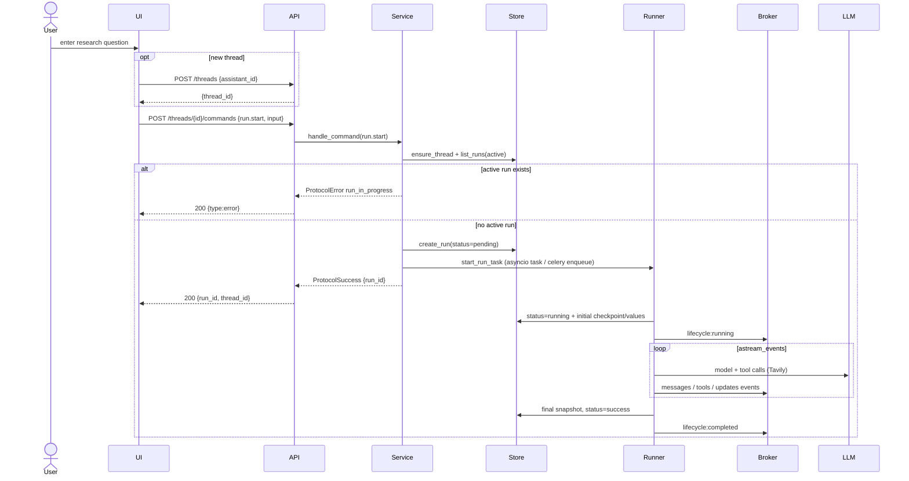
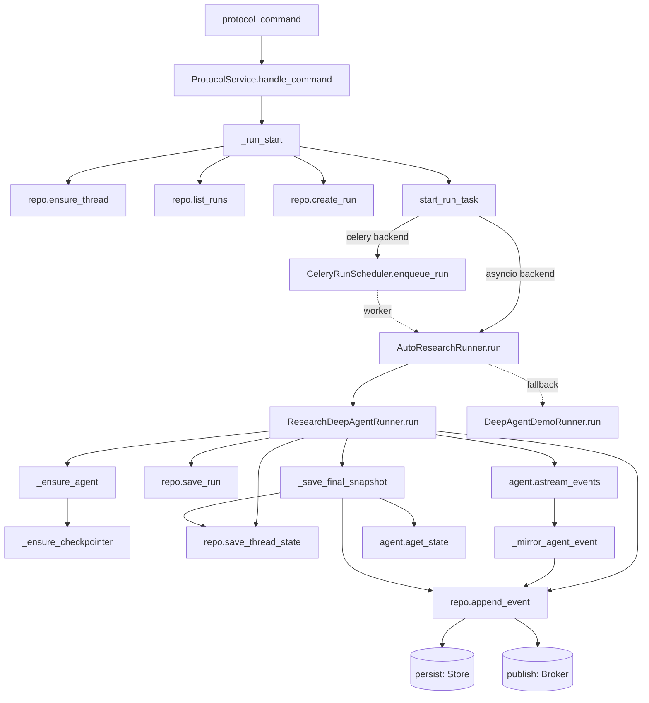

# Use Case 1 — Start a Research Run

## Purpose

Let a user submit a research question and have the deep-research agent plan the work, search the web, delegate sub-topics to a research subagent, and produce a synthesized answer. This is the system's core action; every other use case supports or extends it.

## Actors

- **User** — types a question in the UI.
- **UI** — sends the `run.start` command and opens an event stream.
- **API** (`main.py`) — `POST /threads/{id}/commands`.
- **Service** (`ProtocolService._run_start`) — validates, creates the run, schedules execution.
- **Runner** (`ResearchDeepAgentRunner`) — runs the agent via `astream_events`.
- **Store / Broker** — persist run + events, publish for streaming.
- **LLM / Tavily** — external providers used during research.

## Execution Flow

1. User enters a question; UI ensures a thread exists (`POST /threads` if new).
2. UI calls `startRun()` → `POST /threads/{id}/commands` with `method=run.start`, `params.input = {messages:[{type:human, content}]}`, `multitaskStrategy=reject`.
3. `ProtocolService.handle_command` → `_run_start`:
   - Acquires the per-thread lock.
   - `ensure_thread`, then checks for an existing active run (`running`, then `pending`).
   - If one exists → returns `ProtocolError run_in_progress`.
   - Otherwise creates a `RunRecord` (status `pending`) and persists it.
4. `start_run_task(run, input)`:
   - **Celery backend** → `CeleryRunScheduler.enqueue_run` (task id stored on run metadata).
   - **asyncio backend** → `asyncio.create_task(runner.run)`.
5. Runner marks the run `running`, writes the initial `ThreadState` + `checkpoints`/`values` events, then streams the agent:
   - `agent.astream_events(v2)` → `_mirror_agent_event` emits `messages`, `tools`, `updates` events through the `PublishingRepository` (persist + publish).
   - Real agent unavailable → `AutoResearchRunner` falls back to the deterministic fixture.
6. On completion the runner saves a final snapshot (`aget_state`), sets status `success`, and appends a `lifecycle: completed` event.
7. UI receives `{run_id, thread_id}` and subscribes to the stream (see Use Case 2).

## Sequence Diagram

## Failure Cases

| Condition | Handling |
|---|---|
| Thread already has an active run | `ProtocolError run_in_progress` with `active_run_id` in meta (`_run_start`). |
| Research runtime unavailable (missing deps/creds) | `AutoResearchRunner` catches `ResearchRuntimeUnavailable` → fixture fallback (unless `AGENT_MODE=research` strict → run fails). |
| LLM / Tavily / agent exception mid-run | `run()` except block → status `error`, `lifecycle: failed` with error string. |
| Celery worker down at enqueue | Task sits `PENDING`; later `resume_run` detects a dead task and reschedules (up to `MAX_RESCHEDULES`) or fails. |
| Invalid/empty input | `input_text()` falls back to a default prompt string; no hard error. |
| Command handler raises | `handle_command` wraps in `ProtocolError command_failed`. |

## Related Code

- `ui/src/api.ts` → `startRun`, `createThread`
- `stream-backend/app/main.py` → `protocol_command`, `run_payload_to_command`
- `stream-backend/app/service.py` → `ProtocolService._run_start`, `start_run_task`
- `stream-backend/app/research_runtime.py` → `ResearchDeepAgentRunner.run`, `_mirror_agent_event`, `_save_final_snapshot`
- `stream-backend/app/deep_agent.py` → `DeepAgentDemoRunner.run` (fallback)
- `stream-backend/worker/tasks.py` → `run_agent`, `execute_run_direct`

## Call Graph

Business-logic functions only. Collapsed utilities (not shown as nodes): `new_id`, `now_iso`, `input_text`, `human_message`, `json_ready`, `model_dump`, SSE/JSON formatting.

**Function explanations**

- **protocol_command** — FastAPI handler for `POST /threads/{id}/commands`; forwards the command to the service and returns the JSON result.
- **ProtocolService.handle_command** — dispatches on `command.method`; wraps any exception as a `ProtocolError`.
- **_run_start** — creates the run under a per-thread lock; the core "should this run start" gate.
- **repo.ensure_thread** — loads the thread record or creates it with an empty initial state.
- **repo.list_runs** — looks for an existing `running`/`pending` run to enforce one-active-run-per-thread.
- **repo.create_run** — persists a new `RunRecord` in status `pending`.
- **start_run_task** — chooses the execution backend and schedules the run.
- **CeleryRunScheduler.enqueue_run** — publishes the run to the Celery queue for out-of-process execution; stores the task id on run metadata.
- **AutoResearchRunner.run** — attempts the real agent; on `ResearchRuntimeUnavailable` falls back to the fixture.
- **ResearchDeepAgentRunner.run** — the real execution: drives the agent and mirrors its events into the protocol.
- **DeepAgentDemoRunner.run** — deterministic scripted fallback when the real runtime can't load.
- **_ensure_agent** — builds and caches the deepagents agent (model provider, tools, research subagent, prompts); hot-reloads prompts on change.
- **_ensure_checkpointer** — opens the LangGraph `AsyncPostgresSaver` used for durable graph state.
- **repo.save_run** — persists run status transitions (`running`, `success`, `error`).
- **repo.save_thread_state** — appends a checkpoint/state snapshot to thread history.
- **repo.append_event** — the persist+publish seam: writes the event to the store and broadcasts it to subscribers.
- **agent.astream_events** — LangGraph streaming execution (external); yields model/tool/chain events.
- **_mirror_agent_event** — translates each LangChain event into `messages`/`tools`/`updates` protocol events.
- **_save_final_snapshot** — reads the final graph state (`aget_state`) and persists it as the terminal checkpoint.
- **agent.aget_state** — LangGraph accessor for the run's final accumulated state (external).
