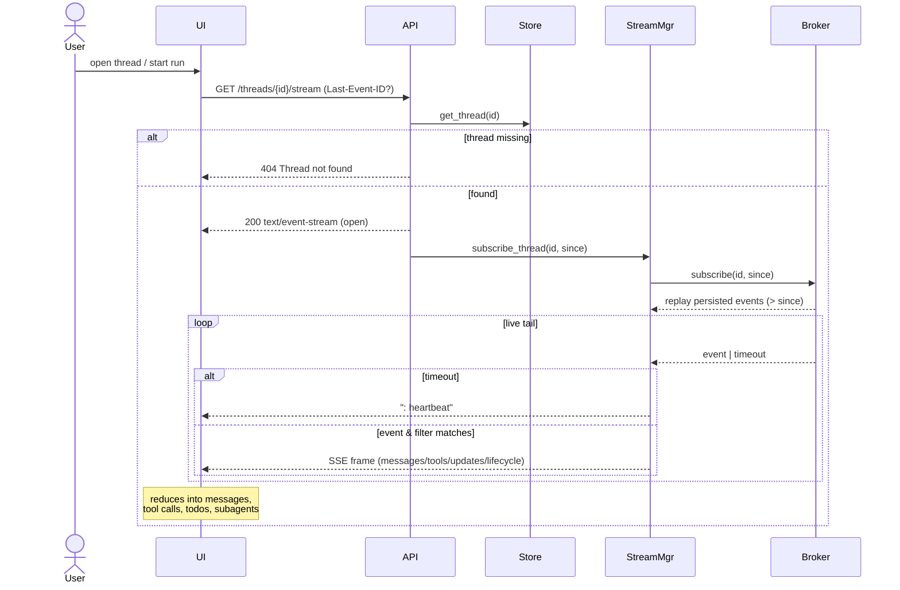
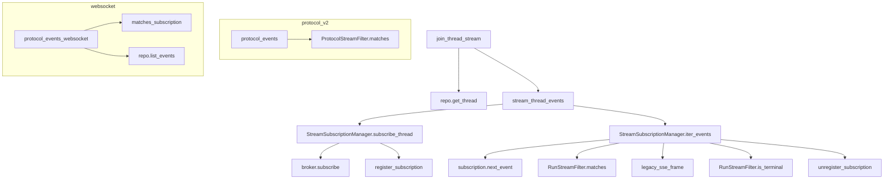

# Use Case 2 — Watch a Run Stream in Real Time

## Purpose

Let a user watch a run unfold live: streaming assistant tokens, tool calls (Tavily searches), todo/plan updates, and subagent activity, without polling. This is what makes the research feel interactive.

## Actors

- **User** — watches the research progress.
- **UI** — subscribes via the SDK (`useStream` in `stream.ts`).
- **API** — SSE endpoints and the WebSocket endpoint (`main.py`).
- **StreamMgr** (`StreamSubscriptionManager`) — subscribes to the thread's event stream and fans out.
- **Broker** — real-time event bus (RabbitMQ Streams / in-memory).
- **Store** — provides replay (`since` cursor / `Last-Event-ID`).

## Execution Flow

1. After starting a run (or opening an existing thread), the UI subscribes to events. Options:
   - `GET /threads/{id}/stream` (legacy SSE join), or
   - `POST /threads/{id}/stream/events` (protocol-v2 SSE with `channels`/`namespaces`/`depth`), or
   - `WS /threads/{id}/stream/events` (bidirectional subscribe + replay), or
   - `POST /threads/{id}/runs/stream` (create-and-stream in one call — see UC1/UC3).
2. API validates the thread, parses `since` (from body or `Last-Event-ID`), and returns `text/event-stream`.
3. `StreamMgr.subscribe_thread` → `Broker.subscribe(thread_id, since)` replays persisted events after the cursor, then tails live ones.
4. `iter_events` loop:
   - On event → apply filter (`RunStreamFilter` for legacy, `ProtocolStreamFilter` channels/namespaces for v2) → format frame (`legacy_sse_frame` / `sse_frame`) → yield to client.
   - On idle timeout → yield `": heartbeat"`.
   - Cursor dedupe: events with `seq <= cursor` are skipped.
5. UI reduces events into messages, tool activities, todos, and subagent cards (namespaced under `tools:task-*`).
6. Stream ends when the client disconnects, or (for run-scoped streams) when a terminal `lifecycle` event is seen (`stop_on_terminal`).

## Sequence Diagram

## Failure Cases

| Condition | Handling |
|---|---|
| Thread does not exist | `404 Thread not found`. |
| `channels` missing (protocol-v2 SSE) | `400 channels is required`. |
| Client disconnects | `iter_events` checks `request.is_disconnected()`, unregisters + closes the subscription. |
| Broker not initialized (`setup()` not called) | `RuntimeError` from broker; surfaced as a server error. |
| RabbitMQ consumer drops | Subscription close-safe; UI can reconnect with `Last-Event-ID` to replay from the last seq. |
| Missed events during disconnect | Replay via `since`/`Last-Event-ID` cursor + Postgres `stream_events` (RabbitMQ retention default 12h). |
| Duplicate events | Skipped by cursor check (`event.seq <= managed.cursor`). |

## Related Code

- `ui/src/stream.ts` (`useStream` wrapper), `ui/src/App.tsx` (event reducers), `ui/src/selectors.ts`
- `stream-backend/app/main.py` → `join_thread_stream`, `protocol_events`, `protocol_events_websocket`, `stream_thread_events`, `legacy_sse_frame`
- `stream-backend/app/streaming.py` → `StreamSubscriptionManager.iter_events`, `RunStreamFilter`, `ProtocolStreamFilter`
- `stream-backend/app/protocol.py` → `matches_subscription`, `sse_frame`
- `stream-backend/app/event_bus.py` → `RabbitMQStreamBroker.subscribe`, `InMemoryEventBroker.subscribe`

## Call Graph

Business-logic functions only. Collapsed utilities: `parse_last_event_id`, `sdk_sse_frame`, `sse_frame`, `stream_metadata`, `message_role`, JSON encoding.

**Function explanations**

- **join_thread_stream** — handler for `GET /threads/{id}/stream`; validates the thread and opens the SSE response.
- **repo.get_thread** — loads the thread to confirm it exists before streaming (404 otherwise).
- **stream_thread_events** — the async generator that yields SSE frames for the thread's events.
- **StreamSubscriptionManager.subscribe_thread** — creates a broker subscription from the `since` cursor and registers it for tracking.
- **broker.subscribe** — opens the underlying event source (RabbitMQ Streams consumer / in-memory queue), replaying events after `since`.
- **register_subscription** — records the subscription (and a `RunHandle` if run-scoped) for lifecycle/cleanup.
- **StreamSubscriptionManager.iter_events** — the pull loop: yields events, emits heartbeats on timeout, dedupes by cursor, and stops on terminal events.
- **subscription.next_event** — awaits the next event from the broker with a timeout.
- **RunStreamFilter.matches** — decides whether an event belongs to the requested run/modes.
- **legacy_sse_frame** — converts a protocol event into the SDK's legacy SSE wire format (messages/tools/values/metadata).
- **RunStreamFilter.is_terminal** — detects a terminal `lifecycle` event to stop run-scoped streams.
- **unregister_subscription** — removes tracking and marks the run handle completed on teardown.
- **protocol_events** — handler for `POST /threads/{id}/stream/events` (protocol-v2 SSE by channel/namespace).
- **ProtocolStreamFilter.matches** — channel + namespace + depth matching for v2 subscriptions.
- **protocol_events_websocket** — WebSocket variant supporting subscribe/unsubscribe, command dispatch, and event replay.
- **matches_subscription** — shared channel/namespace matcher used by the WS send loop.
- **repo.list_events** — fetches persisted events for replay on WS subscribe.
