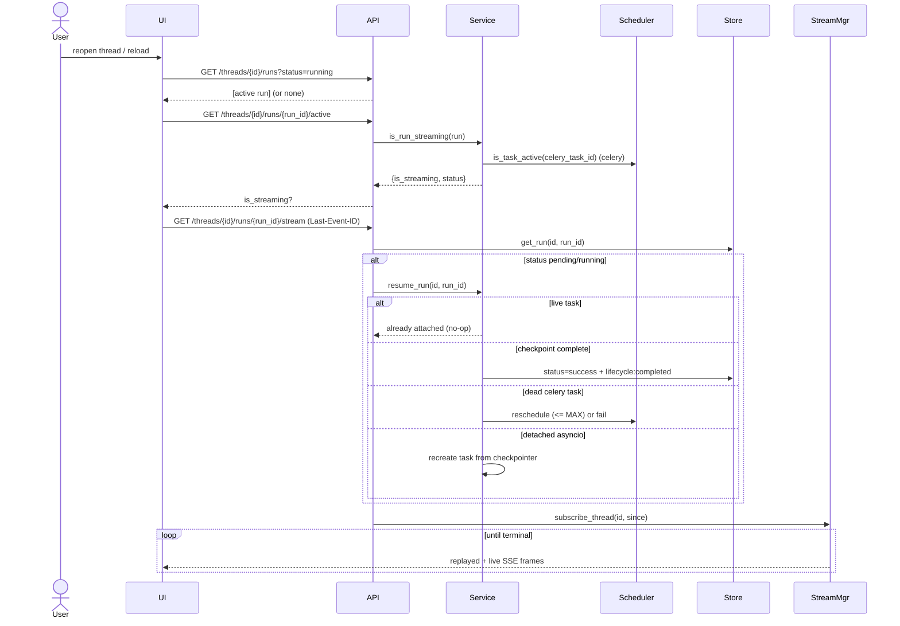
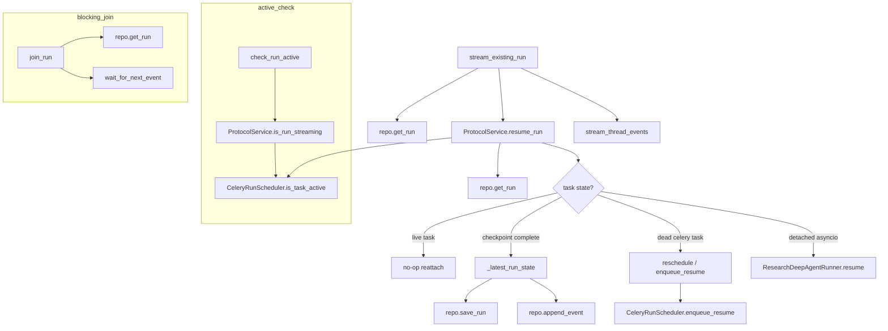

# Use Case 3 — Resume / Reconnect to an Active Run

## Purpose

Let a user who closed the tab, lost connection, or reloaded rejoin a run that is still executing (or was left detached by a crashed worker) and continue watching or awaiting its result. This is what makes runs durable rather than tied to a single HTTP connection.

## Actors

- **User** — returns to an in-progress research session.
- **UI** — on load, discovers the active run and rejoins its stream.
- **API** — `GET /threads/{id}/runs/{run_id}/stream`, `.../join`, `.../active`, `POST .../resume`.
- **Service** (`ProtocolService.resume_run`) — reattaches, or reschedules a dead task.
- **Scheduler** (`CeleryRunScheduler`) — checks task liveness / re-enqueues.
- **StreamMgr / Broker / Store** — replay + live tail.

## Execution Flow

1. On thread open, UI checks for an active run: `GET /threads/{id}/runs?status=running` (or `pending`) and/or `GET /threads/{id}/runs/{run_id}/active`.
2. `check_run_active` → `Service.is_run_streaming`: for Celery it queries task status (`PENDING/STARTED/RETRY` = active); for asyncio it checks the tracked `run_tasks` entry.
3. UI reconnects to the stream: `GET /threads/{id}/runs/{run_id}/stream` with `Last-Event-ID` for replay.
4. If the run is still `pending`/`running`, the handler calls `Service.resume_run` to (re)attach execution:
   - If a live task exists → no-op (`already_attached` / celery task active).
   - If the latest checkpoint has no `next` → mark `success` + emit `lifecycle: completed`.
   - If a Celery task is dead → increment `reschedule_count` and re-enqueue (up to `MAX_RESCHEDULES`, default 2), else fail.
   - Otherwise (detached asyncio) → recreate the task from the checkpointer.
5. The endpoint then streams events from `since` until a terminal lifecycle event (`stop_on_terminal`).
6. Alternatively, a non-streaming client can block on `GET .../join` (polls run status + `wait_for_next_event`) and receive the final `values`.

## Sequence Diagram

## Failure Cases

| Condition | Handling |
|---|---|
| Run not found | `404 Run not found`. |
| Run already terminal | `resume_run` returns true (no-op); stream replays history then ends. |
| Celery task dead, under reschedule limit | Re-enqueued with `reschedule_count+1`, `previous_task_id` recorded. |
| Reschedule limit exceeded | Run set `error` with `reschedule_limit_exceeded`; `lifecycle: failed`. |
| Detached run, no checkpointer | Cannot resume via checkpoint; `research.resume` raises `ResearchRuntimeUnavailable`. |
| Worker restarted (stale run) | `recover_stale_runs` marks `interrupted` with `recovery_reason=worker_restart`. |
| Client disconnects while joining | `join_run` raises `499`; optional `cancel_on_disconnect` cancels the run. |
| Event broker unreachable while joining (`wait_for_next_event` → `RabbitMQStreamBroker.subscribe` raises `EventBrokerUnavailable`) | `join_run` catches it, logs a warning, sleeps briefly, and retries — it does **not** 500 the request. This is a long-held connection the SDK's `stream.joinStream()` is awaiting with no client-side auto-reconnect of its own (unlike the SSE endpoints, whose native `EventSource` clients auto-reconnect on a closed connection — see [Use Case 4](04-cancel-run.md)); failing this request outright previously left the UI's `currentRunId`/`joinedRunIds` wedged on a run that would never receive another event. |

## Related Code

- `ui/src/App.tsx` → active-run discovery / monitor (`activeRun.*`, `ACTIVE_RUN_STATUSES`)
- `stream-backend/app/main.py` → `stream_existing_run`, `join_run`, `check_run_active`, `resume_run`
- `stream-backend/app/service.py` → `ProtocolService.resume_run`, `is_run_streaming`, `_latest_run_state`
- `stream-backend/app/research_runtime.py` → `ResearchDeepAgentRunner.resume`
- `stream-backend/worker/client.py` → `CeleryRunScheduler.is_task_active`, `enqueue_resume`
- `stream-backend/worker/tasks.py` → `resume_agent`, `recover_stale_runs`

## Call Graph

Business-logic functions only. Collapsed utilities: `parse_last_event_id`, `now_iso`, `model_dump`, SSE formatting.

**Function explanations**

- **stream_existing_run** — handler for `GET /threads/{id}/runs/{run_id}/stream`; reattaches execution and replays+tails the stream.
- **repo.get_run** — loads the run to check existence/status.
- **ProtocolService.resume_run** — the reattach/recovery brain: decides whether to no-op, complete, reschedule, or re-execute.
- **stream_thread_events** — replays from `since` and tails until the terminal lifecycle event (see UC2).
- **CeleryRunScheduler.is_task_active** — queries Celery for `PENDING/STARTED/RETRY` to tell if a worker is still on the run.
- **_latest_run_state** — finds the newest root checkpoint for the run to see if the graph already finished (`next` empty).
- **repo.save_run** — persists the resolved status (`success`/`error`).
- **repo.append_event** — emits the resulting `lifecycle` event (completed/failed) for streaming clients.
- **CeleryRunScheduler.enqueue_resume** — re-enqueues a resume task when the previous worker task died (under the reschedule limit).
- **ResearchDeepAgentRunner.resume** — resumes the LangGraph run from its checkpoint (optionally with a `Command(resume=...)`).
- **check_run_active** — handler for `.../active`; reports whether execution is live.
- **ProtocolService.is_run_streaming** — backend-aware liveness: Celery task status or tracked asyncio task.
- **join_run** — handler for `.../join`; blocks (non-streaming) until the run reaches a terminal status. Retries on `EventBrokerUnavailable` (event broker unreachable) the same way it already retried on `asyncio.TimeoutError`, instead of letting the exception 500 the request.
- **wait_for_next_event** — parks the request on the broker until a new event arrives or a timeout (poll loop). Can raise `EventBrokerUnavailable` (from `RabbitMQStreamBroker.subscribe`) if the broker connection fails.
