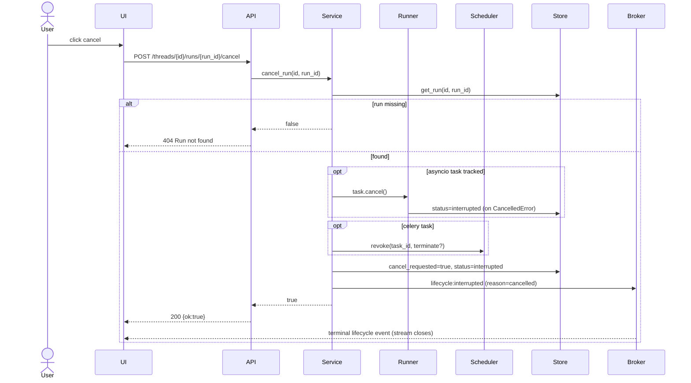
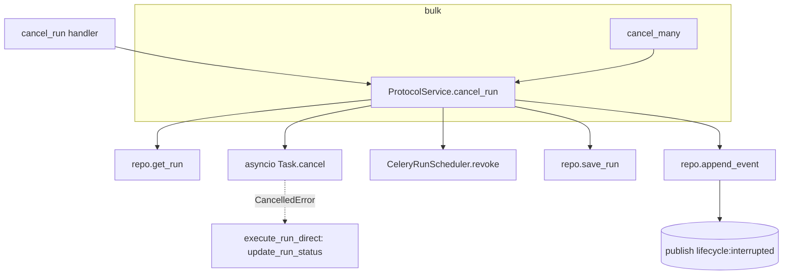

# Use Case 4 — Cancel a Run

## Purpose

Let a user stop an in-progress research run — because it is off-track, taking too long, or no longer needed — and free the associated execution (asyncio task or Celery worker).

## Actors

- **User** — clicks "cancel/stop".
- **UI** — `cancelRun()`.
- **API** — `POST /threads/{id}/runs/{run_id}/cancel` (and bulk `POST /runs/cancel`).
- **Service** (`ProtocolService.cancel_run`) — cancels the task, revokes Celery, updates state.
- **Runner / Scheduler** — the asyncio task or Celery task being stopped.
- **Store / Broker** — persist `interrupted`, publish `lifecycle: interrupted`.

## Execution Flow

1. User triggers cancel; UI calls `POST /threads/{id}/runs/{run_id}/cancel`.
2. `Service.cancel_run`:
   - `get_run`; if missing → return false → `404`.
   - If an in-process asyncio task is tracked in `run_tasks[(thread,run)]` and not done → `task.cancel()`.
   - If Celery backend and the run has a `celery_task_id` → `Scheduler.revoke(task_id, terminate=?)` (terminate controlled by `STREAM_BACKEND_CELERY_TERMINATE_ON_CANCEL`).
   - Set `run.cancel_requested = True`, `run.status = "interrupted"`, `save_run`.
   - Append `lifecycle: interrupted` event (`reason=cancelled`).
3. Streaming clients see the terminal `interrupted` lifecycle event and close (`RunStreamFilter.is_terminal`).
4. The worker/task, on catching `CancelledError`, records `interrupted` and unwinds (`execute_run_direct`).
5. Bulk variant: `POST /runs/cancel` iterates `run_ids` calling `cancel_run` for each and returns `{cancelled: count}`.

## Sequence Diagram

## Failure Cases

| Condition | Handling |
|---|---|
| Run not found | `cancel_run` returns false → `404 Run not found`. |
| No live task (already finished/detached) | State is still forced to `interrupted`; event still emitted (idempotent-ish). |
| Celery task mid-execution, `terminate=false` | Task is revoked but a running task may finish its current step; `cancel_requested` guards re-execution. |
| Revoke fails (broker unreachable) | Exception propagates; DB state may be `interrupted` while worker keeps running until it checks `cancel_requested` / shutdown. |
| Race: completion vs cancel | Last write wins on `save_run`; UI reconciles via lifecycle events and run status polling. |
| Bulk cancel with bad ids | Non-string / missing runs are skipped; only successful cancels counted. |

## Related Code

- `ui/src/api.ts` → `cancelRun`
- `stream-backend/app/main.py` → `cancel_run`, `cancel_many`
- `stream-backend/app/service.py` → `ProtocolService.cancel_run`
- `stream-backend/app/streaming.py` → `RunStreamFilter.is_terminal`
- `stream-backend/worker/client.py` → `CeleryRunScheduler.revoke`
- `stream-backend/worker/tasks.py` → `execute_run_direct` (CancelledError handling), `WorkerShutdownManager`

## Call Graph

Business-logic functions only. Collapsed utilities: `now_iso`, env parsing, `model_dump`.

**Function explanations**

- **cancel_run handler** — FastAPI route `POST /threads/{id}/runs/{run_id}/cancel`.
- **ProtocolService.cancel_run** — orchestrates cancellation across the local task, the Celery worker, and persisted state.
- **repo.get_run** — loads the run (returns false → 404 if missing).
- **asyncio Task.cancel** — cancels the in-process execution task if one is tracked and still running.
- **CeleryRunScheduler.revoke** — revokes (optionally SIGTERM-terminates) the Celery task on the worker.
- **repo.save_run** — sets `cancel_requested=true` and `status=interrupted`.
- **repo.append_event** — emits the terminal `lifecycle: interrupted` (reason=cancelled) so streams close.
- **execute_run_direct / update_run_status** — worker-side: on `CancelledError` marks the run `interrupted` and unwinds.
- **cancel_many** — handler for bulk `POST /runs/cancel`; loops over run ids calling `cancel_run`.
