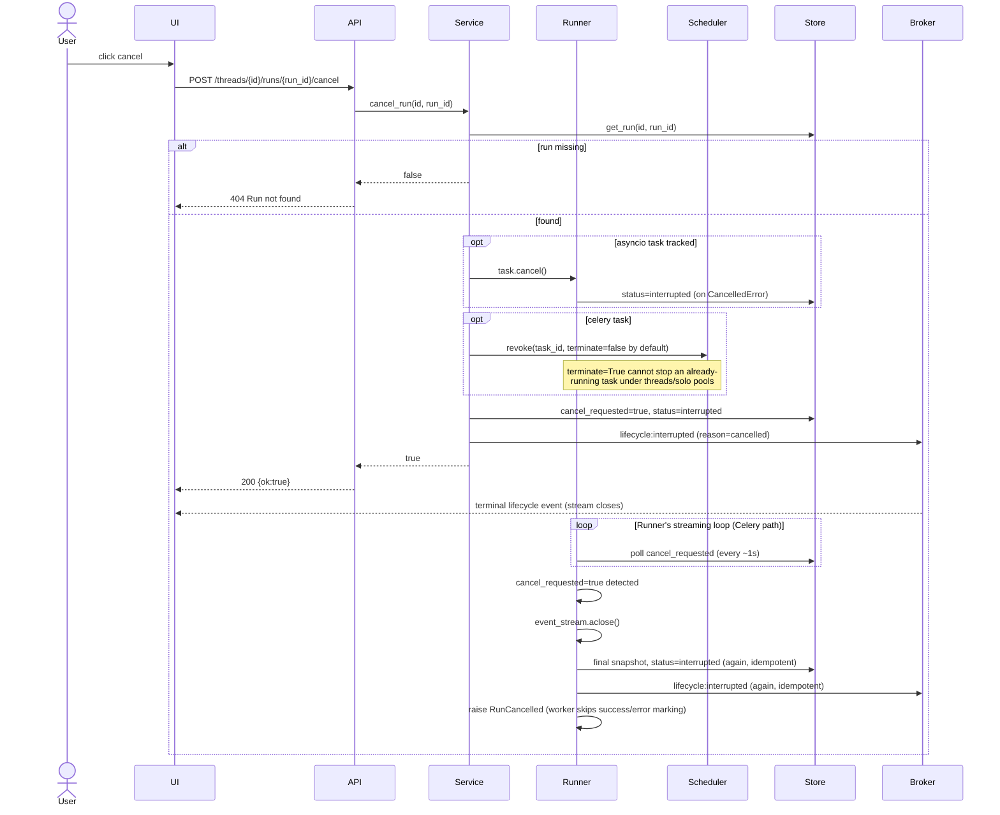
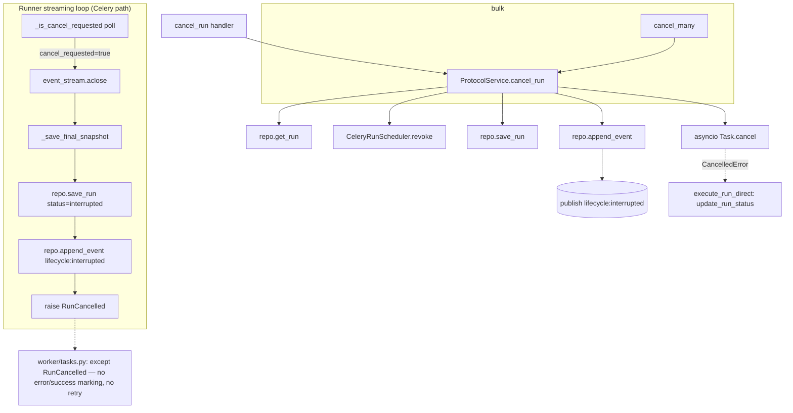

# Use Case 4 — Cancel a Run

## Purpose

Let a user stop an in-progress research run — because it is off-track, taking too long, or no longer needed — and free the associated execution (asyncio task or Celery worker).

## Actors

- **User** — clicks "cancel/stop".
- **UI** — `cancelRun()` / `stopCurrentRun()`.
- **API** — `POST /threads/{id}/runs/{run_id}/cancel` (and bulk `POST /runs/cancel`).
- **Service** (`ProtocolService.cancel_run`) — cancels the task, revokes Celery, updates state.
- **Runner** — `ResearchDeepAgentRunner`: the only thing that actually stops in-progress work.
- **Store / Broker** — persist `interrupted`, publish `lifecycle: interrupted`.

## Two independent stop mechanisms — and why both are needed

| Backend | What stops it | How |
|---|---|---|
| In-process asyncio (`STREAM_BACKEND_RUNNER_BACKEND=asyncio`) | `Service.cancel_run`'s `task.cancel()` | Standard `asyncio.Task` cancellation: raises `CancelledError` at the run's next `await` (inside the `astream_events` loop), caught by `execute_run_direct`. |
| Celery (`STREAM_BACKEND_RUNNER_BACKEND=celery`, the default) | The runner's own **cooperative cancel poll** | `research_runtime.py`'s `run()`/`resume()` streaming loop re-checks `cancel_requested` on the stored run every `RESEARCH_AGENT_CANCEL_POLL_INTERVAL` seconds (default 1.0) and stops itself — see below. |

Celery's `revoke(task_id, terminate=True)` **cannot** stop an already-running task under the `threads`/`solo` pools this project uses on Windows (`worker/README.md`): Python threads cannot be forcibly killed from outside, so `celery.concurrency.thread.TaskPool` does not implement `kill_job` — attempting `terminate=True` there raises `NotImplementedError` inside the worker's pidbox handler (visible in worker logs as `pidbox command error`) and does not stop the task. `STREAM_BACKEND_CELERY_TERMINATE_ON_CANCEL` therefore defaults to `false`; `revoke()` is still called (useful for a task that hasn't started yet — Celery just never dequeues it), but the cooperative poll is what actually stops in-progress work.

Before the cooperative poll existed, a cancelled Celery run had **no way to stop**: it kept executing to completion, then unconditionally overwrote `status=interrupted` back to `status=success` (the runner's success path doesn't check whether a cancel arrived in the meantime). The UI would show the run as stopped immediately, while the agent kept running — and calling silently — in the background.

## Execution Flow

1. User triggers cancel; UI calls `POST /threads/{id}/runs/{run_id}/cancel`.
2. `Service.cancel_run`:
   - `get_run`; if missing → return false → `404`.
   - If an in-process asyncio task is tracked in `run_tasks[(thread,run)]` and not done → `task.cancel()`.
   - If Celery backend and the run has a `celery_task_id` → `Scheduler.revoke(task_id, terminate=?)` (terminate controlled by `STREAM_BACKEND_CELERY_TERMINATE_ON_CANCEL`, default `false` — see above).
   - Set `run.cancel_requested = True`, `run.status = "interrupted"`, `save_run`.
   - Append `lifecycle: interrupted` event (`reason=cancelled`).
3. Streaming clients see the terminal `interrupted` lifecycle event and close (`RunStreamFilter.is_terminal`).
4. **Meanwhile, inside the runner** (whichever backend is executing it):
   - **asyncio**: `task.cancel()` raises `CancelledError` at the run's next `await`; `execute_run_direct` catches it and calls `update_run_status(..., "interrupted")`.
   - **Celery**: the runner's streaming loop periodically re-fetches the run from the store (throttled to `RESEARCH_AGENT_CANCEL_POLL_INTERVAL`, not on every streamed event) and, on seeing `cancel_requested=True`: closes the `astream_events` generator (`event_stream.aclose()`, best-effort), persists a final snapshot of whatever was produced so far, sets `status="interrupted"`, appends `lifecycle: interrupted` (`reason=cancelled`) itself, then raises `RunCancelled` — a dedicated exception distinct from a failure. `worker/tasks.py` has a specific `except RunCancelled` branch (both inside `execute_run_direct`'s inner task and at the outer Celery-task level) that does **not** call `update_run_status(..., "error")` the way a real failure would, and does **not** let Celery's `autoretry_for` retry it.
5. Bulk variant: `POST /runs/cancel` iterates `run_ids` calling `cancel_run` for each and returns `{cancelled: count}`.

## Sequence Diagram

## Failure Cases

| Condition | Handling |
|---|---|
| Run not found | `cancel_run` returns false → `404 Run not found`. |
| No live task (already finished/detached) | State is still forced to `interrupted`; event still emitted (idempotent-ish). |
| Celery task mid-execution | The revoke's `terminate=false` (default) does nothing to a running task. The runner's own cooperative poll is what stops it, within `RESEARCH_AGENT_CANCEL_POLL_INTERVAL` (default 1s) of the request — not instantaneous, but bounded. |
| `STREAM_BACKEND_CELERY_TERMINATE_ON_CANCEL=true` set anyway, pool is `threads`/`solo` | The revoke raises `NotImplementedError` inside the worker's pidbox handler (logged as `pidbox command error`); this does not propagate to the API caller (Celery's `control.revoke` is fire-and-forget) and does not stop the task — the cooperative poll is still what actually stops it. Only set this env var true if the worker runs `--pool=prefork`. |
| Revoke fails (broker unreachable) | Exception propagates from `Service.cancel_run` itself (the `app.control.revoke()` call, not a worker-side reply); DB state may not get updated for this request — retry the cancel. |
| Race: completion vs cancel | The runner's success path does not overwrite an already-cancelled run: cancellation is detected and handled *inside* the streaming loop, before the success path ever runs, and raises `RunCancelled` instead of falling through to it. If the cancel request arrives after the loop has already finished and the success path has already started, cancellation loses the race and the run completes normally (`cancel_requested` stays true but is never observed again). |
| Bulk cancel with bad ids | Non-string / missing runs are skipped; only successful cancels counted. |

## Related Code

- `ui/src/api.ts` → `cancelRun`; `ui/src/runControl.ts` → `cancelCurrentRunRequest`; `ui/src/App.tsx` → `stopCurrentRun`, `stopActiveRun`
- `stream-backend/app/main.py` → `cancel_run`, `cancel_many`, `set_env` (`STREAM_BACKEND_CELERY_TERMINATE_ON_CANCEL` default)
- `stream-backend/app/service.py` → `ProtocolService.cancel_run`
- `stream-backend/app/research_runtime.py` → `ResearchDeepAgentRunner.run`/`.resume` (cooperative cancel poll), `_is_cancel_requested`, `_cancel_poll_interval_seconds`, `RunCancelled`
- `stream-backend/app/streaming.py` → `RunStreamFilter.is_terminal`
- `stream-backend/worker/client.py` → `CeleryRunScheduler.revoke`
- `stream-backend/worker/tasks.py` → `execute_run_direct` (`CancelledError` and `RunCancelled` handling), `WorkerShutdownManager`

## Call Graph

Business-logic functions only. Collapsed utilities: `now_iso`, env parsing, `model_dump`.

**Function explanations**

- **cancel_run handler** — FastAPI route `POST /threads/{id}/runs/{run_id}/cancel`.
- **ProtocolService.cancel_run** — orchestrates cancellation across the local task, the Celery worker, and persisted state.
- **repo.get_run** — loads the run (returns false → 404 if missing).
- **asyncio Task.cancel** — cancels the in-process execution task if one is tracked and still running.
- **CeleryRunScheduler.revoke** — revokes (optionally, if configured for a compatible pool, SIGTERM-terminates) the Celery task on the worker.
- **repo.save_run** — sets `cancel_requested=true` and `status=interrupted`.
- **repo.append_event** — emits the terminal `lifecycle: interrupted` (reason=cancelled) so streams close.
- **execute_run_direct / update_run_status** — worker-side: on `CancelledError` (asyncio backend) marks the run `interrupted` and unwinds.
- **_is_cancel_requested** — re-fetches the run from the store and checks its `cancel_requested` flag; the in-memory `run` object held by the worker task is a snapshot from before execution started, so it cannot see a cancel request written after the fact without this re-read.
- **event_stream.aclose / _save_final_snapshot / RunCancelled** — the Celery-path cancellation handling inside the runner's streaming loop: best-effort close the generator, persist what was produced so far, mark the run interrupted, then raise a dedicated exception the worker treats as neither success nor failure.
- **cancel_many** — handler for bulk `POST /runs/cancel`; loops over run ids calling `cancel_run`.
