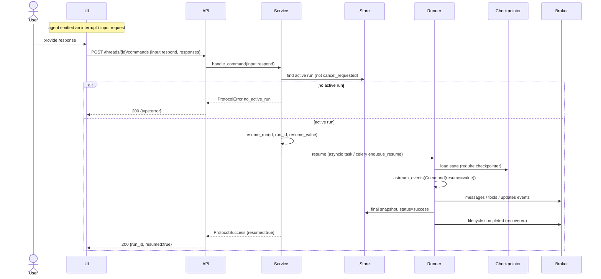
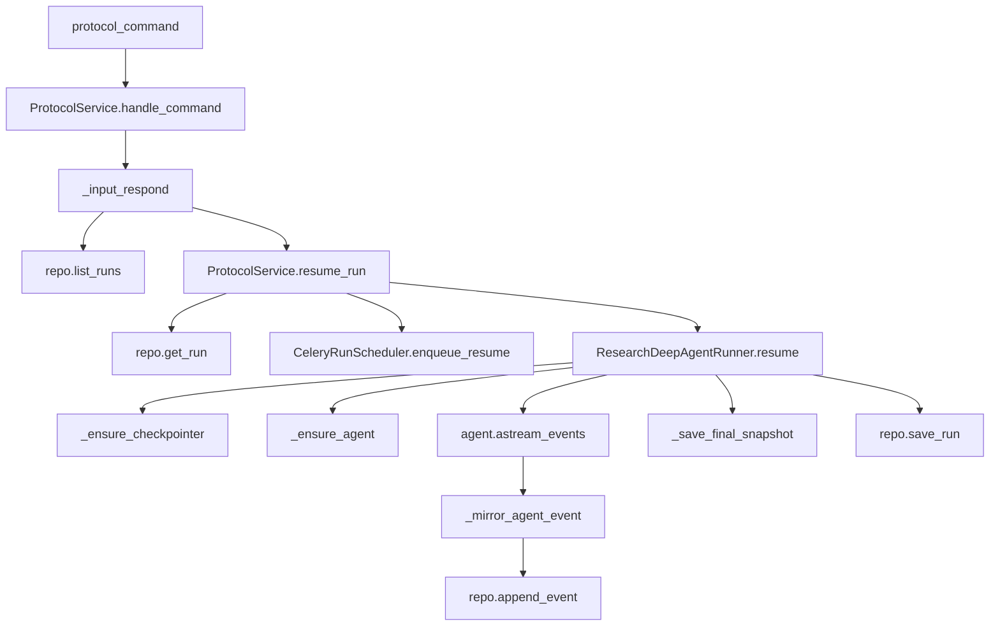

# Use Case 5 — Continue a Conversation (Respond to Input / Interrupt)

## Purpose

Let a user carry a thread forward: answer a mid-run interrupt (e.g. a clarification or approval the agent requested) or send a follow-up turn. The thread accumulates message history across runs so context persists.

## Actors

- **User** — provides a response / follow-up.
- **UI** — `respondToInput()` (or a new `run.start` for a fresh turn).
- **API** — `POST /threads/{id}/commands` with `method=input.respond`.
- **Service** (`_input_respond` → `resume_run(resume_value=...)`).
- **Runner** (`ResearchDeepAgentRunner.resume`) — resumes the graph with `Command(resume=...)`.
- **Checkpointer** — LangGraph `AsyncPostgresSaver` (required to resume).

## Execution Flow

1. Agent hits an interrupt during a run; UI surfaces an input request (from `input`/interrupt events).
2. User answers; UI calls `POST /threads/{id}/commands` with `method=input.respond`, `params.responses=[{id, value}]` (or `response`).
3. `Service._input_respond`:
   - Extracts `resume_value` (from `response`, or first of `responses`).
   - Finds the active run (`running`, then `pending`), excluding `cancel_requested` runs.
   - No active run → `ProtocolError no_active_run`.
   - Calls `resume_run(thread, run_id, resume_value)`.
4. `resume_run` sets `run.kwargs.resume`, then:
   - **Celery** → `enqueue_resume(run, resume_value)`.
   - **asyncio** → `create_task(runner.resume(run, resume_value))`.
5. `ResearchDeepAgentRunner.resume`:
   - Requires a checkpointer (else `ResearchRuntimeUnavailable`).
   - Builds `Command(resume=resume_value)` and calls `astream_events` from the saved checkpoint.
   - Mirrors events, saves final snapshot, sets `success` + `lifecycle: completed` (`recovered: true`).
6. A brand-new follow-up turn (no pending interrupt) instead uses `run.start`; the runner appends the new human message to the thread's existing `messages` (see `ResearchDeepAgentRunner.run`).

## Sequence Diagram

## Failure Cases

| Condition | Handling |
|---|---|
| No active run waiting for input | `ProtocolError no_active_run`. |
| Active run was cancelled | Filtered out (`cancel_requested`); treated as no active run. |
| Run disappeared between lookup and resume | `resume_run` false → `ProtocolError no_such_run`. |
| No checkpointer configured | `resume` raises `ResearchRuntimeUnavailable` → run set `error`, `lifecycle: failed`. |
| Resume execution throws | `resume()` except block → status `error`, `lifecycle: failed` (`recovered: true`). |
| Response value malformed | Passed through as `resume_value`; the agent decides how to interpret it. |

## Related Code

- `ui/src/api.ts` → `respondToInput`
- `stream-backend/app/main.py` → `protocol_command`, `run_payload_to_command` (maps `command.resume` → `input.respond`)
- `stream-backend/app/service.py` → `ProtocolService._input_respond`, `resume_run`
- `stream-backend/app/research_runtime.py` → `ResearchDeepAgentRunner.resume`, `run` (multi-turn message append)
- `stream-backend/worker/client.py` → `enqueue_resume`

## Call Graph

Business-logic functions only. Collapsed utilities: `run_payload_to_command`, `new_id`, `json_ready`, `model_dump`.

**Function explanations**

- **protocol_command** — routes the `input.respond` command to the service.
- **ProtocolService.handle_command** — dispatches to `_input_respond`.
- **_input_respond** — extracts the resume value, finds the active (non-cancelled) run, and delegates to `resume_run`.
- **repo.list_runs** — locates the `running`/`pending` run awaiting input.
- **ProtocolService.resume_run** — re-schedules execution with the user's `resume_value`.
- **repo.get_run** — reloads the run under the thread lock before resuming.
- **CeleryRunScheduler.enqueue_resume** — sends a resume task to the worker (Celery backend).
- **ResearchDeepAgentRunner.resume** — resumes the graph from its checkpoint using `Command(resume=value)`.
- **_ensure_checkpointer** — required for resume; without it resume raises `ResearchRuntimeUnavailable`.
- **_ensure_agent** — rebuilds/reuses the agent to continue execution.
- **agent.astream_events** — continues LangGraph streaming from the interrupt point (external).
- **_mirror_agent_event** — mirrors continued events into the protocol stream.
- **repo.append_event** — persists+publishes the streamed events and final lifecycle.
- **_save_final_snapshot** — persists the post-resume final state.
- **repo.save_run** — sets terminal `success`/`error` after resume completes.
