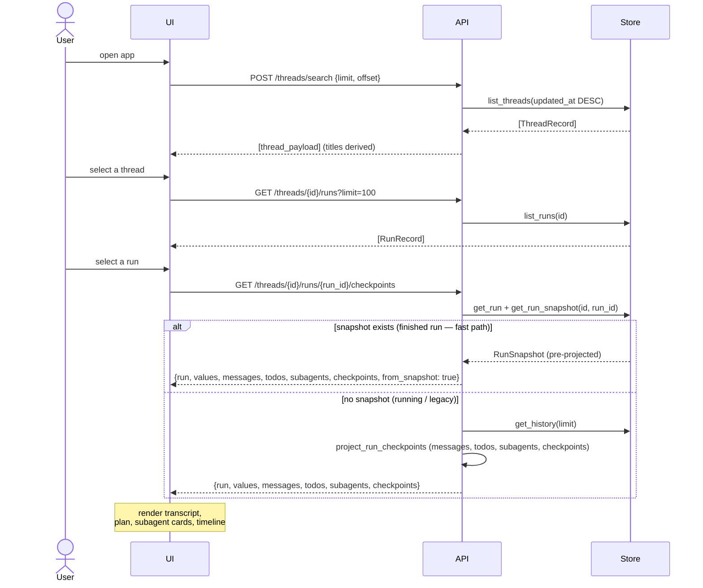
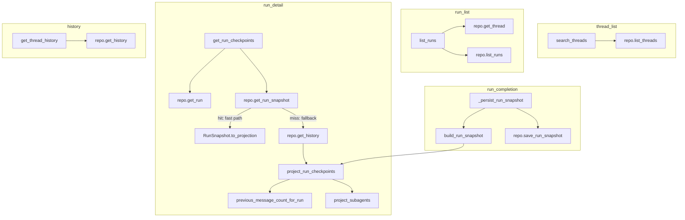

# Use Case 6 — Browse History (Threads, Runs, Checkpoints)

## Purpose

Let a user review past research: list their threads, open a thread to see its runs, and inspect a specific run's reconstructed output — messages, todos, subagent cards, and checkpoints. This turns the system into a durable research archive, not just a live stream.

## Actors

- **User** — browses previous sessions.
- **UI** — thread list, run list, run detail views.
- **API** — `POST /threads/search`, `GET /threads/{id}/runs`, `GET /threads/{id}/runs/{run_id}/checkpoints`, `POST /threads/{id}/history`, `GET /threads/{id}/state`.
- **Store** — Postgres/in-memory repository (durable threads, runs, events, history).

## Execution Flow

1. **Thread list**: UI calls `POST /threads/search {limit, offset}` → `list_threads` (ordered `updated_at DESC`). UI derives a title from `metadata.title` or the first human message (`threadTitle`).
2. **Open thread**: UI calls `GET /threads/{id}/runs?limit=100` → `list_runs`; optionally `GET /threads/{id}/state` for the latest values.
3. **Run detail**: UI calls `GET /threads/{id}/runs/{run_id}/checkpoints` → `get_run_checkpoints`:
   - `get_run`, then `get_run_snapshot(id, run_id)`.
   - **Fast path** — a finished run has a pre-projected `RunSnapshot` in `stream_run_snapshots`; the endpoint returns it directly (`from_snapshot: true`) with a single keyed lookup, no history scan.
   - **Fallback** — for a still-running run (or one saved before snapshots existed) the endpoint loads `get_history(limit)` and `project_run_checkpoints` reconstructs, for this run: the root-checkpoint states, the run's slice of `messages` (via `previous_message_count_for_run`), `todos`, `subagents` (`project_subagents` groups `task` tool-calls with their outputs), and `checkpoints`. The snapshot is built once at run completion using this same projection.
4. **History / time-travel**: `POST /threads/{id}/history {limit}` returns the full ordered `ThreadState` list (checkpoint chain via `parent_checkpoint`).
5. UI renders messages, todo list, subagent cards, and checkpoint timeline from the projection.

## Sequence Diagram

## Failure Cases

| Condition | Handling |
|---|---|
| Thread not found (runs/checkpoints) | `404 Thread not found` / `404 Run not found`. |
| Empty thread / no history | `get_history` returns `[]`; projection yields empty messages/subagents. |
| Corrupt/partial run state | `project_run_checkpoints` guards types (falls back to `[]`/`{}`); best-effort reconstruction. |
| In-memory store after restart | History lost (memory mode); Postgres mode persists across restarts. |
| Large history | Finished runs skip the scan entirely via the `stream_run_snapshots` fast path; the fallback `get_history(limit)` is bounded (default 200 for checkpoints, Postgres `LIMIT 10000` on events). |
| Snapshot write fails on completion | Logged and swallowed; the endpoint transparently falls back to the live projection, so run data is never lost. |
| Non-dict values / missing todos | Normalized to empty list/dict in projection and in `api.ts` mappers. |

## Related Code

- `ui/src/api.ts` → `listThreads`, `listRuns`, `getRunCheckpointSnapshot` (reads `fromSnapshot`), `threadTitle`
- `stream-backend/app/main.py` → `search_threads`, `list_runs`, `get_run_checkpoints` (snapshot fast path + fallback), `get_thread_history`, `get_thread_state`
- `stream-backend/app/projections.py` → `project_run_checkpoints`, `project_subagents`, `previous_message_count_for_run`, `build_run_snapshot`
- `stream-backend/app/research_runtime.py` / `deep_agent.py` → `_persist_run_snapshot` (writes the snapshot on run completion)
- `stream-backend/app/store_postgres.py` / `store.py` → `list_threads`, `list_runs`, `get_history`, `save_run_snapshot`, `get_run_snapshot` (`stream_run_snapshots`)

## Call Graph

Business-logic functions only. Collapsed utilities: `thread_payload`, `select_run_fields`, `normalized_message`, `message_content_text`, `parse_tool_args`, `state_messages`, `state_run_id`, `is_root_checkpoint`, `new_id`, `model_dump`.

**Function explanations**

- **search_threads** — handler for `POST /threads/search`; returns thread summaries.
- **repo.list_threads** — reads thread records ordered by `updated_at DESC`.
- **list_runs** — handler for `GET /threads/{id}/runs`; validates thread then lists runs.
- **repo.get_thread** — confirms the thread exists (404 otherwise).
- **repo.list_runs** — reads run records for the thread (optional status filter, paginated).
- **get_run_checkpoints** — handler for `.../runs/{run_id}/checkpoints`; returns the run's reconstructed view, preferring the stored snapshot.
- **repo.get_run** — loads the run being inspected.
- **repo.get_run_snapshot** — single keyed lookup in `stream_run_snapshots`; returns the pre-projected view for a finished run (fast path) or `None` (fallback).
- **RunSnapshot.to_projection** — reshapes the stored snapshot into the endpoint payload and tags it `from_snapshot: true`.
- **repo.get_history** — loads the thread's checkpoint/state history (fallback only).
- **project_run_checkpoints** — the core reconstruction: derives this run's messages, values, todos, subagents, and checkpoint chain from history.
- **previous_message_count_for_run** — walks parent checkpoints to find where this run's messages begin (so only its slice is shown).
- **project_subagents** — pairs `task` tool-calls with their outputs to build subagent cards and their namespaced sub-transcripts.
- **_persist_run_snapshot** — runs on run completion; projects the finished run once and writes the `RunSnapshot`.
- **build_run_snapshot** — wraps `project_run_checkpoints` into a stored `RunSnapshot` (captures the latest checkpoint id).
- **repo.save_run_snapshot** — upserts the snapshot row keyed by `(thread_id, run_id)`.
- **get_thread_history** — handler for `POST /threads/{id}/history`; returns the raw ordered state list for time-travel.
- **repo.get_history** — same history read, bounded by `limit`.
