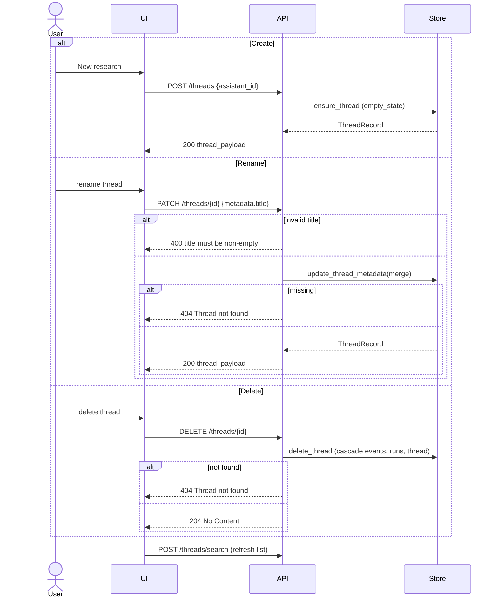
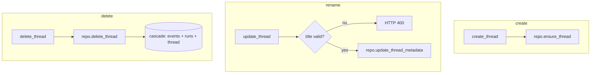

# Use Case 7 — Manage Threads (Create / Rename / Delete)

## Purpose

Let a user organize their research sessions: start a new thread, give a thread a meaningful title, and delete threads they no longer want. Threads are the top-level container for runs, state, and event history.

## Actors

- **User** — manages the thread list.
- **UI** — new/rename/delete actions in the sidebar.
- **API** — `POST /threads`, `PATCH /threads/{id}`, `DELETE /threads/{id}`.
- **Store** — persists thread records, cascades deletes.

## Execution Flow

1. **Create**: UI calls `POST /threads {assistant_id}` → `create_thread` → `ensure_thread` creates a `ThreadRecord` with an empty initial `ThreadState` (`empty_state`) and returns `thread_payload`.
2. **Rename**: UI calls `PATCH /threads/{id} {metadata:{title}}` → `update_thread`:
   - Validates `title` is a non-empty string (trimmed) → else `400`.
   - `update_thread_metadata` merges metadata; `404` if the thread is missing.
   - The title later drives `threadTitle()` in the UI list.
3. **Delete**: UI calls `DELETE /threads/{id}` → `delete_thread`:
   - Store cascades: deletes `stream_events`, `stream_runs`, then `stream_threads` (Postgres transaction).
   - `204` on success, `404` if not found.
4. UI refreshes the thread list (`listThreads`).

## Sequence Diagram

## Failure Cases

| Condition | Handling |
|---|---|
| Rename with empty/blank/non-string title | `400 metadata.title must be a non-empty string`. |
| Rename/delete a missing thread | `404 Thread not found`. |
| Delete while a run is active | Delete cascades regardless; any in-flight task loses its store/thread (events keep going to a now-deleted thread → orphaned). No guard exists — a caller should cancel first. |
| Concurrent create with same id | `ensure_thread` is idempotent (`ON CONFLICT DO NOTHING` / existing-record reuse). |
| Delete cascade partially fails | Wrapped in a Postgres transaction; rolls back on error. |

## Related Code

- `ui/src/api.ts` → `createThread`, `renameThread`, `deleteThread`, `threadTitle`
- `stream-backend/app/main.py` → `create_thread`, `update_thread`, `delete_thread`, `thread_payload`
- `stream-backend/app/store.py` → `InMemoryRepository.ensure_thread/update_thread_metadata/delete_thread`, `empty_state`
- `stream-backend/app/store_postgres.py` → `PostgresRepository.ensure_thread/update_thread_metadata/delete_thread` (cascade transaction)

## Call Graph

Business-logic functions only. Collapsed utilities: `new_id`, `now_iso`, `empty_state`, `thread_payload`, `threadTitle`, `model_dump`.

**Function explanations**

- **create_thread** — handler for `POST /threads`; mints a thread id and provisions the record.
- **repo.ensure_thread** — idempotently creates the thread with an empty initial state (or returns the existing one).
- **update_thread** — handler for `PATCH /threads/{id}`; validates the title before persisting.
- **repo.update_thread_metadata** — merges the new metadata (title) into the thread record; 404 if missing.
- **delete_thread** — handler for `DELETE /threads/{id}`.
- **repo.delete_thread** — removes the thread and cascades deletes of its events and runs within one transaction; returns whether a row existed.
