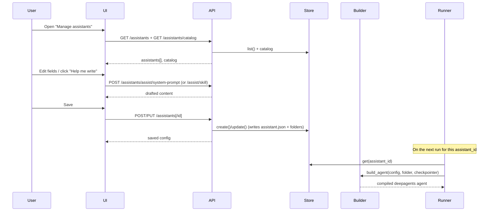

# Use Case 8 — Create & Manage Assistants

Create, configure, and manage deepagents-powered assistants from the UI. Each
assistant is stored in its own folder and built with the `deepagents` library at
run time.

## Actors

- **User** — configures assistants in the web UI.
- **UI** — the assistant manager (`ui/src/AssistantManager.tsx`), opened via the
  "Manage assistants" sidebar button or the `?assistants` URL parameter.
- **API** — the assistant router (`stream-backend/app/assistant_api.py`).
- **Store** — `AssistantStore` (`app/assistants.py`), folder-backed under
  `stream-backend/assistants/<assistant_id>/`.
- **Builder** — `app/assistant_builder.py`, maps a config to `create_deep_agent`.
- **Runner** — `ResearchDeepAgentRunner`, resolves the agent per `assistant_id`.

## What an assistant grants

The editor exposes one tab per capability:

| Tab | Configures | deepagents mapping |
|---|---|---|
| General | Name, description, **system prompt** (with AI-assist) | `system_prompt` |
| Model | Provider, model name, temperature, max tokens, recursion limit | `model` |
| Tools | Custom tools + per-tool permission | `tools`, `interrupt_on` |
| MCP | MCP servers (stdio / http / sse) + permission | MCP tools via `langchain_mcp_adapters` |
| Skills | On-demand SKILL.md playbooks (with AI-assist) | `skills` (SkillsMiddleware) |
| Memory | Always-loaded AGENTS.md context | `memory` (MemoryMiddleware) |
| Subagents | Delegated agents with their own tools/prompt | `subagents` (task tool) |
| Middleware | Optional layers on the always-on core stack | `middleware` |
| Permissions | allow / ask / deny per tool & MCP server | `interrupt_on` (human-in-the-loop) |

`allow` runs a tool freely, `ask` pauses the run for human approval, `deny`
removes it from the agent entirely.

## Flow

## Selecting an assistant & model in chat

The chat header has two dropdowns (`App.tsx`):

- **Assistant** — lists every assistant from `GET /assistants`. Choosing one sets
  the active `assistant_id` (persisted to `localStorage`) that new runs use, and
  starts a fresh thread so the assistant's config applies from the first message.
- **Model** — lists the models for the active assistant's provider (from
  `GET /assistants/catalog` → `providers[].models`). Choosing one persists the
  change via `PUT /assistants/{id}`; the runtime rebuilds the agent on the next
  run because the folder's `assistant.json` mtime changed.

In the manage UI, the **Model** tab offers the same per-provider dropdown with a
"Custom…" option for arbitrary model ids. Switching provider automatically
selects that provider's default model so the pair stays consistent. The tab also
has an optional **API key** field (stored on the assistant's `model.api_key`,
falling back to the provider env var; Bedrock uses AWS credentials) and a
**Test model** button that calls `POST /assistants/assist/test-model` to confirm
the provider/model/key actually work before saving.

> **Bedrock:** model ids are region-aware. Anthropic/Meta/Mistral models are
> invoked via a cross-region inference profile (`eu.`/`us.`/`apac.` prefix chosen
> from `AWS_REGION`); the bare `anthropic.*` id is rejected as invalid in regions
> that require a profile. The catalog offers the prefixed ids plus on-demand
> Amazon Nova models.

## AI-assisted authoring

The **"Help me write"** buttons on the General and Skills tabs call
`/assistants/assist/system-prompt` and `/assistants/assist/skill`. When the
configured model is reachable it drafts the content; otherwise a deterministic
template is returned (`source: "template"`), so the feature works offline.

## Persist-on-checkpoint

When a run finishes and its checkpoint is saved, the runner flushes the
assistant folder and stamps the config snapshot into the thread metadata
(`assistant_id`, `assistant_snapshot`) — the exact assistant used for a run stays
reproducible even after later edits.

## Related endpoints

See [Assistant Management](../architecture/rest-endpoints.md#assistant-management-appassistant_apipy)
in the REST endpoints reference for the full route table and the config→agent
mapping.
