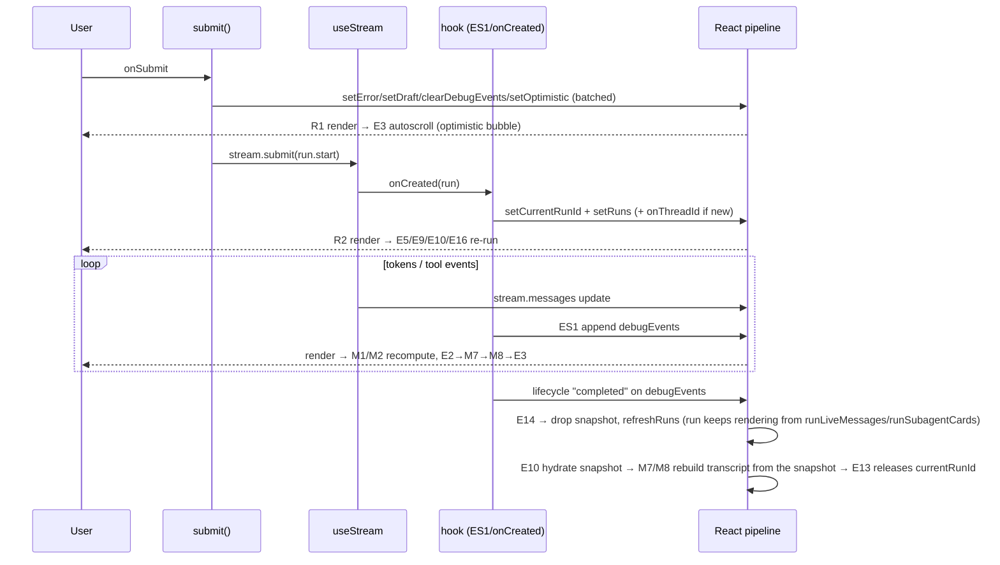

# UI Flow 1 — Start a Research Run

Backend companion: [../01-start-research-run.md](../01-start-research-run.md). Model primer & id catalog: [README](README.md).

## Entry point

User types in the composer and submits the form (`<form className="composer" onSubmit=…>`, line 1728), which calls **`submit()`** (line 877).

## Ordered execution trace

### Tick 0 — the `submit()` call (synchronous part)

`submit()` runs its body before the first `await`:

1. `content = draft.trim()`; guard: bail if empty or `stream.isLoading`.
2. `setError(null)` — state setter #1.
3. `pendingThreadTitleRef.current = content` — ref write (no render; used later by `onThreadId`→`upsertThread`).
4. `setDraft("")` — setter #2 (clears the textbox).
5. `stream.clearDebugEvents()` → `setDebugEvents([])` **inside the hook** — setter #3.
6. `shouldStickToBottomRef.current = true` — ref write (re-arms autoscroll).
7. Build `optimisticMessage` and `setOptimisticMessages(append)` — setter #4.
8. `await stream.submit({messages:[…]}, {streamMode, multitaskStrategy:"reject", …})` — hands off to the SDK.

Setters #1–#4 are **batched** into one re-render (Render pass R1).

### Render pass R1 (draft cleared, optimistic message added)

- Changed state: `error`, `draft`, `optimisticMessages`, `debugEvents`.
- Memos: **M7** recomputes (`optimisticMessages` dep) → **M8** recomputes. `debugEvents` change gives **MS1** a new identity → **M1** (`stream` dep) and **M2** (`stream.debugEvents`) recompute; `currentRunId` is still `null` so they produce empty sets.
- Layout: **E3** runs (M8 changed) → scrolls the optimistic bubble into view.
- Passive: **E2** re-runs (`stream.messages`/`isLoading` may not have changed yet — often skipped); **E14** re-runs (`stream.debugEvents` dep) but finds no terminal event. The optimistic human bubble is now on screen.

### The SDK `submit` resolves the run

Inside `stream.submit`, the SDK POSTs the `run.start` command, then fires **`onCreated(run)`** (stream.ts:186):

1. `onRunCreated(run)` → the callback passed from `App`:
   - If `run.thread_id !== threadIdRef.current` → ignored (stale thread).
   - `liveBaselineIdsRef.current = messageIdSet(streamMessagesRef.current, …)` — snapshots the message ids that already exist *before* this run's output starts arriving. Everything absent from this set (once the SDK starts streaming) belongs to the new run — see [UI Flow 6](06-browse-history.md).
   - `setCurrentRunId(run.run_id)` — setter.
   - `setRuns(prepend {status:"running"})` — setter.
2. `setDebugEvents(append metadata event)` — setter in the hook.
3. For a **new thread**, the SDK also calls **`onThreadId(nextThreadId)`** (line 592): sets `threadIdRef`, bumps `threadRequestSeqRef`, `setThreadId`, writes `localStorage` + URL, and `setThreads(upsertThread(…, pendingThreadTitleRef.current))`.

### Render pass R2 (run becomes current)

- Changed state: `currentRunId`, `runs`, (`threadId`, `threads` if new).
- Memos: **M1** (`currentRunId`,`stream`), **M2** (`currentRunId`), **M3** (`currentRunId`,`stream`), **M4** (`runs`), **M7** (`currentRunId`, and `runsInMessageOrder` via M4), **M8** all recompute.
- Passive effects that re-run because their deps changed:
  - **E2** (`currentRunId`) — reconciles optimistic vs stream messages.
  - **E5** (`currentRunId`,`threadId`) — refreshes the mirror refs.
  - **E9** (`threadId`, only if new thread) — `refreshRuns`.
  - **E10** (`currentRunId`,`runs`,`runsInMessageOrder`) — hydration pass; the running run is not persisted so nothing is fetched yet.
  - **E13** (`currentRunId`) — run is active + `isLoading`, so it early-returns.
  - **E15** (`currentRunId`,`runs`) — the run is already `currentRunId`/joined, so it early-returns.
  - **E16** (`threadId`, only if new) — subscribes the lifecycle EventSource for the new thread.

### The streaming loop (repeated, many times)

For every model token / tool event, two channels push updates (see [UI Flow 2](02-watch-run-stream.md)):

- **SDK** updates `stream.messages`/`isLoading` → new `stream` identity → **R(n)**.
- **ES1** appends to `debugEvents` → new `debugEvents` → **MS1** → **R(n)**.

Each such render: **M1/M2** recompute (live subagent cards + action rows), **E2** routes `stream.messages` into `runLiveMessages[currentRunId]` (→ **M7**/**M8** → **E3** autoscroll) and **E2b** retains the live cards into `runSubagentCards[currentRunId]`, and **E14** scans `debugEvents` for a terminal event (none yet). The `logStreamingTokens` helper (called from E2) diff-logs each appended token.

### Completion

When the run finishes, a `lifecycle` frame (`completed`) arrives on `debugEvents`:

- **E14** finds the terminal event for `currentRunId`, marks it handled, sets the run's status (`success`) in `runs`, clears `optimisticMessages`, drops the stale snapshot from `runCheckpointSnapshots`, `clearDebugEvents()`, and `refreshRuns(threadId)`. It deliberately does **not** clear `runLiveMessages`/`runSubagentCards` or `currentRunId` — the run keeps rendering from its own retained data (`persistedOrLive`) through the gap where the snapshot has been dropped but not yet refetched.
- `refreshRuns` → `setRuns(next)` → **E10** now sees a *persisted* run and hydrates its checkpoint snapshot (once it's non-empty — see [UI Flow 6](06-browse-history.md#the-empty-snapshot-race)) → `setRunCheckpointSnapshots` → **M7/M8** rebuild the transcript, now sourcing this run from the snapshot instead of `runLiveMessages` → **E13** sees `currentRunSnapshotLoaded` flip true and releases `currentRunId` (no visible change — M7 was already rendering this run's content).

`submit()`'s own tail (`await stream.submit` resolved) then runs `refreshThreads()` + `refreshRuns()` to reconcile the sidebar and run list.

## Phase diagram

## Re-render cascade summary

| State change | Memos invalidated | Effects triggered |
|---|---|---|
| `optimisticMessages` | M7, M8 | E3 (layout) |
| `debugEvents` (MS1) | M1, M2, (MS1) | E14 |
| `currentRunId` | M1, M2, M3, M7 | E2, E2b, E5, E10, E13, E15 |
| `runs` | M4, M7 | E10, E15 |
| `threadId` (new thread) | M4, M7 | E5, E9, E16 |
| `runCheckpointSnapshots` | M7 | E10, E13 |

## Related code

- `ui/src/App.tsx` → `submit`, `onCreated` callback, E2, E2b, E10, E13, E14
- `ui/src/stream.ts` → `useDeepResearchStream`, `onCreated`, ES1
