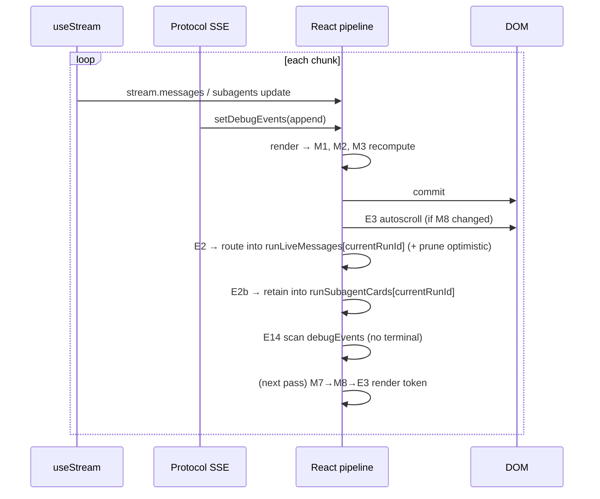

# UI Flow 2 — Watch a Run Stream in Real Time

Backend companion: [../02-watch-run-stream.md](../02-watch-run-stream.md). Model primer & id catalog: [README](README.md).

## What this covers

The steady-state render loop while a run streams: how three inbound channels convert into re-renders, and the precise order in which memos and effects run per streamed chunk.

## The three channels feeding a render

| Channel | Registered by | State it writes | Consumers |
|---|---|---|---|
| SDK `useStream` | `useDeepResearchStream` (stream.ts:311) | `stream.messages`, `stream.isLoading`, `stream.subagents`, `stream.activeSubagents`, `stream.interrupts` | E2, M1, M3, topbar status |
| Protocol SSE (**ES1**) | stream.ts:110 | `debugEvents` (→ `stream.debugEvents` via **MS1**) | M1, M2, E14 |
| Lifecycle EventSource (**E16**) | App.tsx:1439 | none directly — calls `showActiveRun`/`clearActiveRun` → `setActiveRun` | E15 banner, activeRun UI |

Each `setState` from any channel schedules one React pipeline pass.

## Ordered execution per streamed chunk

A single model-token frame arrives on **both** the SDK channel and ES1. React batches the two setters if they land in the same tick; otherwise two passes run. For one pass:

1. **Render** — because `stream` identity changed (MS1) and/or `stream.messages` changed:
   - **M1** `liveRunSubagentCards` recomputes (`stream` dep) — rebuilds subagent cards from `debugEvents` + SDK `subagents`.
   - **M2** `liveRunActions` recomputes (`stream.debugEvents` dep) — rebuilds the "Searching…/Reading…/Delegating…" rows.
   - **M3** `inputRequests` recomputes (`stream` dep) — usually empty mid-run.
   - `currentRun`/`currentRunStatus` recomputed (plain).
   - **M7** recomputes only if `runLiveMessages`/`optimisticMessages`/`runCheckpointSnapshots`/`runsInMessageOrder` changed — on a *pure* debugEvents pass it may be cached; on a `stream.messages` pass E2 will change `runLiveMessages` next.
2. **Commit** — bubbles/cards updated.
3. **Layout — E3** runs if **M8** (`displayedMessages`) changed → autoscroll to the newest token (respecting `shouldStickToBottomRef`, maintained by **E4**'s scroll listener).
4. **Paint.**
5. **Passive effects** (only changed deps):
   - **E2** (`stream.messages`) → `logStreamingTokens(stream.messages)` (diff-logs the appended token), routes `stream.messages` into `runLiveMessages[currentRunId]` via `selectLiveRunMessages`, prunes confirmed optimistic messages. This sets state → schedules the next pass where **M7→M8→E3** render the token.
   - **E2b** (`liveRunSubagentCards`) → retains M1's cards into `runSubagentCards[currentRunId]` (structural-compare bailed via `sameSubagentCards` when unchanged).
   - **E14** (`stream.debugEvents`) → scans for a terminal lifecycle event; none yet, returns.

So a token's journey is **two** pipeline passes: pass 1 ingests it into `stream.messages`; E2 copies it into `runLiveMessages[currentRunId]`; pass 2 recomputes M7/M8 and E3 scrolls it into view.

## Subagent activity

When a `task` tool event arrives on ES1, **M1** (`subagentCardsForLiveRun`) merges:
- event-derived cards from `subagentCardsFromEvents(protocolEventsFromDebugEvents(runEvents))`, and
- SDK `stream.subagents` via `subagentStreamToCard`,

producing the cards passed to `subagentCardsForMessage(index)` → `<MessageBubble subagents=…>`. **E2b** retains this into `runSubagentCards[currentRunId]` after every recompute, so the cards survive the run's own completion (see [UI Flow 6](06-browse-history.md)) instead of only existing transiently in the M1 memo. `stream.activeSubagents.length` drives the topbar `statusText` ("N subagents active").

## Phase diagram

## Backpressure / bounding

`appendDebugEvent` keeps only the **last 250** events (`.slice(-250)`, stream.ts:58), so `debugEvents` (and the memos derived from it) stay bounded on long runs. `loggedMessageTextRef` caches per-message text so `logStreamingTokens` only emits the *delta*, not the whole message, each pass.

## Re-render cascade summary

| Channel event | State change | Memos | Effects |
|---|---|---|---|
| SDK token | `stream.messages` | M1, M3 (M7 next pass) | E2 → then E3 |
| ES1 frame | `debugEvents` (MS1) | M1, M2 | E2b, E14 |
| lifecycle running/terminal | `activeRun` (maybe) | — | E15, E16 handlers |

## Related code

- `ui/src/stream.ts` → ES1, `onMessageEvent/onToolEvent/onTaskEvent`, MS1, `appendDebugEvent`
- `ui/src/App.tsx` → E2, E2b, E3, E4, E14, M1, M2, `subagentCardsForLiveRun`, `logStreamingTokens`
