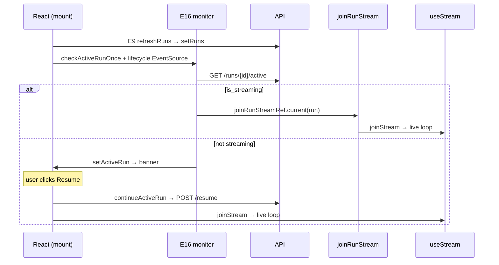

# UI Flow 3 — Resume / Reconnect to an Active Run

Backend companion: [../03-resume-run.md](../03-resume-run.md). Model primer & id catalog: [README](README.md).

## What this covers

Two paths that share the **activeRunMonitor** machinery (E15 + E16):

- **A. Reconnect on load** — the app opens with a `threadId` that already has an active run.
- **B. Manual resume** — the user clicks **Resume run** on the "Inactive run found" banner.

## Path A — reconnect on mount / thread open

### Effects that run on mount (in passive order)

`initialThreadId()` seeds `threadId` from the URL or `localStorage` (line 558), so on the very first render `threadId` is already set. After paint:

1. **ES1** (stream.ts) subscribes the protocol SSE for the thread.
2. **E8** (`apiUrl`) loads the sidebar threads.
3. **E9** (`apiUrl, threadId`) → `refreshRuns(threadId)` → `setRuns(next)`.
4. **E16** (`apiUrl, threadId`) runs `checkActiveRunOnce()` (one-shot `GET /runs?limit=20`) **and** opens the lifecycle `EventSource`.

### Discovery decision

Both **E15** (triggered by the `setRuns` from E9) and **E16**'s `checkActiveRunOnce` look for a run whose status ∈ `ACTIVE_RUN_STATUSES`. When found, they call `fetchRunActive(apiUrl, {threadId, runId})` → `GET /runs/{id}/active`, then branch on `is_streaming`:

```
is_streaming === true   → joinRunStreamRef.current({threadId, runId})   // auto-join, no dialog
is_streaming === false  → setActiveRun({threadId, runId})               // show banner
```

De-dupe guards prevent double work: `joinedRunIds` (a ref Set), `currentRunIdRef`, and `activeRunRef` (kept fresh by **E5**). `joinRunStreamRef.current` is reassigned every render (README §1.3) so the auto-join always closes over the latest `stream`.

### Auto-join branch

`joinRunStreamRef.current(run)`:
1. Skip if `joinedRunIds` already has the run.
2. `joinedRunIds.add(runId)`; clear a matching banner (`setActiveRun`); `setCurrentRunId(runId)`.
3. `await stream.joinStream(runId, undefined, {streamMode})` — the SDK attaches and begins pushing `stream.messages`/events, entering the [Flow 2](02-watch-run-stream.md) streaming loop.

`setCurrentRunId` triggers a render → **M1/M2/M3/M7** recompute, **E2/E10/E13** re-run; the transcript switches from persisted-only to live tail.

**On a failed join** (step 3 rejects — e.g. the backend's event-broker subscribe failed, see [backend Use Case 4](../04-cancel-run.md) for that path): `joinedRunIds.delete(runId)` and `setCurrentRunId(current => current === runId ? null : current)` release the claim, plus `setError(...)` surfaces it. Previously the catch block only logged: `currentRunId` stayed pointing at a run that would never receive another event (transcript stays empty), and `joinedRunIds` permanently blocked any later retry — the run was effectively wedged until a full page reload. Releasing the claim lets the next activeRunMonitor pass (E15/E16) rediscover and retry it instead.

### Banner branch

`setActiveRun({threadId, runId})` triggers a render where `visibleActiveRun = activeRun?.threadId === threadId ? activeRun : null` is truthy → the `active-run-banner` renders with **Resume run** / **Cancel run**. **E5** mirrors `activeRun` into `activeRunRef`.

## Path B — manual resume (banner button)

Clicking **Resume run** calls **`continueActiveRun(run)`** (line 948):

1. `setError(null)`, `stream.clearDebugEvents()`.
2. `await fetchRunStatus` — if terminal, `setActiveRun(null)` and stop.
3. Stale-thread guard against `threadIdRef.current`.
4. `POST /runs/{id}/resume`.
5. `joinedRunIds.add(runId)`, `setActiveRun(null)`, `setCurrentRunId(runId)`, drop any stale snapshot (`setRunCheckpointSnapshots`), upsert the run into `runs` as running.
6. `await stream.joinStream(runId, …)` → streaming loop.

The batch of setters in step 5 produces one render: banner disappears (`activeRun` null), `currentRunId` set → **M1/M2/M3/M7** recompute, **E10** (snapshot dropped → refetch candidate), **E13/E15** re-evaluate.

**On a failed join** (step 6 rejects): same recovery as path A — `joinedRunIds.delete(runId)` + `setCurrentRunId(current => current === runId ? null : current)` release the claim so the run can be rediscovered (the banner reappears) instead of leaving `currentRunId` wedged on a run that will never stream.

## Phase diagram



## Re-render cascade summary

| Trigger | State change | Effects |
|---|---|---|
| E9 `refreshRuns` | `runs` | E10, E15 |
| auto-join / resume | `currentRunId`, `activeRun`=null | E2, E5, E10, E13, E15 |
| lifecycle `running` (E16) | `activeRun` (maybe) | E15 |

## Related code

- `ui/src/App.tsx` → E15, E16, `continueActiveRun`, `joinRunStreamRef`, `fetchRunActive`, `fetchRunStatus`, E5
- `ui/src/stream.ts` → `useStream.joinStream`, ES1
