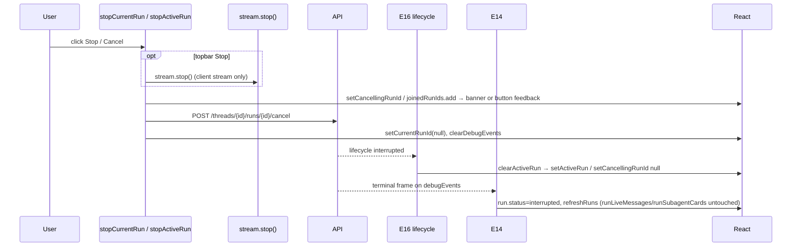

# UI Flow 4 — Cancel a Run

Backend companion: [../04-cancel-run.md](../04-cancel-run.md). Model primer & id catalog: [README](README.md).

## Entry points

Two buttons cancel, depending on UI state — **both** now POST to the backend cancel route; neither relies on the SDK's own `stream.stop()` to do that:

- **Topbar stop** (`stream.isLoading` true) → **`stopCurrentRun()`**, cancels `currentRunId`.
- **Banner "Cancel run"** (inactive-run banner) → **`stopActiveRun(run)`**, cancels the discovered `ActiveRun`.

Both converge on the backend cancel + a terminal lifecycle event that the monitor consumes.

## Why the topbar button needed its own function (not just `stream.stop()`)

The SDK's `useStream().stop()` only calls the backend's cancel route through an internal `runMetadataStorage`, which the SDK sets to `null` unless `reconnectOnMount` is `true` or a function (`dist/react/stream.lgp.js`, `useStreamLGP`). This app passes `reconnectOnMount: false` deliberately (to skip a heavy `/history` fetch on load — see [stream.ts](../../../ui/src/stream.ts)), which as a side effect disables that internal cancel call entirely.

The bug this produced: clicking the topbar Stop button tore down the *client's* stream connection (`stream.isLoading` → `false`) but never told the backend to cancel. The worker kept executing the run, which stayed `status: "running"` server-side. Submitting a new message then got rejected as `run_in_progress` (see [Use Case 1](../01-start-research-run.md#failure-cases)), and the activeRunMonitor (E15/E16) rediscovered the still-`running`-but-no-longer-streaming run and showed the "inactive run" banner — which is what looked like a spurious interrupt/blocker to the user.

`stopCurrentRun()` fixes this by POSTing the same `/threads/{id}/runs/{id}/cancel` route `stopActiveRun` already used correctly, targeting `currentRunId` instead of a discovered `ActiveRun`. The URL/guard decision is factored into a pure, unit-tested helper: `cancelCurrentRunRequest(apiUrl, threadId, currentRunId)` (`ui/src/runControl.ts`) — returns `null` when either id is missing (e.g. the window between `stream.submit()` starting and the backend's `onCreated` assigning a run id), otherwise the POST target.

## Ordered execution — `stopCurrentRun()`

1. `stream.stop()` — always called first, unconditionally: tears down the client-side connection immediately for instant UI feedback (topbar button unmounts as `stream.isLoading` flips false), and is still correct/necessary even though it can't cancel the backend run itself.
2. `cancelCurrentRunRequest(apiUrl, threadId, currentRunId)` — if `null` (no run id yet), return; nothing more to cancel.
3. `setError(null)`.
4. `joinedRunIds.current.add(runId)` — **before** the network round-trip, so E15/E16 can't rediscover the run (still `running` server-side, no longer streaming client-side) and flash the banner while the cancel request is in flight.
5. `await POST /threads/{id}/runs/{id}/cancel`.
6. On success: `setCurrentRunId(runId===current ? null : current)`, `stream.clearDebugEvents()`.
7. On failure: `joinedRunIds.current.delete(runId)` (release the claim — the run is genuinely still active, let discovery + the banner offer Resume/Cancel) + `setError(...)`.

## Ordered execution — `stopActiveRun(run)`

Synchronous body:

1. `setError(null)` — setter.
2. `setCancellingRunId(run.runId)` — setter → the banner switches to the "Cancelling — waiting…" state and disables the button.
3. `await POST /threads/{id}/runs/{id}/cancel`.
4. On success: `joinedRunIds.add(runId)` (ref — blocks E15/E16 from re-showing the banner while the run drains), `setCurrentRunId(runId===current ? null : current)`, `stream.clearDebugEvents()` → `setDebugEvents([])`.
5. On failure: `setCancellingRunId(null)` + `setError(...)`.

The setters in steps 1–2 render first (banner shows "Cancelling…"); step 4's setters render again after the POST resolves.

`stopCurrentRun` and `stopActiveRun` claim `joinedRunIds` at different points relative to the request (before vs. after) because the two entry conditions differ: `stopCurrentRun`'s target is actively streaming right up until `stream.stop()` runs synchronously in step 1, so the claim must land before that visible `isLoading` flip creates a rediscovery window; `stopActiveRun`'s target was already discovered as *not* streaming, so there's no equivalent flip to race.

## The terminal handoff (who actually flips the run to cancelled)

Neither function marks the run terminal itself — both wait for the backend's lifecycle event, delivered on two channels:

- **E16**'s lifecycle `EventSource` receives `{event: "interrupted", run_id}` → `clearActiveRun(runId)`:
  - `setCancellingRunId(current===runId ? null : current)` and `setActiveRun(current matches ? null : current)` → banner disappears.
- **E14** (if `runId === currentRunId`) sees the terminal `interrupted` frame in `debugEvents` → marks the run's status `interrupted` in `runs`, drops its stale snapshot, `refreshRuns`. It does **not** clear `runLiveMessages`/`runSubagentCards`/`currentRunId` (see [UI Flow 6](06-browse-history.md)) — for a cancelled run these simply stop updating; **E13** later releases `currentRunId` once the run's (now-terminal) snapshot is hydrated.

`TERMINAL_RUN_EVENTS` (`completed/failed/interrupted/timeout`) is the set both handlers match; `TERMINAL_EVENT_TO_RUN_STATUS` maps `interrupted → interrupted`.

## Phase diagram

## Re-render cascade summary

| State change | Memos | Effects |
|---|---|---|
| `cancellingRunId` | — | (banner label only) |
| `currentRunId`→null | M1, M2, M3, M7 | E2, E2b, E5, E10, E13, E15 |
| `debugEvents` cleared | M1, M2 | E14 |
| `activeRun`→null (E16) | — | E5, E15 |

## Why `joinedRunIds.add` before the terminal event matters

Between the cancel POST and the terminal lifecycle event, `runs` may still list the run as `pending/running`. Without adding it to `joinedRunIds`, **E15**/**E16** would re-discover it and re-show the banner or auto-rejoin. Adding it suppresses discovery until the terminal event arrives and finalizes the run.

## Related code

- `ui/src/App.tsx` → `stopCurrentRun`, `stopActiveRun`, E14, E16 (`clearActiveRun`), E13
- `ui/src/runControl.ts` → `cancelCurrentRunRequest`
- `ui/src/stream.ts` → `useStream.stop` (client-side only — see above)
