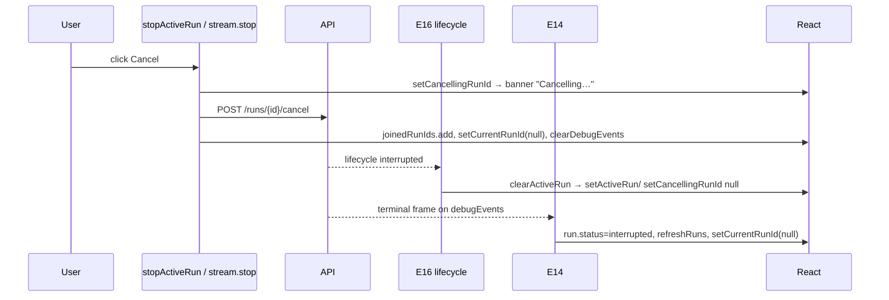

# UI Flow 4 — Cancel a Run

Backend companion: [../04-cancel-run.md](../04-cancel-run.md). Model primer & id catalog: [README](README.md).

## Entry points

Two buttons cancel, depending on UI state:

- **Topbar stop** (`stream.isLoading` true) → `stream.stop()` (SDK), line 1654.
- **Banner "Cancel run"** (inactive-run banner) → **`stopActiveRun(run)`** (line 1014).

Both converge on the backend cancel + a terminal lifecycle event that the monitor consumes.

## Ordered execution — `stopActiveRun(run)`

Synchronous body:

1. `setError(null)` — setter.
2. `setCancellingRunId(run.runId)` — setter → the banner switches to the "Cancelling — waiting…" state and disables the button.
3. `await POST /runs/{id}/cancel`.
4. On success: `joinedRunIds.add(runId)` (ref — blocks E15/E16 from re-showing the banner while the run drains), `setCurrentRunId(runId===current ? null : current)`, `stream.clearDebugEvents()` → `setDebugEvents([])`.
5. On failure: `setCancellingRunId(null)` + `setError(...)`.

The setters in steps 1–2 render first (banner shows "Cancelling…"); step 4's setters render again after the POST resolves.

## The terminal handoff (who actually flips the run to cancelled)

`stopActiveRun` does **not** mark the run terminal itself — it waits for the backend's lifecycle event, delivered on two channels:

- **E16**'s lifecycle `EventSource` receives `{event: "interrupted", run_id}` → `clearActiveRun(runId)`:
  - `setCancellingRunId(current===runId ? null : current)` and `setActiveRun(current matches ? null : current)` → banner disappears.
- **E14** (if `runId === currentRunId`) sees the terminal `interrupted` frame in `debugEvents` → marks the run's status `interrupted`, clears live state, `setCurrentRunId(null)`, `refreshRuns`.

`TERMINAL_RUN_EVENTS` (`completed/failed/interrupted/timeout`) is the set both handlers match; `TERMINAL_EVENT_TO_RUN_STATUS` maps `interrupted → interrupted`.

## Ordered execution — topbar `stream.stop()`

`stream.stop()` aborts the SDK stream directly:
- `stream.isLoading` flips false → render → topbar stop button unmounts; **E13** (`stream.isLoading` dep) re-evaluates and, once the run is terminal + snapshot loaded, clears `currentRunId`.
- The backend still emits the terminal lifecycle event → E16/E14 finalize as above.

## Phase diagram

## Re-render cascade summary

| State change | Memos | Effects |
|---|---|---|
| `cancellingRunId` | — | (banner label only) |
| `currentRunId`→null | M1, M2, M3, M7 | E2, E5, E10, E13, E15 |
| `debugEvents` cleared | M1, M2 | E14 |
| `activeRun`→null (E16) | — | E5, E15 |

## Why `joinedRunIds.add` before the terminal event matters

Between the cancel POST and the terminal lifecycle event, `runs` may still list the run as `pending/running`. Without adding it to `joinedRunIds`, **E15**/**E16** would re-discover it and re-show the banner or auto-rejoin. Adding it suppresses discovery until the terminal event arrives and finalizes the run.

## Related code

- `ui/src/App.tsx` → `stopActiveRun`, E14, E16 (`clearActiveRun`), E13
- `ui/src/stream.ts` → `useStream.stop`
