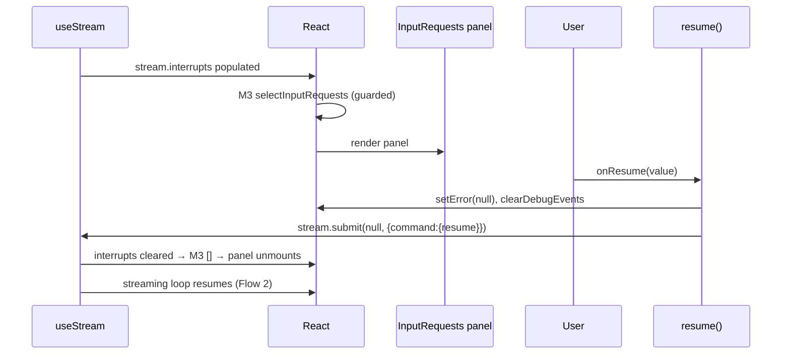

# UI Flow 5 — Respond to Input (Interrupt / Permission)

Backend companion: [../05-respond-to-input.md](../05-respond-to-input.md). Model primer & id catalog: [README](README.md).

## What this covers

When the agent interrupts to ask for human input (or permission), the UI renders an `<InputRequests>` panel; the user's answer flows back through **`resume(value)`**.

## How an interrupt reaches the screen

1. The SDK surfaces the interrupt on `stream.interrupts`. A new `stream` identity triggers a render.
2. **M3** `inputRequests` recomputes — but note its guard:
   ```ts
   currentRunId !== null && visibleActiveRun === null ? selectInputRequests(stream) : []
   ```
   Interrupts render **only** while a run is current *and* no "inactive run" banner is showing (the two are mutually exclusive UI states). `selectInputRequests` maps each `stream.interrupts` entry to an `InputRequest` (`inputRequestFromInterrupt`), classifying `permission` vs `interrupt`.
3. Render: `{inputRequests.length > 0 && <InputRequests requests=… onResume={resume} />}` (line 1698).

## Ordered execution — `resume(value)`

Triggered by an action inside `<InputRequests>` (`onResume`). Body (line 926):

1. `setError(null)` — setter.
2. `stream.clearDebugEvents()` → `setDebugEvents([])` — setter.
3. `await stream.submit(null, { command: { resume: value }, streamMode, multitaskStrategy:"reject", metadata:{action:"resume"} })`.
   - Passing `null` input with a `command.resume` tells the SDK to resume the interrupted graph rather than start a new turn.
4. On resolve: logs `resume.completed`; on reject: `setError(...)`.

Once `stream.submit` resumes the run, `stream.interrupts` empties → **M3** returns `[]` → the panel unmounts, and the streaming loop ([Flow 2](02-watch-run-stream.md)) continues.

## Render/effect ordering

- Steps 1–2 batch into one render: `debugEvents` cleared → **MS1** new identity → **M1/M2** recompute (empty), **M3** recomputes. `E14` re-runs (debugEvents) and finds nothing.
- The resumed stream then re-enters the token loop; **E2** copies messages, **E3** autoscrolls, exactly as in Flow 2.

## Phase diagram



## Re-render cascade summary

| Trigger | State change | Memos | Effects |
|---|---|---|---|
| interrupt arrives | `stream.interrupts` (MS1) | M1, M2, M3 | E14 |
| `resume()` | `error`, `debugEvents` | M1, M2, M3 | E14 |
| resume streams | `stream.messages` | M1, M3 | E2 → E3 |

## Edge cases

- If a run is **not** current (e.g. only the banner is shown), interrupts are intentionally suppressed by M3's guard — the user resumes via the banner ([Flow 3](03-resume-run.md)) first.
- `selectInputRequests` tolerates missing fields: `detail` falls back through `prompt → message → action → JSON`.

## Related code

- `ui/src/App.tsx` → M3 `inputRequests`, `resume`, `<InputRequests>` render
- `ui/src/selectors.ts` → `selectInputRequests`, `inputRequestFromInterrupt`
- `ui/src/stream.ts` → `useStream.submit` with `command.resume`
