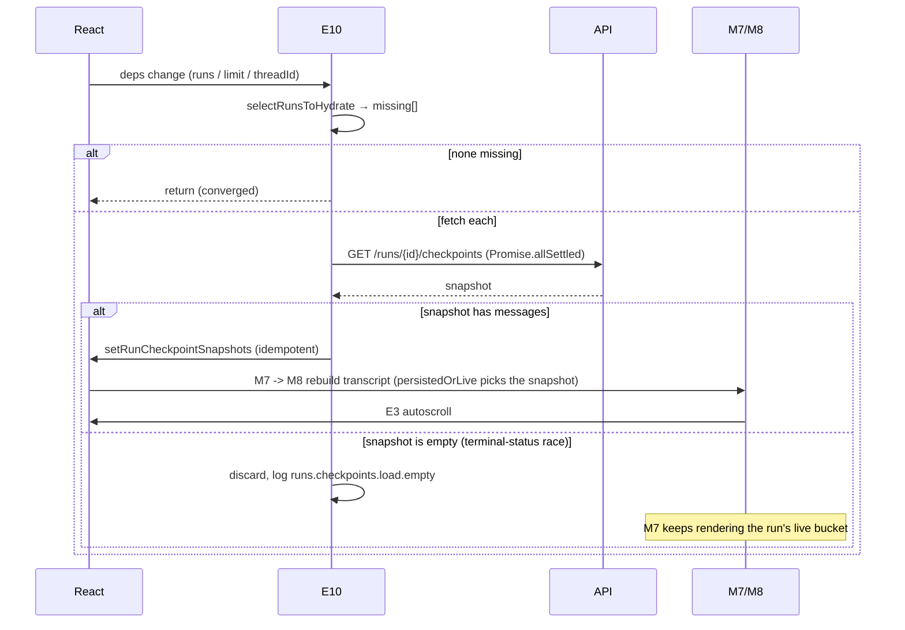

# UI Flow 6 — Browse History (Runs & Checkpoints)

Backend companion: [../06-browse-history.md](../06-browse-history.md). Model primer & id catalog: [README](README.md).

## What this covers

How the persisted transcript is assembled from **run checkpoint snapshots** via **lazy hydration** (E10), how "Load earlier runs" reveals older runs, and how a run stays visible (transcript **and** subagent cards) through the window between finishing and its snapshot landing.

## The transcript pipeline

```
runsInMessageOrder ──┐
runCheckpointSnapshots ──┼──M7(buildRunMessageEntries)──> displayedMessageEntries ──M8──> displayedMessages ──E3
runLiveMessages ──────┘
```

- **M4** `runsInMessageOrder` — this thread's runs, oldest→newest; the iteration order for M7.
- **M7** `displayedMessageEntries` — assembled **per run** by `buildRunMessageEntries`, in run order, from exactly one source per run via `persistedOrLive(snapshot, live)`: the persisted snapshot's messages once they have content, otherwise that run's live bucket (`runLiveMessages[runId]`, filled by **E2** via `selectLiveRunMessages`, which excludes `otherRunsMessageIds` — every *other* run's known message ids, recomputed fresh each time rather than a one-time run-start snapshot; see [UI Flow 3](03-resume-run.md) for why that distinction matters). Optimistic messages trail until confirmed.

  Two things make this deterministic and gap-free:
  - Ids are deduped **globally**, earliest run wins (a later run's snapshot repeats earlier history), so every message belongs to exactly one run and the render key `${runId}:${messageId}` is unique by construction.
  - An **empty** snapshot (`messages: []`) counts as *absent*, not as "this run has no messages" — see "The empty-snapshot race" below.

  Subagent cards follow the identical pattern one level over: `subagentCardsForMessage`/`actionsForMessage` use `persistedOrLive(snapshot.subagents, runSubagentCards[runId])` — cards captured live are retained by **E2b** the same way messages are retained by E2.

## The empty-snapshot race

A run can flip to a terminal status (`success`/`error`) before its snapshot row is written on the backend. If E10 fetches in that window, it gets back `messages: []` (and `subagents: []`). Two guards handle this:

- **E10 does not cache it.** A zero-message result is discarded (logged as `runs.checkpoints.load.empty`) instead of being written to `runCheckpointSnapshots` — otherwise the run would be pinned to an empty transcript forever (nothing ever triggers a refetch of an id that's already "hydrated"). Since nothing was written, the *next* effect run (a new run starting, `refreshRuns`, a thread change) retries it.
- **M7 (`persistedOrLive`) treats `[]` as absent** even if a snapshot *were* somehow cached with no messages, falling back to the run's live bucket. A real run always has at least the user's message, so `[]` never legitimately means "no messages."

## Lazy hydration — E10

E10 fires whenever `[apiUrl, currentRunId, hydratedRunLimit, runCheckpointSnapshots, runs, runsInMessageOrder, threadId]` changes.

1. `selectRunsToHydrate(runsInMessageOrder, runCheckpointSnapshots, hydratedRunLimit, PERSISTED_RUN_STATUSES, currentRunId)` picks:
   - the newest `hydratedRunLimit` **persisted** runs not already in `runCheckpointSnapshots`, plus
   - the currently-viewed run (even if outside the window).
2. If none are missing → early return (this is what makes E10 **converge** rather than loop, despite `runCheckpointSnapshots` being a dep).
3. Otherwise fetch each via `getRunCheckpointSnapshot` independently under `Promise.allSettled` (one slow/failing run never blocks the others), guarded by `isStale()` (thread switch / seq bump / abort).
4. Each non-empty resolved snapshot → `setRunCheckpointSnapshots(current => current[id] ? current : {…})` (idempotent insert). An empty result is dropped instead (see above).

Each insert is a state change → E10 re-runs, finds the run now present, and selects the *next* missing one — until the window is satisfied.

### Ordering per hydration insert

`setRunCheckpointSnapshots` → render → **M7** (dep `runCheckpointSnapshots`) → **M8** → **E3** autoscroll. **E13** also re-runs (`currentRunSnapshotLoaded` dep) — relevant when the hydrated run is the just-finished current run: it releases `currentRunId`, which switches `subagentCardsForMessage`/`actionsForMessage` from the live-`currentRunId` branch to the retained/persisted branch (no visual change, since M7 was already rendering that run's content either way).

## "Load earlier runs"

The control shows when `hasEarlierUnhydratedRuns(runsInMessageOrder, PERSISTED_RUN_STATUSES, hydratedRunLimit)` is true (persisted run count exceeds the window). Clicking it:

```
setHydratedRunLimit(limit => limit + EARLIER_RUNS_BATCH)   // +5
```

→ E10 re-runs with a larger window → selects the newly-in-window older runs → fetches + inserts their snapshots → M7/M8 prepend the older messages to the transcript.

## Opening a different thread

`openThread(id)` → `resetVisibleThread(id)`:
- Bumps `threadRequestSeqRef` (invalidates in-flight `refreshRuns`/hydration via `isStale`).
- Resets `activeRun`, `runLiveMessages`, `runSubagentCards`, `optimisticMessages`, `runs`, `currentRunId`, `runCheckpointSnapshots`, `hydratedRunLimit` (back to `INITIAL_HYDRATED_RUN_LIMIT = 3`), clears `joinedRunIds`, `stream.switchThread(id)`, `setThreadId(id)`.
- `setThreadId` → **E9** reloads `runs`, **E16** re-subscribes lifecycle, **E10** hydrates the newest 3 runs, **ES1** re-subscribes protocol SSE.

## Phase diagram



## Re-render cascade summary

| Trigger | State change | Memos | Effects |
|---|---|---|---|
| snapshot fetched (non-empty) | `runCheckpointSnapshots` | M7, M8 | E10 (next), E13 |
| snapshot fetched (empty) | none (discarded) | — | — (retried by the next natural E10 trigger) |
| Load earlier runs | `hydratedRunLimit` | — | E10 |
| open thread | many (reset) | M1–M4, M7, M8 | ES1, E9, E10, E16 |

## Related code

- `ui/src/App.tsx` → E10, E2, E2b, M4, M7, M8, `retainedSubagentCards`, `resetVisibleThread`, "Load earlier runs" button
- `ui/src/runHydration.ts` → `selectRunsToHydrate`, `hasEarlierUnhydratedRuns`
- `ui/src/messageMerge.ts` → `buildRunMessageEntries`, `persistedOrLive`, `selectLiveRunMessages`, `collectOtherRunMessageIds`, `messageIdSet`, `sameMessageIdentity`
- `ui/src/api.ts` → `getRunCheckpointSnapshot`, `listRuns`
