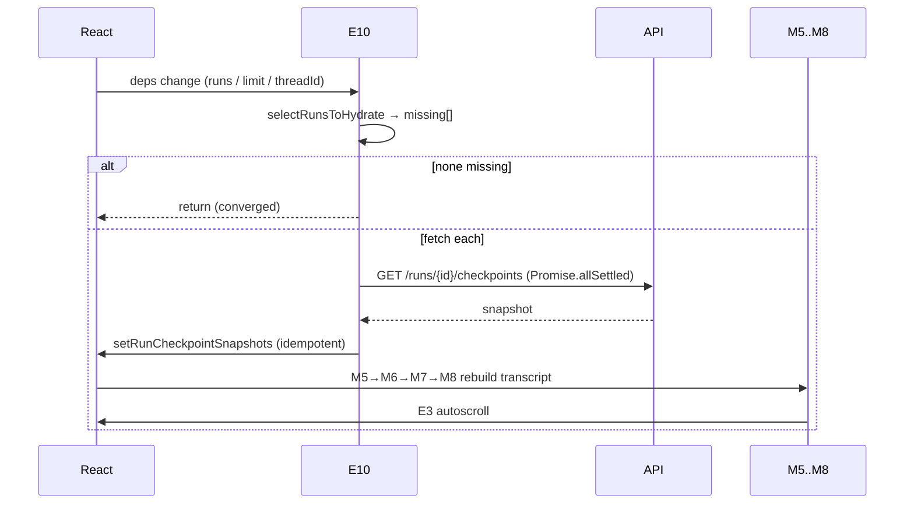

# UI Flow 6 — Browse History (Runs & Checkpoints)

Backend companion: [../06-browse-history.md](../06-browse-history.md). Model primer & id catalog: [README](README.md).

## What this covers

How the persisted transcript is assembled from **run checkpoint snapshots** via **lazy hydration** (E10), and how "Load earlier runs" reveals older runs. The transcript is built from snapshots, **not** from `stream.messages` — `stream` only supplies the live tail (see the `fetchStateHistory: { limit: 1 }` note in [stream.ts](../../../ui/src/stream.ts)).

## The transcript pipeline (memos)

```
runs ──M4──> runsInMessageOrder ──┐
                                   ├──M5──> persistedMessageEntries ──M6──> persistedMessages
runCheckpointSnapshots ───────────┘                    │
                                                        └──M7──> displayedMessageEntries ──M8──> displayedMessages ──E3
```

- **M4** `runsInMessageOrder` — this thread's runs, oldest→newest.
- **M5** `persistedMessageEntries` — `messageEntriesFromCheckpointSnapshots`: flattens each run's snapshot messages, **deduping by message id** so a message shared across checkpoints appears once, attributed to the earliest run.
- **M7** `displayedMessageEntries` — persisted entries + (for the current, not-yet-persisted run) a live tail from `liveRunMessages(visibleMessages, persistedMessages)` + un-confirmed optimistic messages.

## Lazy hydration — E10

E10 fires whenever `[apiUrl, currentRunId, hydratedRunLimit, runCheckpointSnapshots, runs, runsInMessageOrder, threadId]` changes.

1. `selectRunsToHydrate(runsInMessageOrder, runCheckpointSnapshots, hydratedRunLimit, PERSISTED_RUN_STATUSES, currentRunId)` picks:
   - the newest `hydratedRunLimit` **persisted** runs not already in `runCheckpointSnapshots`, plus
   - the currently-viewed run (even if outside the window).
2. If none are missing → early return (this is what makes E10 **converge** rather than loop, despite `runCheckpointSnapshots` being a dep).
3. Otherwise fetch each via `getRunCheckpointSnapshot` independently under `Promise.allSettled` (one slow/failing run never blocks the others), guarded by `isStale()` (thread switch / seq bump / abort).
4. Each resolved snapshot → `setRunCheckpointSnapshots(current => current[id] ? current : {…})` (idempotent insert).

Each insert is a state change → E10 re-runs, finds the run now present, and selects the *next* missing one — until the window is satisfied.

### Ordering per hydration insert

`setRunCheckpointSnapshots` → render → **M5** (dep `runCheckpointSnapshots`) → **M6** → **M7** → **M8** → **E3** autoscroll. **E13** also re-runs (`currentRunSnapshotLoaded` dep) — relevant when the hydrated run is the just-finished current run (completes the live→persisted handoff from [Flow 1](01-start-research-run.md)).

## "Load earlier runs"

The control shows when `hasEarlierUnhydratedRuns(runsInMessageOrder, PERSISTED_RUN_STATUSES, hydratedRunLimit)` is true (persisted run count exceeds the window). Clicking it:

```
setHydratedRunLimit(limit => limit + EARLIER_RUNS_BATCH)   // +5
```

→ E10 re-runs with a larger window → selects the newly-in-window older runs → fetches + inserts their snapshots → M5..M8 prepend the older messages to the transcript.

## Opening a different thread

`openThread(id)` (line 1050) → `resetVisibleThread(id)`:
- Bumps `threadRequestSeqRef` (invalidates in-flight `refreshRuns`/hydration via `isStale`).
- Resets `activeRun`, `visibleMessages`, `optimisticMessages`, `runs`, `currentRunId`, `runCheckpointSnapshots`, `hydratedRunLimit` (back to `INITIAL_HYDRATED_RUN_LIMIT = 3`), clears `joinedRunIds`, `stream.switchThread(id)`, `setThreadId(id)`.
- `setThreadId` → **E9** reloads `runs`, **E16** re-subscribes lifecycle, **E10** hydrates the newest 3 runs, **ES1** re-subscribes protocol SSE.

## Phase diagram



## Re-render cascade summary

| Trigger | State change | Memos | Effects |
|---|---|---|---|
| snapshot fetched | `runCheckpointSnapshots` | M5, M6, M7, M8 | E10 (next), E13 |
| Load earlier runs | `hydratedRunLimit` | — | E10 |
| open thread | many (reset) | M1–M8 | ES1, E9, E10, E16 |

## Related code

- `ui/src/App.tsx` → E10, M4–M8, `messageEntriesFromCheckpointSnapshots`, `resetVisibleThread`, "Load earlier runs" button
- `ui/src/runHydration.ts` → `selectRunsToHydrate`, `hasEarlierUnhydratedRuns`
- `ui/src/messageMerge.ts` → `liveRunMessages`
- `ui/src/api.ts` → `getRunCheckpointSnapshot`, `listRuns`
