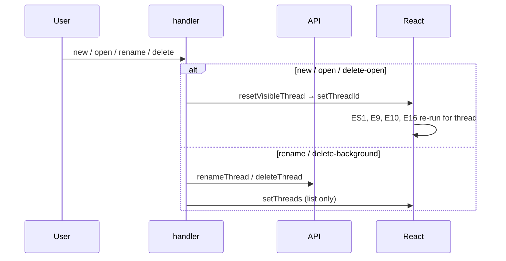

# UI Flow 7 — Manage Threads (Create / Open / Rename / Delete)

Backend companion: [../07-manage-threads.md](../07-manage-threads.md). Model primer & id catalog: [README](README.md).

## What this covers

The thread lifecycle in the sidebar, and how each action drives resets, URL sync, and the mount-only effects (E1, E7, E8, E11).

## Startup & URL sync (mount effects)

- `initialThreadId()` seeds `threadId` from `?thread_id=` (or `localStorage`) during the first render.
- **E7** (mount) normalizes that initial thread into the address bar once (`writeThreadUrl(threadId, true)` if the URL lacks it).
- **E8** (`apiUrl`) loads the sidebar via `listThreads` → `setThreads`; `threadsLoading` toggles the "Loading threads…" row.
- **E11** (mount) installs the `popstate` handler for browser back/forward.
- **E1** (mount) installs the global `click`/`Escape` listeners that close the per-thread `⋯` menu (`setOpenThreadMenu(null)`).

## Create — `newThread()`

`newThread()` (line 1042):
1. `setOpenThreadMenu(null)`.
2. `pendingThreadTitleRef.current = "New research"` (the title `onThreadId`→`upsertThread` will apply once the first run creates the real thread id).
3. `resetVisibleThread(null)` — clears all per-thread state and `setThreadId(null)`.
4. `writeThreadUrl(null)` (pushState, drops the query param).

`setThreadId(null)` → **E9** clears `runs` (no thread), **E16** early-returns (`!threadId`) and clears `joinedRunIds`, **ES1** unsubscribes. The empty state (`What should we research?`) renders. The actual thread is created lazily on the first `submit` (see [Flow 1](01-start-research-run.md)).

## Open — `openThread(id)`

Covered in [Flow 6](06-browse-history.md#opening-a-different-thread): `resetVisibleThread(id)` + `writeThreadUrl(id)`. Re-triggers ES1/E9/E10/E16 for the new thread. No-ops if `id === threadId`.

## Rename — `renameThreadTitle(id)`

`renameThreadTitle` (line 1061):
1. `setOpenThreadMenu(null)`; `window.prompt` for the new title (cancel → return; empty → `setError`).
2. `setError(null)`; `await renameThread(apiUrl, id, title)`.
3. `setThreads(map → replace title/updatedAt for id)` — optimistic-ish list update from the server response.

Only `threads` changes → the sidebar row re-renders. No run/transcript effects fire (no `threadId`/`runs`/`currentRunId` change).

## Delete — `removeThread(id)`

`removeThread` (line 1095):
1. `setOpenThreadMenu(null)`; `window.confirm`.
2. `setError(null)`; `await deleteThread(apiUrl, id)`.
3. `setThreads(filter out id)`.
4. If `id === threadId` (deleting the open thread): `resetVisibleThread(null)` + `writeThreadUrl(null, true)`.

Deleting the **open** thread cascades exactly like `newThread` (empties the workspace + ES1/E9/E16 tear-down); deleting a **background** thread only mutates `threads`.

## Back/forward — E11 `popstate`

The handler reads `threadIdFromUrl()` and performs the same reset as `resetVisibleThread` (bumps `threadRequestSeqRef`, clears per-thread state, `switchThreadRef.current?.(next)`, `setThreadId(next)`, syncs `localStorage`). Because `threadId` changes, ES1/E9/E10/E16 re-run for the restored thread. `switchThreadRef` (reassigned each render) avoids a stale `stream` closure inside this mount-only effect.

## Phase diagram

## Re-render cascade summary

| Action | State change | Effects re-run |
|---|---|---|
| new / open / delete-open | `threadId` + full reset | ES1, E9, E10, E16 (+E5) |
| rename | `threads` | — (sidebar only) |
| delete-background | `threads` | — |
| back/forward (E11) | `threadId` + reset | ES1, E9, E10, E16 |
| open `⋯` menu | `openThreadMenu` | — (E1 listeners close it) |

## Related code

- `ui/src/App.tsx` → `newThread`, `openThread`, `renameThreadTitle`, `removeThread`, `resetVisibleThread`, `writeThreadUrl`, `upsertThread`, E1, E7, E8, E11
- `ui/src/api.ts` → `listThreads`, `renameThread`, `deleteThread`
